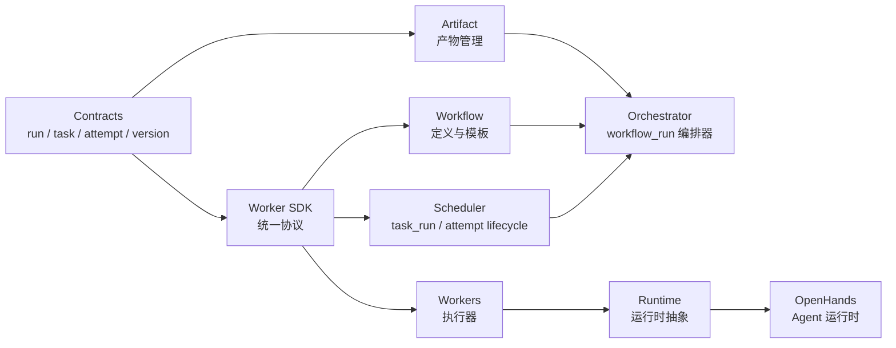
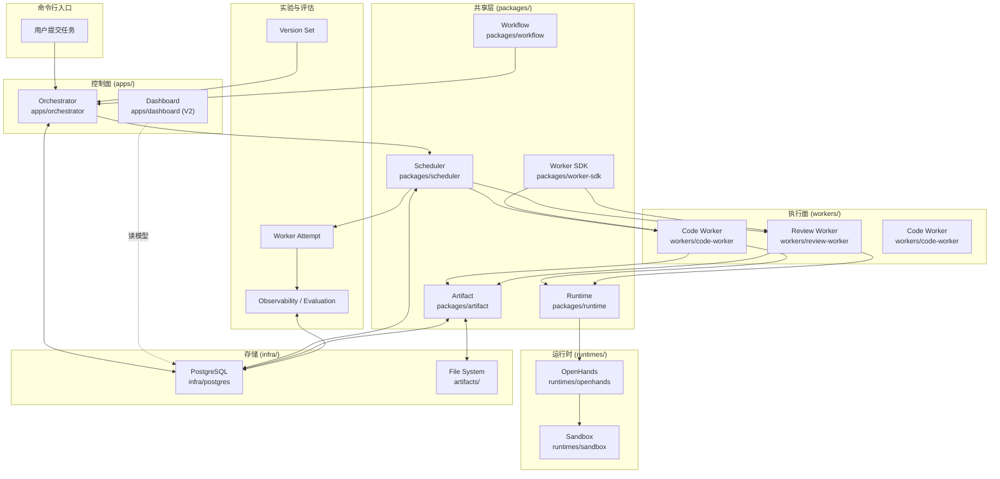
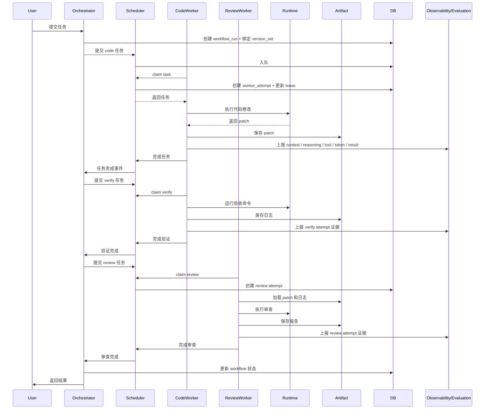

# ARCHITECTURE.md

## 这个系统是什么？

AI SDLC Platform 是一个 AI 驱动的软件开发生命周期平台，通过编排多个专用 Worker 自动化完成从需求到交付的全流程。平台同时服务两类场景：

- `delivery mode`：面向真实业务需求的自动化交付
- `experiment mode`：面向 benchmark 和版本对比的持续调优

**核心能力**：
- 自动化代码生成、验证和审查
- 工作流编排和任务调度
- 失败重试和状态持久化
- 产物管理和追踪
- 基于 `worker_attempt` 的观测、评估和版本比较

**技术选型**：
- 语言：TypeScript（控制面和 Worker）、Python（运行时集成）
- 数据库：PostgreSQL（状态持久化）
- 运行时：OpenHands + Sandbox（隔离执行）
- 包管理：pnpm workspaces（Monorepo）

**部署模型**：
- 容器化部署（Docker）
- 控制面服务（Orchestrator）
- 分布式 Worker（可水平扩展）
- 共享数据库和文件存储

## 业务领域

业务领域划分随业务演进变化，独立维护在 `docs/DOMAINS.md`。

## 代码分层模型

**箭头样式说明**：
- `-->` 实线箭头：依赖方向（import / 编译时依赖，从底层指向上层）
- `-.->` 虚线箭头：运行时数据流（HTTP 调用、事件通知、读模型查询）
- `<-->` 双向箭头：读写双向（如数据库操作）

**智能体必须遵守的规则：**
- 依赖只能从左到右流动（如 Orchestrator 可以导入 Scheduler，但 Scheduler 不能导入 Orchestrator）
- Worker 通过 SDK 与 Scheduler 通信，不直接依赖 Orchestrator
- Runtime 抽象层屏蔽具体运行时实现（OpenHands、Sandbox）
- 横切关注点（日志、遥测）通过统一接口注入
- `worker_attempt` 是执行内核正式对象，不允许只在日志或 trace 层以隐式概念存在
- `version_set` 是运行身份模型的一部分，必须能同时标识 `method_version` 与 `execution_version`

## 技术栈

| 层级 | 技术 | 备注 |
|------|------|------|
| 前端 | React (Dashboard) | 监控和控制界面（V2） |
| 后端 | TypeScript + Node.js | Orchestrator, Scheduler, Workers |
| 数据库 | PostgreSQL | workflow_runs, workflow_tasks, artifacts |
| 缓存 | 内存队列 (V1) → Redis (V2) | 任务队列 |
| CI/CD | GitHub Actions | 自动化测试和部署 |
| 部署 | Docker | 容器化部署 |
| 可观测性 | 结构化日志 (V1) → OpenTelemetry (V2) | 日志和追踪 |

## 依赖选择原则

- 优先选择可组合、API 稳定、在 LLM 训练数据中有良好表现的依赖
- 当第三方库有不透明的上游行为时，考虑重新实现所需的功能子集
- 每个依赖都必须能完全从仓库内推理——不允许隐藏行为
- 引入新依赖前，先检查 `docs/design-docs/core-beliefs.md` 中的原则

## 关键架构决策

详见 `docs/design-docs/core-beliefs.md`。与演进路线和实验执行链路直接相关的补充约束见：

- `docs/design-docs/architecture/dual-track-roadmap.md`
- `docs/design-docs/architecture/attempt-observability-evaluation.md`

## 核心对象模型

平台的核心对象分为三层：

### 执行内核对象

- `workflow_run`
  - 一次完整需求实现，由 `orchestrator` 拥有和推进
- `task_run`
  - workflow 中的阶段级任务，由 `scheduler` 调度和回收
- `worker_attempt`
  - 某个 worker 对某个 `task_run` 的一次真实执行，是 claim、lease、heartbeat、完成、失败、过期等生命周期事件的主体

### 实验控制对象

- `version_set`
  - 一次运行绑定的版本快照，拆分为：
  - `method_version`：system skill、project skill、harness docs、prompt、policy
  - `execution_version`：worker implementation、model、runtime、toolchain、tuning params
- `benchmark_case`
  - 可重复执行和比较的任务样本

### 评估对象

- `attempt_scorecard`
- `task_scorecard`
- `run_scorecard`

评分对象属于评估域，不参与执行时序决策；执行系统负责“把任务跑完”，评估系统负责“把结果评出来”。

`worker_attempt` 的观测协议、`attempt_finished / attempt_summary_report` 完整性规则、observability 状态机、scorecard revision、human calibration 和标签传播建议，统一受 `docs/design-docs/architecture/attempt-observability-evaluation.md` 约束。

## 总体架构

## Monorepo 模块映射

| 模块 | 路径 | 职责 | 依赖 |
|------|------|------|------|
| **控制面** |
| Orchestrator | `apps/orchestrator` | `workflow_run` 编排、状态机、任务生成 | scheduler, workflow, artifact |
| Dashboard | `apps/dashboard` | 监控和控制界面（V2） | - |
| **共享层** |
| Scheduler | `packages/scheduler` | `task_run` 调度、claim/lease、重试、attempt 生命周期 | worker-sdk |
| Worker SDK | `packages/worker-sdk` | 统一协议、`task_run / worker_attempt` 类型定义 | - |
| Workflow | `packages/workflow` | Workflow 定义与模板（步骤、顺序、失败策略） | worker-sdk（仅类型导入） |
| Artifact | `packages/artifact` | 产物存储、元数据管理 | - |
| Runtime | `packages/runtime` | 运行时抽象接口 | - |
| **执行面** |
| Code Worker | `workers/code-worker` | 代码修改和验证，产生 `worker_attempt` | worker-sdk, runtime, artifact |
| Review Worker | `workers/review-worker` | 代码审查，产生 `worker_attempt` | worker-sdk, runtime, artifact |
| Code Worker | `workers/code-worker` | 代码修改和验证（Claude Code 引擎），产生 `worker_attempt` | worker-sdk, runtime, artifact |
| **实验与评估** |
| Version Set | `packages/worker-sdk`（类型）+ `infra/postgres`（持久化） | 运行身份快照（method + execution） | - |
| Worker Attempt | `packages/worker-sdk`（类型）+ `packages/scheduler`（生命周期） | 单次执行主体，驱动观测与评分 | scheduler, worker-sdk |
| Observability | `packages/observability` | 证据索引、时间线、回放、聚合状态机 | artifact, worker-sdk |
| Evaluation | `packages/evaluation` | 规则分、LLM 分、人工校准、scorecard revision | observability, artifact |
| Insights | `packages/insights` | 相似组分析、标签传播建议、趋势与性价比洞察 | evaluation, observability |
| **运行时** |
| OpenHands | `runtimes/openhands` | Agent 运行时集成 | - |
| Sandbox | `runtimes/sandbox` | 隔离执行环境 | - |
| **基础设施** |
| PostgreSQL | `infra/postgres` | 数据库 Schema 和迁移 | - |
| Docker | `infra/docker` | 容器化配置 | - |

## 端到端流程

## 数据流

**状态数据**：
- workflow_runs → PostgreSQL
- workflow_tasks → PostgreSQL
- worker_attempts → PostgreSQL
- lease 信息 → PostgreSQL
- version_set 引用 → PostgreSQL

**产物数据**：
- patch 文件 → File System
- 日志文件 → File System
- 审查报告 → File System
- 元数据引用 → PostgreSQL (artifacts 表)

**观测与评估数据**：
- context / reasoning / tool / token / timing 证据 → PostgreSQL / Artifact Store
- attempt_scorecard / task_scorecard / run_scorecard → PostgreSQL

## 模块详细设计

各模块的详细设计文档集中管理在 `docs/design-docs/`，索引见 `docs/design-docs/index.md`。
