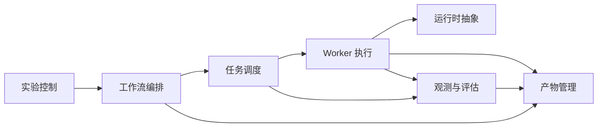

# 业务领域划分

本文件记录 AI SDLC Platform 的业务领域划分。智能体据此判断代码应该放在哪里、新功能属于哪个领域。

## 领域清单

| 领域 | 职责说明 | 代码位置 | 关键实体 |
|------|----------|----------|----------|
| 工作流编排 | 管理 workflow 生命周期、状态机、任务生成 | `apps/orchestrator` | WorkflowRun, WorkflowState |
| 任务调度 | 管理 `task_run` 队列、claim/lease、重试与 attempt 生命周期 | `packages/scheduler` | TaskRun, WorkerAttempt, Lease, Queue |
| Worker 执行 | 代码修改、验证、审查的具体实现 | `workers/*` | CodexWorker, ReviewWorker |
| 运行时抽象 | 屏蔽 OpenHands/Sandbox 实现细节 | `packages/runtime` | Runtime, RuntimeSession |
| 产物管理 | 存储和管理 patch、日志、报告 | `packages/artifact` | Artifact, ArtifactStore |
| 实验控制 | 管理 benchmark、experiment batch 和 `version_set` | 平台级对象（V1-V3） | BenchmarkCase, ExperimentBatch, VersionSet |
| 观测与评估 | 管理 attempt 证据、scorecard、反馈标签和 compare 结果 | 平台级对象（V1-V3） | AttemptScorecard, TaskScorecard, RunScorecard, FeedbackLabel |

## 领域间关系

## 领域通信规则

- 领域之间不允许循环依赖
- Orchestrator 通过 Scheduler 接口提交任务，不直接调用 Worker
- `worker_attempt` 属于执行内核正式对象：由 Scheduler 负责生命周期，Worker 负责产生执行证据
- Worker 通过 Worker SDK 与 Scheduler 通信
- 所有 artifact 操作通过 Artifact Service 统一管理
- Runtime 抽象层对 Worker 透明，Worker 不感知具体运行时实现
- `version_set` 属于实验控制域：标识一次运行的 `method_version` 与 `execution_version`
- 评分与 compare 属于观测与评估域，不参与执行时序决策
