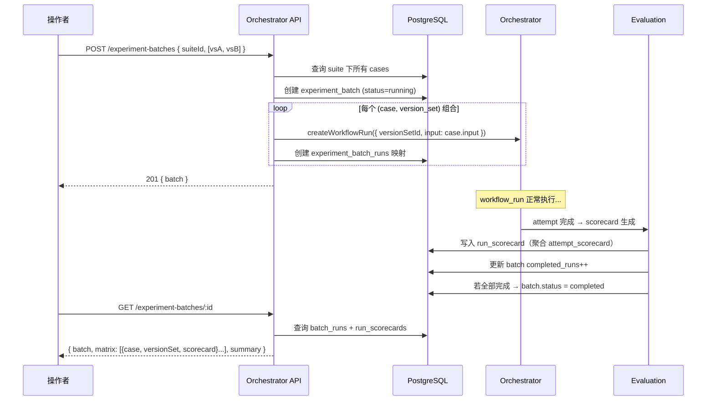

# 设计文档：实验批次调度 + Benchmark 管理

## 背景

平台需要规模化的实验能力——在同一组任务样本上对比多个配置的效果。当前缺少 benchmark 持久化、批量调度和聚合评分，操作者无法系统化地进行调优。

## 技术方案

### 数据模型

```sql
-- Benchmark 管理
CREATE TABLE benchmark_suites (
  id UUID PRIMARY KEY DEFAULT gen_random_uuid(),
  name TEXT NOT NULL,
  description TEXT DEFAULT '',
  created_at TIMESTAMPTZ DEFAULT now()
);

CREATE TABLE benchmark_cases (
  id UUID PRIMARY KEY DEFAULT gen_random_uuid(),
  suite_id UUID NOT NULL REFERENCES benchmark_suites(id),
  name TEXT NOT NULL,
  input JSONB NOT NULL,  -- { requirement, repository?, branch?, workDir?, verifyCommand?, implementation? }
  source_workflow_run_id UUID,  -- 非空表示从历史 workflow 转化
  created_at TIMESTAMPTZ DEFAULT now()
);

-- 实验批次
CREATE TABLE experiment_batches (
  id UUID PRIMARY KEY DEFAULT gen_random_uuid(),
  suite_id UUID NOT NULL REFERENCES benchmark_suites(id),
  version_set_ids JSONB NOT NULL,  -- UUID[]
  status TEXT NOT NULL DEFAULT 'pending',  -- pending | running | completed
  total_runs INT NOT NULL DEFAULT 0,
  completed_runs INT NOT NULL DEFAULT 0,
  failed_runs INT NOT NULL DEFAULT 0,
  created_at TIMESTAMPTZ DEFAULT now(),
  finished_at TIMESTAMPTZ
);

CREATE TABLE experiment_batch_runs (
  id UUID PRIMARY KEY DEFAULT gen_random_uuid(),
  batch_id UUID NOT NULL REFERENCES experiment_batches(id),
  benchmark_case_id UUID NOT NULL REFERENCES benchmark_cases(id),
  version_set_id UUID NOT NULL,
  workflow_run_id UUID NOT NULL REFERENCES workflow_runs(id),
  UNIQUE(batch_id, benchmark_case_id, version_set_id)
);

-- Run 级聚合评分
CREATE TABLE run_scorecards (
  workflow_run_id UUID PRIMARY KEY REFERENCES workflow_runs(id),
  dimension_scores JSONB NOT NULL,  -- { success, efficiency, cost }
  total_score NUMERIC(5,4) NOT NULL,
  source_attempt_id UUID,
  created_at TIMESTAMPTZ DEFAULT now()
);
```

### 接口契约

| 端点 | 方法 | 请求体 | 响应 |
|------|------|--------|------|
| `/benchmark-suites` | POST | `{ name, description? }` | 201 + suite |
| `/benchmark-suites` | GET | — | suite[] |
| `/benchmark-suites/:id` | GET | — | suite + cases[] |
| `/benchmark-suites/:id/cases` | POST | `{ name, input }` | 201 + case |
| `/benchmark-suites/:id/cases/from-workflow` | POST | `{ workflowRunId, name? }` | 201 + case |
| `/experiment-batches` | POST | `{ suiteId, versionSetIds }` | 201 + batch |
| `/experiment-batches` | GET | — | batch[] |
| `/experiment-batches/:id` | GET | — | batch + results matrix |

### 核心流程



### run_scorecard 聚合逻辑

在 evaluation 模块的 `scoreAttempt` 完成后新增一步：

1. 查询该 attempt 所属的 workflow_run_id
2. 检查该 workflow_run 是否已有 run_scorecard（幂等）
3. 取最新 attempt_scorecard_revision 的 dimension_scores 和 total_score
4. 写入 run_scorecards

同时检查该 workflow_run 是否属于某个 batch，若是则更新 batch 计数和状态。

### batch 状态推进

```
pending → running（创建时立即转为 running）
running → completed（completed_runs + failed_runs = total_runs）
```

## 影响范围

| 模块/文件 | 变更类型 | 说明 |
|-----------|----------|------|
| `infra/postgres/migrations/` | 新增 | 6 张新表的 DDL |
| `apps/orchestrator/src/index.ts` | 修改 | 新增 benchmark + batch API 路由 |
| `packages/evaluation/src/index.ts` | 修改 | scoreAttempt 后聚合 run_scorecard + 更新 batch 状态 |
| `apps/dashboard/src/` | 新增 | 实验页面（BatchList, BatchDetail, CompareTable 组件） |
| `apps/dashboard/src/api.ts` | 修改 | 新增 fetch 函数 |

## 约束（智能体必须遵守）

- batch 执行复用现有 orchestrator/scheduler/worker 链路，不引入新的调度器
- run_scorecard 聚合在 evaluation 模块完成，不侵入 scheduler
- version_set_ids 引用必须是已存在的 version_set 记录
- benchmark_case.input 的 schema 必须与 createWorkflowRun 的 input 兼容

## 迁移与兼容

- **Schema migration**：新增表，无破坏性变更，纯增量迁移
- **数据回填**：不适用（新功能，无历史数据）
- **向后兼容**：现有 API 不受影响，新端点独立
- **Feature flag**：不使用（功能独立，不影响现有链路）

## 发布与回滚

- **发布策略**：全量部署
- **回滚方案**：删除新表 + 回退代码即可，不影响已有数据
- **回滚触发条件**：新 API 影响现有 workflow 执行

## 观测性

- **关键指标**：batch 创建数、平均完成时间、失败率
- **日志**：batch 创建/完成事件结构化日志
- **告警**：暂无（Phase 4 引入）

## 异常处理

| 场景 | 技术处理方式 |
|------|-------------|
| suite 无 case | API 返回 400 |
| workflow_run 创建失败 | 该 run 标记 failed，batch 继续 |
| evaluation 聚合失败 | 重试（现有 pending_eval_jobs 机制） |
| batch 进度更新并发冲突 | 使用 UPDATE ... SET completed_runs = completed_runs + 1（原子） |

## 验证方式

- 单元测试：run_scorecard 聚合逻辑、batch 状态推进
- 集成测试：创建 batch → mock workflow 完成 → 验证对比结果
- E2E 测试：Dashboard 对比表格渲染

## 备选方案

| 方案 | 优势 | 否决原因 |
|------|------|----------|
| 引入 batch 级调度器 | 可控制并发 | 过度设计，当前单 worker 无需 |
| task_scorecard + run_scorecard 两级 | 更精细 | 线性链下两级等价，增加复杂度 |
| batch_scorecard 独立对象 | 持久化汇总 | 汇总可在查询时计算，无需持久化 |

## 参考资料

- `docs/design-docs/architecture/dual-track-roadmap.md` — Phase 2 实验侧要求
- `ARCHITECTURE.md` — 核心对象模型
- `packages/evaluation/src/index.ts` — 现有评分逻辑
