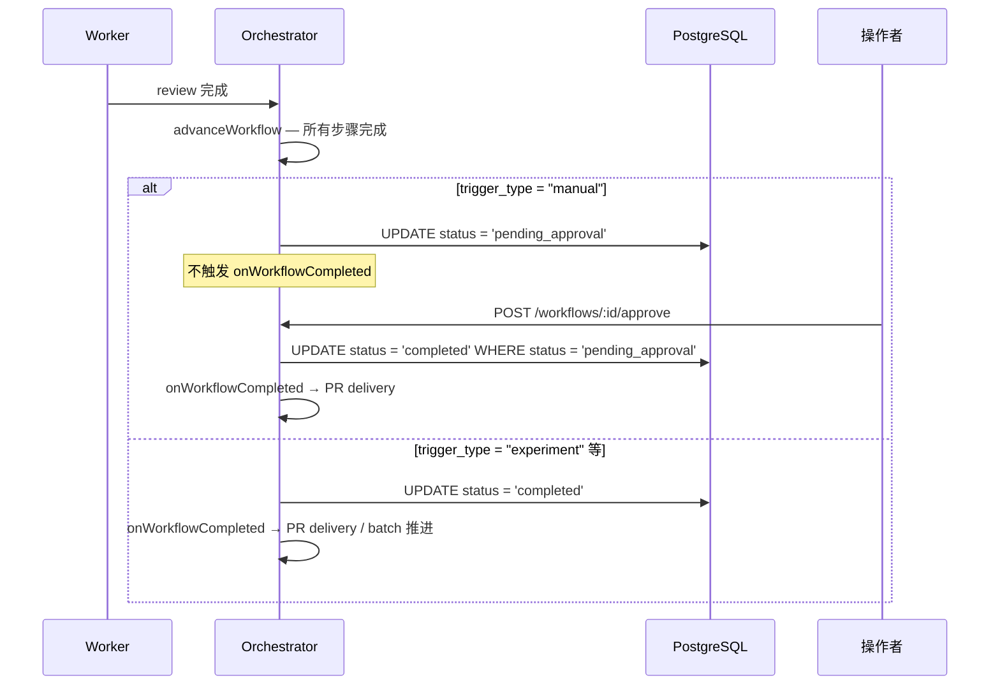

# 设计文档：人工审批门

## 背景

手动触发的 workflow 完成 AI review 后直接交付 PR，缺少人工质量门。需要在 review 完成与 PR delivery 之间插入人工审批环节。

## 技术方案

### 数据模型

无新表。`workflow_runs.status` 为 varchar，新增枚举值 `pending_approval` 无需 migration。

新增列：

```sql
ALTER TABLE workflow_runs ADD COLUMN rejection_reason TEXT;
```

成本低（nullable text），保证拒绝原因可从 Dashboard 历史查询和审计追溯。

### 接口契约

| 端点 | 方法 | 请求体 | 响应 |
|------|------|--------|------|
| `POST /workflows/:id/approve` | POST | `{}` | `{ ok: true }` 或 `409` |
| `POST /workflows/:id/reject` | POST | `{ reason?: string }` | `{ ok: true }` 或 `409` |

### 核心流程



### orchestrator advanceWorkflow 变更

当 `findNextStep` 返回 null（所有步骤完成）时：

```typescript
if (!nextStep) {
  if (run.triggerType === "manual") {
    await sql`UPDATE workflow_runs SET status = 'pending_approval', updated_at = now() WHERE id = ${run.id}`;
    run.status = "pending_approval";
    return; // 等待人工操作
  }
  await sql`UPDATE workflow_runs SET status = 'completed', finished_at = now(), updated_at = now() WHERE id = ${run.id}`;
  run.status = "completed";
  config.onWorkflowCompleted?.(run);
}
```

### approve/reject 端点

```typescript
app.post("/workflows/:id/approve", async (c) => {
  const [row] = await sql`
    UPDATE workflow_runs SET status = 'completed', finished_at = now(), updated_at = now()
    WHERE id = ${id} AND status = 'pending_approval' RETURNING *
  `;
  if (!row) return c.json({ error: "not in pending_approval state" }, 409);
  const run = buildWorkflowRun(row);
  try { config.onWorkflowCompleted?.(run); } catch {}
  return c.json({ ok: true });
});

app.post("/workflows/:id/reject", async (c) => {
  const { reason } = await c.req.json().catch(() => ({ reason: undefined }));
  const [row] = await sql`
    UPDATE workflow_runs SET status = 'failed', finished_at = now(), rejection_reason = ${reason ?? null}, updated_at = now()
    WHERE id = ${id} AND status = 'pending_approval' RETURNING *
  `;
  if (!row) return c.json({ error: "not in pending_approval state" }, 409);
  const run = buildWorkflowRun(row);
  try { config.onWorkflowFailed?.(run); } catch {}
  console.log(JSON.stringify({ event: "workflow_approval", action: "reject", workflowId: run.id, reason: reason ?? null }));
  return c.json({ ok: true });
});
```

## 影响范围

| 模块/文件 | 变更类型 | 说明 |
|-----------|----------|------|
| `apps/orchestrator/src/index.ts` | 修改 | advanceWorkflow 分支 + approve/reject 端点 + WorkflowRun.status 类型扩展 |
| `apps/dashboard/src/pages/WorkflowDetail.tsx` | 修改 | pending_approval 时显示 Approve/Reject 按钮 |
| `apps/dashboard/src/api.ts` | 修改 | 新增 approveWorkflow / rejectWorkflow |
| `infra/postgres/migrations/` | 新增 | 003 添加 rejection_reason 列 |

注：`WorkflowRun` 类型仅在 `apps/orchestrator/src/index.ts` 内部定义，不在 `packages/worker-sdk` 中共享，无需修改其他包。

## 约束

- `WHERE status = 'pending_approval'` 保证并发安全（幂等）
- experiment workflow 不受影响
- PR delivery 行为不变（仍为 best-effort）
- 认证/鉴权：V1 不做（单用户模式），V2 绑定操作者身份
- cancel 端点与 pending_approval 的交互：允许对 pending_approval 调用 cancel（等同于 reject 但语义为"放弃"而非"质量不达标"），现有 cancel 端点无状态条件限制，保持现状

## 发布与回滚

- **发布策略**：全量部署
- **回滚方案**：回滚代码后，已处于 pending_approval 的 workflow 可通过 SQL 批量置为 completed（`UPDATE workflow_runs SET status = 'completed', finished_at = now() WHERE status = 'pending_approval'`）恢复交付
- **回滚触发条件**：审批流程阻塞正常交付且无法修复

## 观测性

- **结构化日志**：
  - approve: `{ event: "workflow_approval", action: "approve", workflowId }`
  - reject: `{ event: "workflow_approval", action: "reject", workflowId, reason }`
- **关键指标**（Phase 4 接入 OTel 后）：审批延迟 P50/P99、reject 率趋势
- **告警**：暂无

## 异常处理

| 场景 | 技术处理方式 |
|------|-------------|
| 重复审批（已 completed/failed） | WHERE 不匹配，返回 409 |
| 并发审批 | 同上，只有一个 UPDATE 生效 |
| DB 写入失败 | API 返回 500，状态不变（事务原子性） |
| approve 后 onWorkflowCompleted 异常 | try/catch 吞掉，PR delivery 为 best-effort |

## 验证方式

- 单元测试：advanceWorkflow 按 trigger_type 分支
- 集成测试：approve/reject API 状态转换、重复操作 409、experiment 跳过审批
- 手动验证：Dashboard 按钮条件渲染

## 备选方案

| 方案 | 优势 | 否决原因 |
|------|------|----------|
| 新增 human_gate task_type | 更灵活 | 需要修改步骤模型，过度设计 |
| 所有 workflow 都审批 | 简单 | 实验批次会被阻塞 |
| reject 后自动重试 | 体验好 | 需要步骤回退，当前不支持 |
| reject reason 仅记日志不持久化 | 少改 schema | 无法从 Dashboard 查询历史拒绝原因，影响审计 |
