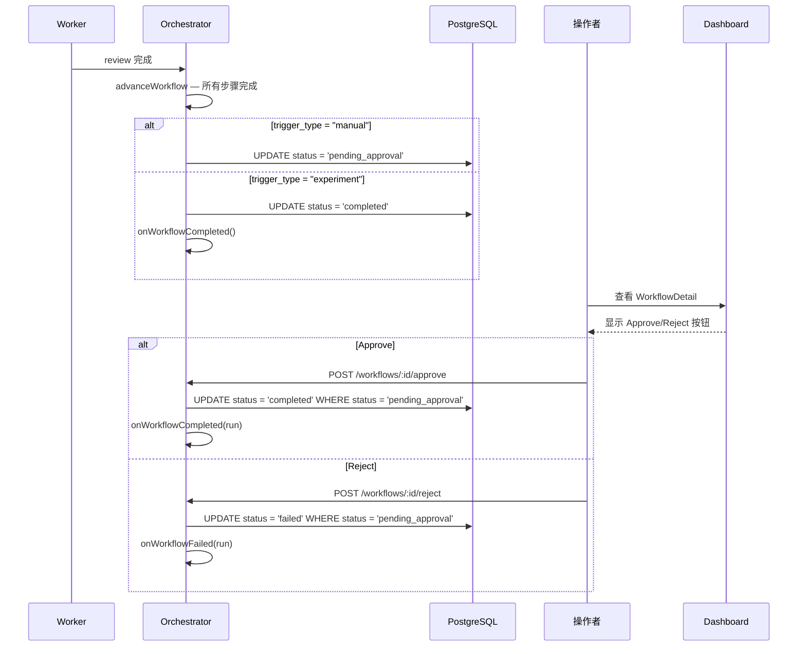

# 设计文档：人工审批门

## 背景

手动触发的 workflow 完成 AI review 后直接交付 PR，缺少人工质量门。需要在 review 完成与 PR delivery 之间插入人工审批环节。

## 技术方案

### 数据模型

无新表。`workflow_runs.status` 为 varchar，新增枚举值 `pending_approval` 无需 migration。

新增字段（可选，用于记录审批信息）：

```sql
-- 可通过 ALTER TABLE 添加，但当前使用 input/completed_steps JSON 即可避免 migration
-- 审批原因记录在 API 响应日志中，不持久化额外列
```

**决策**：不新增列，reject reason 通过结构化日志记录。保持 schema 不变。

### 接口契约

| 端点 | 方法 | 请求体 | 响应 |
|------|------|--------|------|
| `POST /workflows/:id/approve` | POST | `{}` | `{ ok: true }` 或 `409` |
| `POST /workflows/:id/reject` | POST | `{ reason?: string }` | `{ ok: true }` 或 `409` |

### 核心流程



### orchestrator advanceWorkflow 变更

当 `findNextStep` 返回 null（所有步骤完成）时：

```typescript
if (!nextStep) {
  if (run.triggerType === "manual") {
    await sql`UPDATE workflow_runs SET status = 'pending_approval', updated_at = now() WHERE id = ${run.id}`;
    run.status = "pending_approval" as any;
    return; // 等待人工操作，不触发 onWorkflowCompleted
  }
  // experiment 等其他类型直接完成
  await sql`UPDATE workflow_runs SET status = 'completed', finished_at = now(), updated_at = now() WHERE id = ${run.id}`;
  run.status = "completed";
  config.onWorkflowCompleted?.(run);
}
```

### approve/reject 端点

```typescript
app.post("/workflows/:id/approve", async (c) => {
  const result = await sql`
    UPDATE workflow_runs SET status = 'completed', finished_at = now(), updated_at = now()
    WHERE id = ${id} AND status = 'pending_approval' RETURNING *
  `;
  if (result.length === 0) return c.json({ error: "not in pending_approval state" }, 409);
  // 触发 onWorkflowCompleted → PR delivery
});

app.post("/workflows/:id/reject", async (c) => {
  const result = await sql`
    UPDATE workflow_runs SET status = 'failed', finished_at = now(), updated_at = now()
    WHERE id = ${id} AND status = 'pending_approval' RETURNING *
  `;
  if (result.length === 0) return c.json({ error: "not in pending_approval state" }, 409);
  // 触发 onWorkflowFailed → workspace cleanup
});
```

`WHERE status = 'pending_approval'` 保证并发安全（幂等）。

## 影响范围

| 模块/文件 | 变更类型 | 说明 |
|-----------|----------|------|
| `apps/orchestrator/src/index.ts` | 修改 | advanceWorkflow 逻辑 + approve/reject 端点 |
| `apps/dashboard/src/pages/WorkflowDetail.tsx` | 修改 | pending_approval 时显示按钮 |
| `apps/dashboard/src/api.ts` | 修改 | 新增 approveWorkflow / rejectWorkflow |

## 约束

- WHERE status = 'pending_approval' 保证并发安全
- experiment workflow 不受影响
- PR delivery 行为不变（仍为 best-effort）

## 迁移与兼容

- **Schema migration**：不适用（varchar 字段，无需修改）
- **向后兼容**：现有 experiment workflow 行为不变
- **Feature flag**：不使用

## 验证方式

- 单元测试：advanceWorkflow 按 trigger_type 分支、approve/reject 状态转换
- 集成测试：Hono app.request 测试 approve/reject API
- 手动验证：Dashboard 按钮渲染

## 备选方案

| 方案 | 优势 | 否决原因 |
|------|------|----------|
| 新增 human_gate task_type | 更灵活 | 需要修改步骤模型，过度设计 |
| 所有 workflow 都审批 | 简单 | 实验批次会被阻塞 |
| reject 后自动重试 | 体验好 | 需要步骤回退，当前不支持 |
