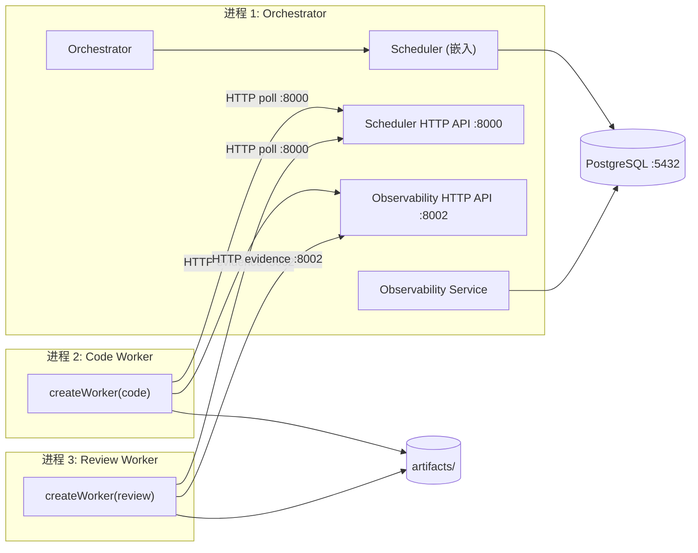

# 设计：Phase 1 最小双轨闭环

## 概述

本文档描述 Phase 1 的集成设计——各模块如何组合运行。各模块内部设计详见 `docs/design-docs/modules/`，此处不重复。

## 模块设计引用

| 模块 | 设计文档 |
|------|----------|
| Worker SDK | `docs/design-docs/modules/worker-sdk.md` |
| Scheduler | `docs/design-docs/modules/scheduler.md` |
| Orchestrator | `docs/design-docs/modules/orchestrator.md` |
| Workflow | `docs/design-docs/modules/workflow.md` |
| Runtime | `docs/design-docs/modules/runtime.md` |
| Artifact | `docs/design-docs/modules/artifact.md` |
| Workers | `docs/design-docs/modules/workers.md` |
| Observability | `docs/design-docs/modules/observability.md` |
| Database | `docs/design-docs/modules/infra-postgres.md` |

## 进程模型

Phase 1 共 3 类进程：



**进程 1（Orchestrator 主进程）** 包含：
- Orchestrator HTTP API（`:8000`，对外 + 接收回调）
- Scheduler（嵌入为库，共享同一 HTTP 服务端口）
- Observability Service（独立端口 `:8002`，但同进程）

**进程 2/3（Worker 进程）**：
- 各自独立进程，通过 HTTP 与进程 1 通信
- 可在同一机器或不同机器运行

## 启动顺序

```bash
# 1. 基础设施
docker compose -f infra/docker/docker-compose.dev.yml up -d  # PostgreSQL
scripts/migrate.sh                                             # 执行迁移

# 2. 主服务
pnpm --filter @ai-sdlc/orchestrator start
# 内部启动 Orchestrator + Scheduler + Observability

# 3. Workers（可启动多个）
pnpm --filter @ai-sdlc/code-worker start -- --implementation codex
pnpm --filter @ai-sdlc/review-worker start -- --implementation claude-code
```

## 通信拓扑

| 源 | 目标 | 协议 | 用途 |
|----|------|------|------|
| Worker → Scheduler | HTTP `:8000` | 执行协议（claim/heartbeat/complete/fail） |
| Worker → Observability | HTTP `:8002` | 观测协议（evidence/summary） |
| Worker → Artifact | 本地文件系统 | 产物写入 |
| Orchestrator → Scheduler | 进程内调用 | submitTask/cancelTask |
| Scheduler → Orchestrator | 进程内回调 | onTaskCompleted/onTaskFailed |
| Scheduler → Observability | 进程内调用 | attempt_finished 通知 |
| Orchestrator/Scheduler → DB | TCP `:5432` | 状态持久化 |
| Observability → DB | TCP `:5432` | 证据和观测记录 |
| Observability → Artifact | 本地文件系统 | 大载荷外置存储 |

## 配置管理

Phase 1 通过环境变量或启动参数传入配置，不引入配置中心：

```ts
// Orchestrator 配置
{
  port: 8000,
  observabilityPort: 8002,
  db: { connectionString: "postgresql://..." },
  scheduler: { leaseDefaultMs: 300000, leaseScanIntervalMs: 30000 },
  workflow: { defaultDefinitionId: "default" },
}

// Worker 配置
{
  workerId: "code-worker-01",
  roles: ["code"],
  implementation: "codex",  // 启动参数决定
  supportedTaskTypes: ["code", "verify"],
  versionSetId: "...",      // 启动参数或环境变量
  scheduler: { baseUrl: "http://localhost:8000", pollIntervalMs: 5000 },
  observability: { baseUrl: "http://localhost:8002" },
}
```

## 开发环境

```yaml
# infra/docker/docker-compose.dev.yml
services:
  postgres:
    image: postgres:16
    ports: ["5432:5432"]
    environment:
      POSTGRES_DB: ai_sdlc
      POSTGRES_USER: dev
      POSTGRES_PASSWORD: dev
    volumes:
      - pgdata:/var/lib/postgresql/data

volumes:
  pgdata:
```

## version_set 初始化

Phase 1 通过种子数据创建初始 version_set：

```sql
-- infra/postgres/seeds/dev_seed.sql
INSERT INTO version_sets (id, method_version, execution_version) VALUES (
  '00000000-0000-0000-0000-000000000001',
  '{"skills": "v1", "harness_docs": "v1", "prompt": "default"}',
  '{"worker": "codex", "model": "gpt-4o", "runtime": "cli"}'
);
```

提交任务时指定此 version_set_id，后续创建新 version_set 来对比。

## Mock CLI 模式

开发和测试时不依赖真实 CLI 工具，CliRuntime 支持 mock 模式：

```ts
// 启动 Worker 时传入 --mock 标志
// CliRuntime mock 实现：
//   - code task: 生成一个固定 patch 文件
//   - verify task: 返回 success
//   - review task: 返回固定审查报告
```

这确保了：
- CI 中无需安装 kiro/codex/claude-code
- 端到端测试可在任何环境运行
- 开发者可专注于平台逻辑而非 CLI 配置

## 关键集成约束

1. Scheduler 嵌入 Orchestrator 但通过接口调用——不允许直接访问 Scheduler 内部状态
2. Observability 与 Scheduler 同进程但故障域隔离——Observability 异常不阻塞 Scheduler
3. Worker 进程完全无状态——重启后从 Scheduler 重新 claim，无需恢复
4. 产物路径由 ArtifactStore 统一管理——禁止 Worker 直接写任意文件路径
5. 所有跨模块通信使用 Worker SDK 定义的类型——禁止模块间传递未定义的自由结构

## 不做什么（集成层面）

- 不做服务发现（地址硬配置）
- 不做负载均衡（单实例）
- 不做分布式追踪（Phase 4 OTel）
- 不做健康检查端点（Phase 2）
- 不做优雅滚动更新（单进程直接重启）
