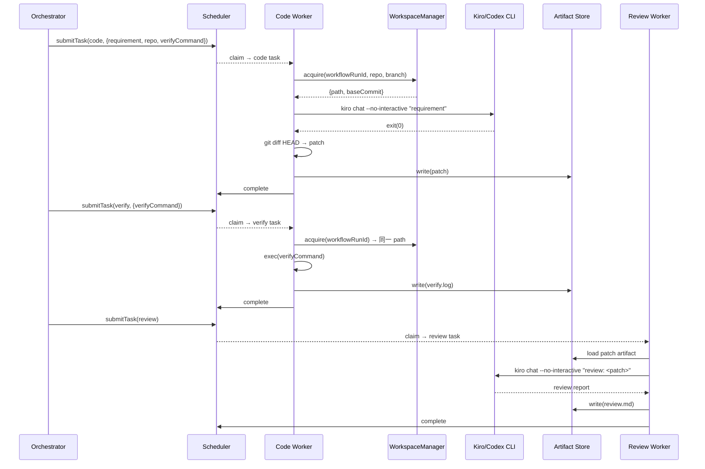
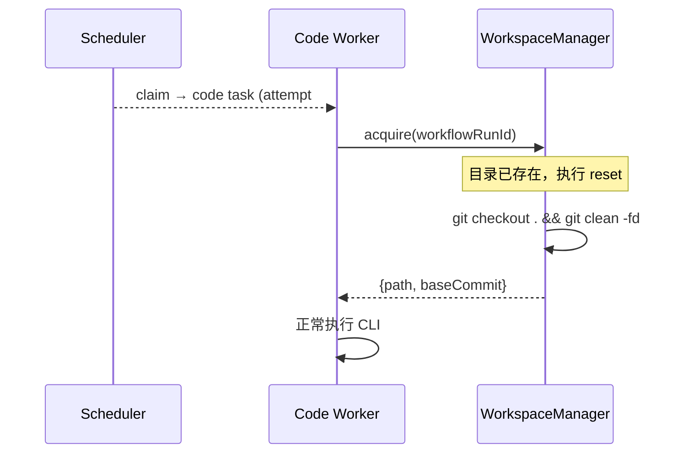

# 设计：Phase 2 真实 Code Worker 集成

## 背景

Phase 1 建立了完整的 mock 链路（code → verify → review + observability + scorecard）。本设计将 Worker 从 mock 模式升级为真实 CLI 调用模式，让平台能在真实仓库上生成代码修改并通过验证。

## 技术方案

### 数据模型

无新增数据库表。扩展 `workflow_runs.input` 的 JSON 结构：

```typescript
// workflow_runs.input 扩展
interface WorkflowInput {
  requirement: string;
  repository?: string;   // git clone URL（托管模式）
  branch?: string;       // 默认 "main"
  workDir?: string;      // 本地绝对路径（本地模式）
  verifyCommand?: string; // 验收命令，如 "pnpm test"
}
```

WorkspaceManager 内部状态（纯内存，不持久化）：

```typescript
// Map<workflowRunId, WorkspaceEntry>
interface WorkspaceEntry {
  path: string;           // 工作目录绝对路径
  mode: "local" | "cloned";
  baseCommit: string;     // clone/进入时的 HEAD commit
}
```

### 接口契约

**WorkspaceManager**（新增，`packages/runtime/src/workspace.ts`）：

```typescript
interface WorkspaceManager {
  acquire(params: {
    workflowRunId: string;
    repository?: string;
    branch?: string;
    workDir?: string;
  }): Promise<{ path: string; baseCommit: string }>;

  reset(workflowRunId: string): Promise<void>;
  release(workflowRunId: string): Promise<void>;
}
```

**CLI 选择器**（新增，`packages/runtime/src/cli-resolver.ts`）：

```typescript
// 返回可用 CLI 的命令前缀
function resolveCliCommand(preferred: string): string[];
// preferred="kiro" → 检测 PATH → 有则返回 ["kiro","chat","--no-interactive","--trust-all-tools"]
// 无则 fallback → ["codex","--quiet","--task"]
```

**Code Worker Handler 签名不变**（`(ctx: TaskContext) => Promise<TaskResult>`），内部逻辑重写。

### 核心流程



### 重试流程



## 影响范围

| 模块 | 路径 | 变更类型 | 说明 |
|------|------|----------|------|
| Runtime | `packages/runtime/src/workspace.ts` | 新增 | WorkspaceManager 实现 |
| Runtime | `packages/runtime/src/cli-resolver.ts` | 新增 | CLI 检测和 fallback 逻辑 |
| Runtime | `packages/runtime/src/index.ts` | 修改 | 导出新模块 |
| Code Worker | `workers/code-worker/src/index.ts` | 重写 | 分离 code/verify 逻辑，接入 WorkspaceManager |
| Review Worker | `workers/review-worker/src/index.ts` | 修改 | 加载前序 patch，改进 prompt |
| Orchestrator | `apps/orchestrator/src/index.ts` | 修改 | 传递 workflow input 中的 repo/verifyCommand 到 task params |
| E2E 测试 | `tests/e2e.test.ts` | 修改 | 新增真实 CLI 集成测试（需要可执行的 CLI） |
| E2E 测试 | `tests/e2e-real.test.ts` | 新增 | 独立的真实 CLI E2E（可选跳过） |

## 约束

- 继承 Phase 1 约束：单 PostgreSQL、单进程 Orchestrator、Worker 本地运行
- Kiro CLI / Codex CLI 必须在 Worker 宿主机 PATH 中可用
- 仓库认证使用宿主机 SSH agent 或 credential helper
- WorkspaceManager 纯内存状态，进程重启后工作目录需重新 acquire（重试机制会处理）
- 工作目录基础路径：`/tmp/ai-sdlc-workspaces/` （可通过环境变量覆盖）
- git 操作使用 shell 调用（不引入 git 库依赖）

## 迁移与兼容

不适用。无 schema 变更，workflow_runs.input 是 JSONB 字段，新字段自然兼容。

## 发布与回滚

- 发布：直接部署新版 Worker 二进制
- 回滚：回退到 mock-only 版本，`--mock` 参数继续可用
- 回滚触发：真实 CLI 调用成功率 < 50% 持续 30 分钟

## 观测性

已有 Phase 1 观测链路完全复用，无需新增：

- `context_loaded` evidence 记录 requirement + repository + commit
- `tool_called` evidence 记录 CLI 名称、status、durationMs
- `artifact_written` evidence 记录 patch/log/report ref
- `attempt_summary_report` 记录 finalStatus + durationMs
- `attempt_scorecard` 基于真实 durationMs 评分

新增日志点：
- WorkspaceManager clone/reset/release 操作记录（结构化日志）
- CLI resolver fallback 事件（warn 级别）

## 异常处理

| 异常 | 策略 | 重试 |
|------|------|------|
| git clone 失败（网络/认证） | 标记 infrastructure_error | ✓ 按 maxAttempts 重试 |
| Kiro CLI 超时 | 通过 CliRuntime timeout 机制终止进程 | ✓ 重试 |
| Kiro CLI 非零退出 | 标记 business_error，记录 stderr | ✓ 重试（可能是 flaky） |
| git diff 为空 | 标记 business_error "no changes generated" | ✓ 重试（不同 attempt 可能成功） |
| Kiro + Codex 均不在 PATH | 标记 infrastructure_error | ✗ 需人工修复环境 |
| verifyCommand 执行失败 | 标记 business_error，保存日志 | ✓ 重试（reset 后重新 code） |
| 工作目录丢失 | acquire 时检测并重新 clone | 自动恢复 |
| Observability 上报失败 | try-catch 吞错误，不阻塞执行 | 继承 Phase 1 行为 |
