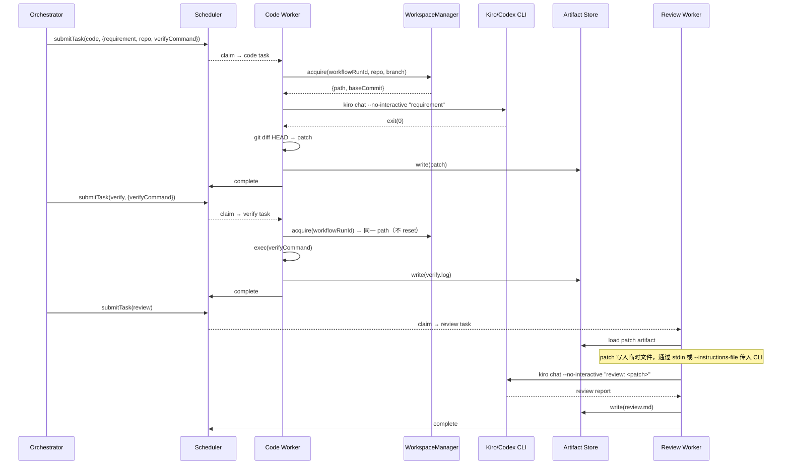
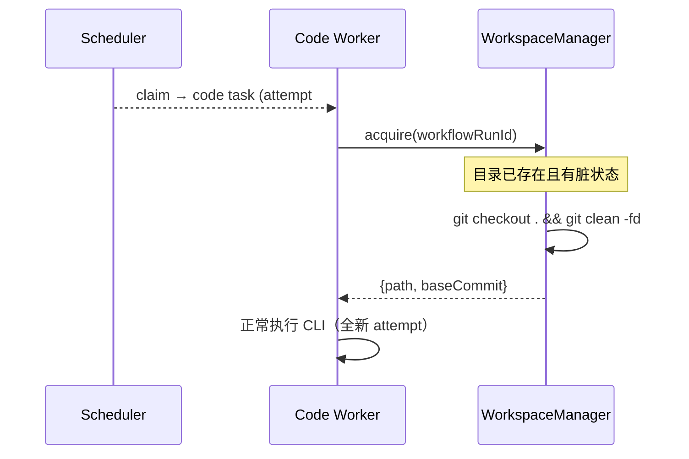
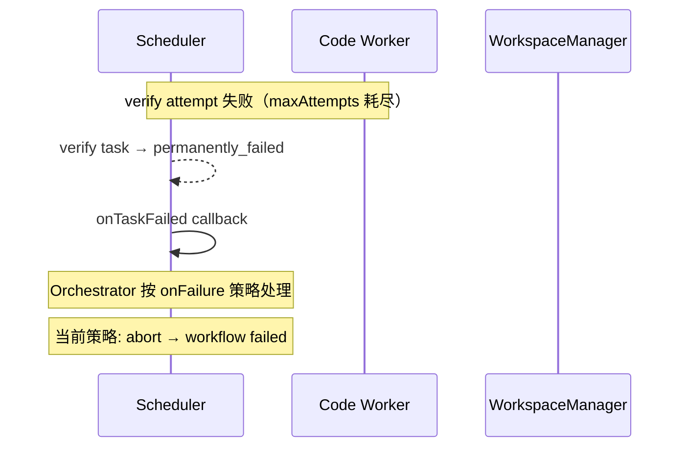

# 设计：Phase 2 真实 Code Worker 集成

## 背景

Phase 1 建立了完整的 mock 链路（code → verify → review + observability + scorecard）。本设计将 Worker 从 mock 模式升级为真实 CLI 调用模式，让平台能在真实仓库上生成代码修改并通过验证。

## 技术方案

### 数据模型

无新增数据库表。扩展 `workflow_runs.input` 的 JSON 结构：

```typescript
// workflow_runs.input 扩展
interface WorkflowInput {
  requirement: string;
  repository?: string;   // git clone URL（托管模式）
  branch?: string;       // 默认 "main"
  workDir?: string;      // 本地绝对路径（本地模式）
  verifyCommand?: string; // 验收命令，如 "pnpm test"
}
```

WorkspaceManager 内部状态（纯内存，不持久化）：

```typescript
// Map<workflowRunId, WorkspaceEntry>
interface WorkspaceEntry {
  path: string;           // 工作目录绝对路径
  mode: "local" | "cloned";
  baseCommit: string;     // clone/进入时的 HEAD commit
}
```

### 接口契约

**WorkspaceManager**（新增，`workers/code-worker/src/workspace.ts`）：

```typescript
interface WorkspaceManager {
  acquire(params: {
    workflowRunId: string;
    repository?: string;
    branch?: string;
    workDir?: string;
  }): Promise<{ path: string; baseCommit: string }>;

  reset(workflowRunId: string): Promise<void>;
  release(workflowRunId: string): Promise<void>;
}
```

**模块归属论证**：WorkspaceManager 放在 `workers/code-worker/` 而非 `packages/runtime/`，原因：

1. `packages/runtime` 的职责是"进程执行抽象"（spawn CLI、超时、取消），它不应知道 git 仓库的概念
2. WorkspaceManager 是"为 Code Worker 准备工作目录"的策略层，不同 Worker 可能有不同的工作目录需求（Review Worker 不需要 clone）
3. 若后续 Review Worker 也需要工作目录管理，再提取为 `packages/workspace` 共享模块（YAGNI）
4. 避免 Runtime 模块向"万能工具包"退化——保持模块职责单一

**CLI 选择器**（新增，`workers/code-worker/src/cli-resolver.ts`）：

```typescript
// 返回可用 CLI 的命令数组（启动时一次性检测，结果缓存）
function resolveCliCommand(preferred: string): Promise<string[]>;
// preferred="kiro" → which kiro → 有则返回 ["kiro","chat","--no-interactive","--trust-all-tools"]
// 无则检测 codex → ["codex","--quiet","--task"]
// 两者都无 → throw Error("NO_CLI_AVAILABLE")
```

检测时机：Worker 进程启动时调用一次，结果缓存在模块级变量中。不在每次 claim 时重复检测（避免 PATH 中途变化导致行为不一致）。

**Code Worker Handler 签名不变**（`(ctx: TaskContext) => Promise<TaskResult>`），内部逻辑重写。

### 安全：shell 注入防护

用户输入（repository URL、verifyCommand）直接用于 shell 命令，必须防护：

1. **repository URL**：WorkspaceManager 使用数组形式传递给 `spawn`（如 `spawn("git", ["clone", "--branch", branch, "--depth", "1", url, destPath])`），不通过 shell 字符串拼接。额外校验：URL 必须匹配 `^(https?://|git@|ssh://)` 格式，拒绝 `file://`、相对路径和含有 shell 元字符的输入。
2. **verifyCommand**：通过 `spawn("sh", ["-c", verifyCommand])` 执行——verifyCommand 由 workflow 提交者（平台操作者）控制，非外部用户输入。在 `POST /workflows` 输入校验中做基础 allowlist 检查（禁止 `rm -rf /`、`curl | sh` 等危险模式）
3. **所有 git 命令**：使用 `spawn` 数组形式，不使用 `exec` 或模板字符串拼接

### 核心流程



### 重试语义

重试发生在 **code step 级别**，不会单独重试 verify：

- Workflow 定义中 code 和 verify 是两个独立的 `task_run`
- 如果 **verify 失败**，Orchestrator 的 `onFailure` 策略决定行为：
  - 当前 workflow 定义使用 `onFailure: "abort"`（默认），整个 workflow 标记 failed
  - 后续可扩展为 `onFailure: "retry_from_code"`，重新提交 code task
- 如果 **code step 自身重试**（attempt 失败但未耗尽 maxAttempts），Scheduler 将 task 回到 ready，新 attempt claim 时 WorkspaceManager 执行 reset：



**关键区别**：
- **code step retry**：reset 工作目录 → 重新运行 CLI（合理，因为要重新生成代码）
- **verify step**：始终在 code 产出的工作目录上运行，不做 reset（verify 只读取 code 的产出）



## 影响范围

| 模块 | 路径 | 变更类型 | 说明 |
|------|------|----------|------|
| Code Worker | `workers/code-worker/src/workspace.ts` | 新增 | WorkspaceManager 实现 |
| Code Worker | `workers/code-worker/src/cli-resolver.ts` | 新增 | CLI 检测和 fallback 逻辑 |
| Code Worker | `workers/code-worker/src/delivery.ts` | 新增 | DeliveryManager（commit + push + gh pr create） |
| Code Worker | `workers/code-worker/src/index.ts` | 重写 | 分离 code/verify 逻辑，接入 WorkspaceManager |
| Review Worker | `workers/review-worker/src/index.ts` | 修改 | 加载前序 patch，改进 prompt |
| Orchestrator | `apps/orchestrator/src/index.ts` | 修改 | 传递 workflow input 中的 repo/verifyCommand 到 task params |
| E2E 测试 | `tests/e2e-real.test.ts` | 新增 | 独立的真实 CLI E2E（可选跳过） |

## 约束

- 继承 Phase 1 约束：单 PostgreSQL、单进程 Orchestrator、Worker 本地运行
- Kiro CLI / Codex CLI 必须在 Worker 宿主机 PATH 中可用
- 仓库认证使用宿主机 SSH agent 或 credential helper
- WorkspaceManager 纯内存状态，进程重启后工作目录需重新 acquire（重试机制会处理）
- 进程重启清理策略：启动时扫描 `WORKSPACE_BASE_PATH` 下的子目录，删除超过 24 小时未修改的目录（孤儿清理）
- 工作目录基础路径：`/tmp/ai-sdlc-workspaces/`（可通过 `WORKSPACE_BASE_PATH` 环境变量覆盖）
- 所有 shell 命令使用 `spawn` 数组形式，禁止字符串拼接

### PR 交付流程（DeliveryManager）

仅在满足条件时触发：`triggerType === "manual"` 且 `mode === "cloned"`（托管模式）。

**新增组件**：`workers/code-worker/src/delivery.ts`

```typescript
interface DeliveryManager {
  shouldDeliver(triggerType: string, mode: "local" | "cloned"): boolean;
  deliver(params: {
    workDir: string;
    branch: string;
    requirement: string;
    workflowRunId: string;
    reviewReport: string;
  }): Promise<{ prUrl?: string; error?: string }>;
}
```

**执行时机**：Orchestrator 在 review task completed 后、标记 workflow completed 前调用。

**分支命名**：`ai-sdlc/<workflowRunId 前 8 位>`，冲突时追加 `-<timestamp>`。

**Best-effort 语义**：PR 创建失败不阻塞 workflow 完成。记录警告，PR URL 为空。

**gh CLI 检测**：启动时一次性检测，不可用则跳过整个 deliver 流程。

## 迁移与兼容

不适用。无 schema 变更，workflow_runs.input 是 JSONB 字段，新字段自然兼容。

## 发布与回滚

- 发布：直接部署新版 Worker 二进制
- 回滚：回退到 mock-only 版本，`--mock` 参数继续可用
- 回滚触发：真实 CLI 调用成功率 < 50% 持续 30 分钟

## 观测性

已有 Phase 1 观测链路完全复用，无需新增 metrics：

- `context_loaded` evidence 记录 requirement + repository + commit
- `tool_called` evidence 记录 CLI 名称、status、durationMs
- `artifact_written` evidence 记录 patch/log/report ref
- `attempt_summary_report` 记录 finalStatus + durationMs
- `attempt_scorecard` 基于真实 durationMs 评分

新增结构化日志：
- WorkspaceManager clone/reset/release 操作（info 级别）
- CLI resolver fallback 事件（warn 级别）

## 异常处理

| 异常 | 策略 | 重试 |
|------|------|------|
| git clone 失败（网络/认证） | 标记 infrastructure_error | ✓ 按 maxAttempts 重试 |
| Kiro CLI 超时 | CliRuntime timeout → 进程 SIGTERM | ✓ 重试 |
| Kiro CLI 非零退出 | 标记 business_error，记录 stderr | ✓ 重试 |
| git diff 为空 | 标记 business_error "no changes generated" | ✓ 重试 |
| Kiro + Codex 均不在 PATH | 标记 infrastructure_error | ✗ 需人工修复 |
| verifyCommand 执行失败 | 标记 business_error，保存日志 | workflow 级别由 Orchestrator 策略决定 |
| 工作目录丢失 | acquire 时检测不存在 → 重新 clone | 自动恢复 |
| Observability 上报失败 | try-catch 不阻塞执行 | 继承 Phase 1 行为 |

## 验证方式

### 单元测试

| 组件 | 测试内容 | 方式 |
|------|----------|------|
| WorkspaceManager | acquire (clone/local)、reset、release、重入幂等 | 真实 git 操作 + 临时目录 |
| CLI Resolver | PATH 检测、fallback 逻辑、两者都不可用 | mock `which` 命令 |
| Code Worker handler | code step 产出 patch、verify step 执行命令 | mock CliRuntime + 真实 git repo |

### 集成测试

| 场景 | 测试内容 |
|------|----------|
| 完整 code → verify → review | 用真实 git 仓库 + mock CLI（返回固定 patch）验证全链路 |
| clone 失败重试 | 模拟网络错误 → 验证 infrastructure_error + 重试行为 |
| verify 失败 | 验证 workflow 标记 failed |
| observability 链路 | 验证 evidence + summary + scorecard 在真实执行中正常生成 |

### E2E 测试（可选，需要真实 CLI）

- `tests/e2e-real.test.ts`：调用真实 Kiro/Codex CLI 在测试仓库上执行
- 通过环境变量 `RUN_REAL_E2E=true` 控制是否执行
- CI 中默认跳过（需要 CLI 认证），本地开发可手动运行

## 备选方案

### 方案 A（已否决）：使用 isomorphic-git 替代 shell git

- **优势**：纯 JS 实现，无需依赖系统 git；类型安全；避免 spawn 的 shell 注入风险
- **否决原因**：
  1. isomorphic-git 不支持完整的 git 功能集（如 `git clean -fd`、sparse checkout）
  2. SSH 认证集成复杂，需要额外的 SSH agent 桥接
  3. 引入 ~2MB 依赖，且 LLM 训练数据中覆盖不如系统 git + spawn
  4. 系统 git 通过 spawn 数组形式调用已足够安全

### 方案 B（已否决）：不做，保持 mock-only

- **优势**：零开发成本；现有测试和 observability 链路不受影响
- **否决原因**：平台的核心价值是"自动化从需求到交付"，mock 模式无法真正交付业务价值。Phase 1 已证明链路可行，Phase 2 必须让真实 CLI 跑起来才能验证平台可用性。

### 方案 C（已否决）：WorkspaceManager 放在 packages/runtime

- **优势**：集中管理所有"执行环境准备"能力
- **否决原因**：Runtime 模块职责是"进程执行抽象"（spawn/timeout/cancel），不应耦合 git 仓库管理。WorkspaceManager 是 Worker 特有的执行策略，放 Runtime 会让该模块变成"万能工具包"，违反单一职责。

### 方案 D（已否决）：不保留工作目录，verify 时 apply patch

- **优势**：每个 step 完全无状态，便于分布式调度
- **否决原因**：
  1. apply patch 后文件状态可能与 code step 产出不一致（CLI 可能修改 lock files 等未 tracked 文件）
  2. verify 需要完整的 node_modules、编译产物等中间状态，仅 patch 不够
  3. Phase 2 是单 Worker 串行模型，无需为分布式做提前设计

### 方案 E（已否决）：不做 CLI fallback

- **优势**：实现更简单
- **否决原因**：开发环境可能没有 Kiro CLI（CI 只装了 Codex），fallback 成本极低但显著提升可用性
