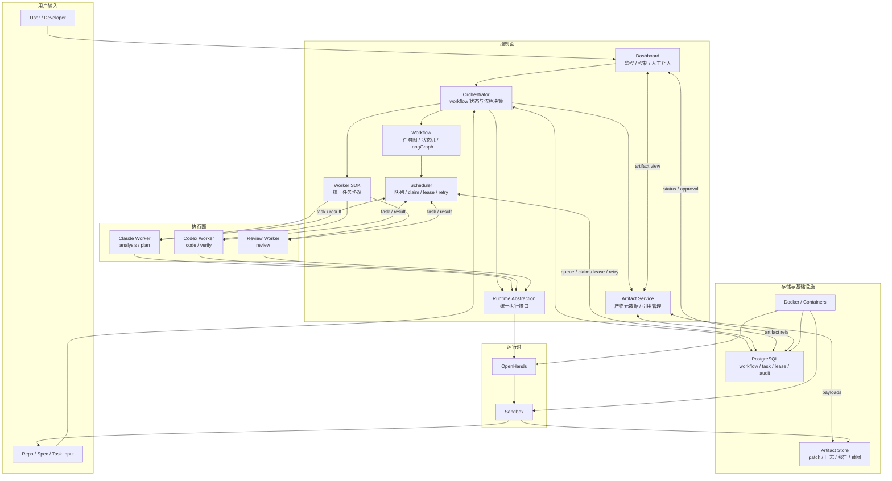
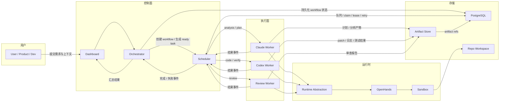
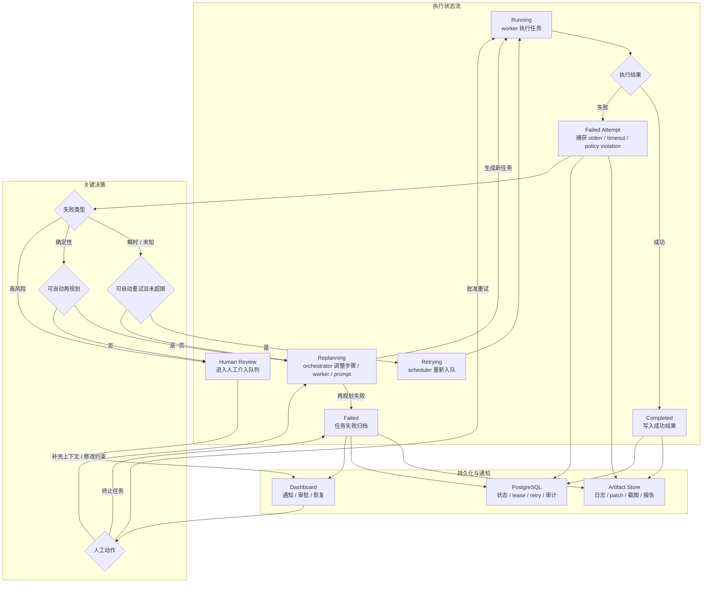
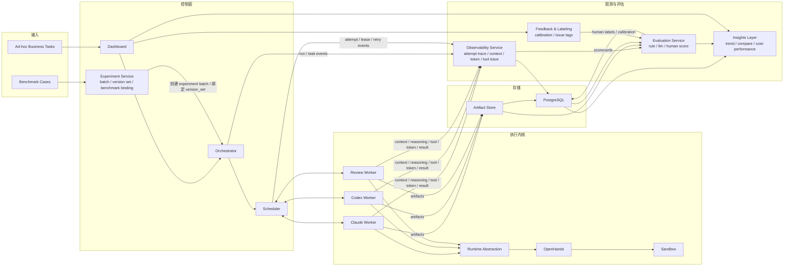

# AI SDLC 平台架构

本文档沉淀了当前仓库的推荐架构。它在现有 [README.md](/mnt/e/Codes/Yggdrasil-Labs/ai-sdlc-platform/README.md) 的轻量模块说明基础上，补全为一套可指导后续落地的系统视图。

## 目标

- 将编排、执行、运行时和存储职责明确分离。
- 通过稳定的 SDK 和运行时抽象，让 worker 可替换、可扩展。
- 通过持久化任务状态和产物，保留完整执行链路。
- 同时支持自动恢复和人工介入。
- 在业务交付链路之上补齐实验、观测和评估闭环，用于持续迭代 harness engineering、skill、worker 和模型配置。

## 分层架构

## 模块职责

### 控制面

- `apps/dashboard`
  - 面向用户的控制入口，负责任务提交、状态跟踪、审批、重试和人工介入。
- `apps/orchestrator`
  - 工作流状态的唯一拥有者；负责创建工作流实例、推进状态机、生成 ready task、接收执行事件、触发再规划或人工介入，并汇总最终结果。
- `packages/workflow`
  - 定义工作流状态流转、分支逻辑和节点依赖。
- `packages/scheduler`
  - 接收 orchestrator 提交的 ready task，并管理 PostgreSQL 持久化队列、claim、lease、超时回收、重试、优先级和并发；可以做基础设施级失败分类，但不拥有 workflow 状态，也不负责流程决策。
- `packages/artifact`
  - 存储 patch、日志、报告、截图和结构化输出，以及对应的元数据引用。
- `packages/worker-sdk`
  - 定义所有 worker 必须遵守的统一协议，包括任务 claim、lease 续租、输入输出、心跳和结果上报。
- `packages/runtime`
  - 在稳定执行接口后面屏蔽不同运行时的差异。

### 执行面

- `workers/claude-worker`
  - 负责需求整理、实现方案生成和非代码类推理任务。
- `workers/codex-worker`
  - 在可写环境中执行真实代码修改、命令运行和验证任务。
- `workers/review-worker`
  - 独立于生成 worker，对 patch 和验证结果做质量审查。

### 运行时层

- `runtimes/openhands`
  - 管理 agent 会话、工具执行生命周期以及与 sandbox 的交互。
- `runtimes/sandbox`
  - 为代码修改和验证命令提供隔离的文件系统与进程执行环境。

### 基础设施

- `infra/postgres`
  - 持久化工作流实例、任务状态、调度队列、lease、重试计数、产物索引和审计事件。
- `infra/docker`
  - 承载控制面服务和运行时依赖的部署定义。

## 平台模式

平台需要同时承担两种用途，但复用同一套执行内核：

- `delivery mode`
  - 面向真实业务需求自动化，目标是稳定交付、可追踪、可人工介入。
- `experiment mode`
  - 面向固定基准集或选定任务集反复执行，目标是比较不同 `skill`、`harness docs`、worker、模型和 runtime 配置的性价比，并沉淀可复用的调优结论。

两种模式共享 `orchestrator / scheduler / worker / runtime / artifact` 主链路，不维护两套执行系统；差异主要体现在任务来源、版本绑定、观测粒度、评分流程和控制面视图。

## 调度边界与投递语义

- `orchestrator` 独占 workflow 状态机和流程决策，`scheduler` 不扫描全局 workflow 状态，只消费被显式提交的 ready task。
- `scheduler` 对 workflow 保持轻度感知：知道任务类型、依赖元数据、优先级和重试策略，但不决定是否推进下游节点。
- worker 采用 pull 模型，从 `scheduler` 拉取并 claim 任务；`scheduler` 不主动维护 worker 长连接，也不直接推送任务。
- claim 通过 PostgreSQL 原子操作完成，并为运行中的任务生成 `lease_token`；只有持有当前有效 `lease_token` 的 worker 才能续租、上报完成或上报失败。
- 任务执行语义采用 `at-least-once`；因此 worker 处理逻辑、artifact 写入和 orchestrator 事件消费都必须具备幂等性，能够识别重复或迟到结果。
- 第一版 task 保持阶段级粒度，例如 `analysis`、`plan`、`code`、`verify`、`review`，先打通单条主路径，再考虑更细粒度的 DAG 拆分。

## 端到端主路径

### 主路径说明

1. 用户通过 dashboard 提交需求、仓库上下文和约束条件。
2. orchestrator 创建工作流实例，并持久化初始状态。
3. orchestrator 基于 workflow 状态机生成首批 ready task，并显式提交给 scheduler。
4. 对应类型的 worker 从 scheduler 拉取并 claim 任务；claim 成功后获得 `lease_token`，并在执行期间持续续租。
5. `claude-worker` 负责 `analysis` 和 `plan` 阶段，`codex-worker` 负责 `code` 和 `verify` 阶段，`review-worker` 负责 `review` 阶段。
6. scheduler 管理运行中任务的超时回收、重试回队和基础设施级失败分类，并将执行事件回传给 orchestrator。
7. orchestrator 消费任务完成或失败事件，决定是否推进下游节点、触发再规划、转入人工介入，或结束 workflow。
8. 所有 worker 的产物统一存储，并由 PostgreSQL 保存任务、lease、重试和 artifact 引用关系。
9. orchestrator 汇总执行结果，并将最终结论发布到 dashboard。

## 失败、重试与人工介入

### 失败处理规则

- 自动重试适用于超时、临时网络问题和短时运行时不稳定等瞬时故障。
- `scheduler` 可以先对超时、租约失效、运行时不可达和基础设施退出码等失败做基础设施级分类；是否再规划、改派 worker 或终止 workflow 由 `orchestrator` 决定。
- 自动再规划适用于可通过调整步骤、prompt 或 worker 分配来修复的确定性失败。
- 对于重复失败、策略违规、安全敏感操作和需要业务判断的情况，必须引入人工介入。
- 对于租约超时的运行中任务，`scheduler` 应回收 claim、增加 `retry_count`，并按策略重新入队；迟到结果不得覆盖新的有效执行。
- 所有失败路径都必须在 artifact 中保留执行证据，并在 PostgreSQL 中保留状态历史。

## 实验与评估扩展

### 扩展目标

- 将平台从“可执行工作流”扩展为“可执行、可观测、可评估、可对比”的实验操作台。
- 支持在同一需求或同一基准集上重复运行，并比较不同方法版本与执行版本的表现差异。
- 让 `skill`、`harness docs`、worker、模型和 runtime 的调整都能被量化，并能回溯到具体执行证据。

### 增量模块

- `observability service`
  - 采集和索引 `workflow_run / task_run / worker_attempt` 的执行证据，不负责评分。
  - 重点记录上下文快照、思考过程、tool trace、token/cost、执行时间、重试与租约事件、artifact 引用。
- `evaluation service`
  - 在观测证据之上生成 `scorecard`，内部包含规则评分、LLM 评分和人工校准入口。
  - 不直接参与执行链路，避免评分逻辑污染主流程。
- `experiment service`
  - 管理 `benchmark_case`、`experiment_batch` 和 `version_set`，负责批量创建 `workflow_run`。
  - 用于让实验运行和业务运行共享同一执行内核。
- `feedback & labeling`
  - 为高价值样本补充人工标签和校准结论，例如“上下文污染”“skill 使用不当”“harness docs 缺约束”“worker 推理冗长”。
- `insights layer`
  - 面向趋势、对比和性价比分析，回答“哪个 worker 最划算”“哪个 skill 版本提升通过率”“哪个模型在特定阶段最值”等问题。

### 核心对象

- `benchmark_case`
  - 固定基准任务，包含需求描述、仓库上下文、约束、验收命令和重点关注项。
- `experiment_batch`
  - 一次实验批次，表示“在一组 benchmark 上运行某组方法版本和执行版本”。
- `workflow_run`
  - 一次完整需求实现；既可以来自实验批次，也可以来自临时业务任务。
- `task_run`
  - workflow 内的阶段级任务；第一版保持 `analysis / plan / code / verify / review` 粗粒度。
- `worker_attempt`
  - 评分和观测的原子单位，表示某个 worker 对某个 `task_run` 的一次真实执行。
- `version_set`
  - 运行绑定的实验版本快照，拆成两条独立版本轴：
  - `method_version`：系统级 skill、项目级 skill、harness docs、prompt、policy。
  - `execution_version`：worker 实现、模型、runtime、toolchain、参数配置。
- `scorecard`
  - 评分结果对象，分为 `attempt_scorecard`、`task_scorecard` 和 `run_scorecard`。

### 默认观测范围

增强采集默认开启，至少覆盖以下证据：

- `execution trace`
  - 排队、claim、开始、结束、lease 续租、重试、退出状态和失败分类。
- `cost trace`
  - prompt tokens、completion tokens、总 token、估算成本、工具调用次数、外部 API 次数。
- `context trace`
  - system prompt、项目级 skill、系统级 skill、harness docs、附加上下文和输入任务快照。
- `reasoning trace`
  - 完整思考过程或尽可能完整的推理证据，并附结构化摘要用于检索和评分。
- `tool trace`
  - 命令、文件读取、文件修改、测试执行、patch、stdout/stderr 摘要。
- `artifact trace`
  - 计划文档、patch、测试结果、审查报告、最终结论及其引用关系。

### 评分模型

- 评分主键为 `worker_attempt`，在此基础上聚合出 task 和 workflow 层评分。
- 评分采用混合模式：
  - `rule score`
    - 评估效率、成本、稳定性和通过率等可计算指标。
  - `llm score`
    - 评估过程质量、上下文利用质量和产出质量。
  - `human score`
    - 用于关键样本校准、争议样本修正和高质量基准沉淀。
- 建议至少覆盖 5 个评分维度：
  - `efficiency`
  - `cost`
  - `stability`
  - `process_quality`
  - `output_quality`
- 所有评分都必须附带证据引用和评分解释，不能只保留总分。

### 控制面视图

- `run detail`
  - 查看单次 `workflow_run` 的时间线、阶段流转、artifact 和总成本。
- `worker attempt review`
  - 回放单次 `worker_attempt` 的上下文、思考过程、tool trace、token、产物和评分。
- `experiment compare`
  - 对比不同 `version_set` 在同一 benchmark 上的通过率、均分、平均 token、平均耗时和单位成功成本。
- `evaluation queue`
  - 承接需要人工校准的样本，例如高成本低质量、规则分与 LLM 分差异过大、关键 benchmark 首次失败等情况。

### 优先实现范围

优先落地实验平台能力，而不是先做完整业务交付面：

1. `experiment service`
   - 支持固定基准集、实验批次和 `version_set` 绑定。
2. `observability service`
   - 先打通 `worker_attempt` 级别的上下文、reasoning、tool trace、token/cost 和 artifact 采集。
3. `evaluation service`
   - 先实现规则评分和基础 LLM 评分，人工校准以后补全。
4. `dashboard`
   - 优先实现 `worker attempt review` 和 `experiment compare` 两类视图。
5. `delivery mode`
   - 作为共享执行内核保留，但不作为第一阶段的产品重心。

## 建议的持久化状态字段

任务跟踪建议至少包含以下字段：

- `status`
- `lease_token`
- `lease_expires_at`
- `retry_count`
- `failure_type`
- `failure_reason`
- `human_action_required`
- `last_artifact_id`
- `resolution_note`

## 建议的下一步文档

- workflow、task、artifact、audit 等表的数据模型和实体关系文档。
- orchestrator、scheduler 和 worker SDK 的 API 协议文档。
- sandbox 资源准备和命令隔离的运行时执行契约文档。
- experiment、attempt、scorecard、feedback 等表的数据模型与索引设计文档。
- 评分 rubric、人工校准规则和 experiment compare 指标定义文档。
