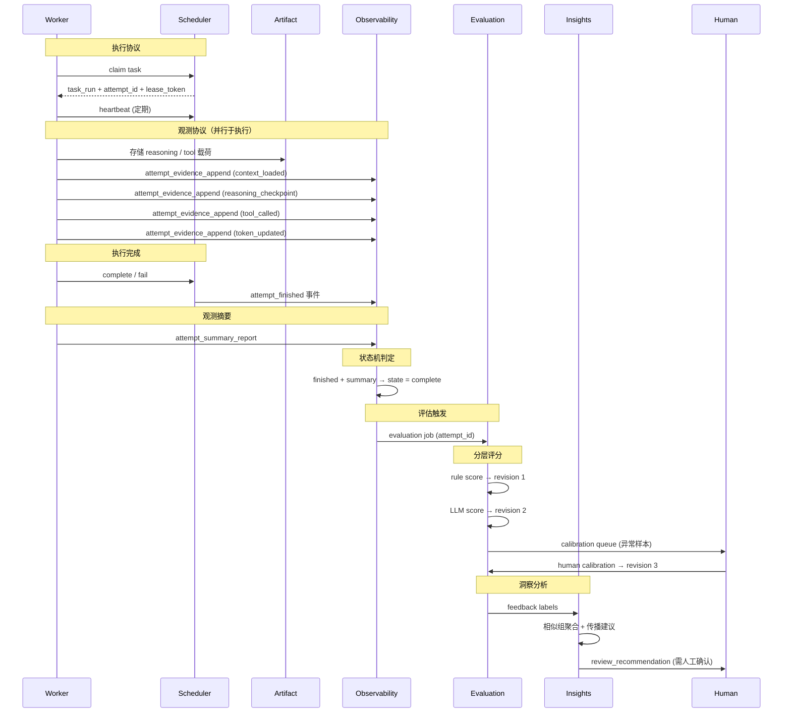
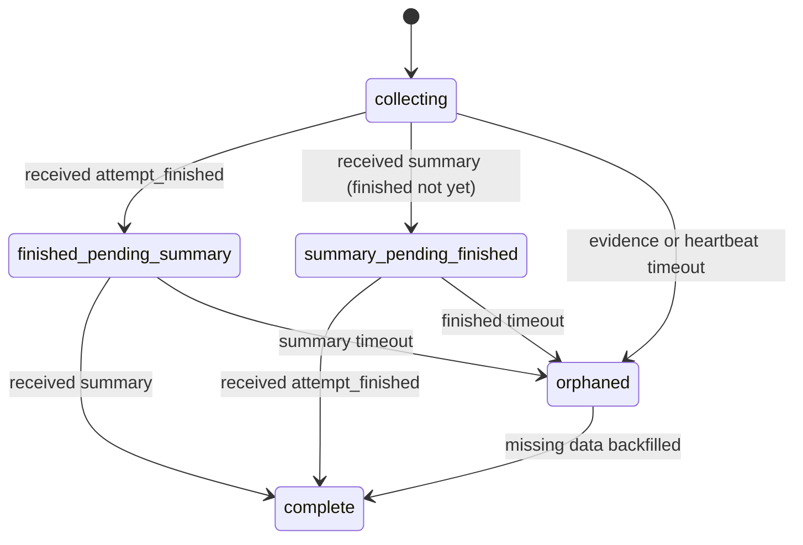

# Worker Attempt 观测与评估架构

## 背景与目标

平台已经明确同时服务两类场景：

- `delivery mode`：面向真实业务需求的自动化交付
- `experiment mode`：面向 benchmark 和版本对比的持续调优

如果没有稳定的 `worker_attempt` 观测与评估链路，平台只能知道任务是否完成，却无法稳定回答以下问题：

- 某次 attempt 实际加载了哪些上下文、做了哪些关键推理、调用了哪些工具、消耗了多少时间和 token
- 同一 `benchmark_case` 在不同 `version_set` 下，具体是哪个环节变好或变差
- 低分或异常结果应该归因到 `skill`、`harness docs`、worker 行为，还是 benchmark 本身

本设计把 `worker_attempt` 从隐式日志概念提升为正式架构对象，并定义从执行、观测、评估、人工校准到标签传播建议的一条稳定架构链路。

## 设计原则

1. `worker_attempt` 是执行内核正式对象，不允许只在日志或 trace 中隐式存在。
2. 执行协议与观测协议必须分层，避免 `scheduler` 承载大体量 reasoning / tool payload。
3. 观测系统只描述事实，不负责最终判断；评估系统只生成判断，不回写执行事实。
4. 评分建立在可回放证据之上，不能只保留总分。
5. 评估链路异步触发，不阻塞执行和观测入库主链路。
6. 标签传播只能给出建议，不能自动把单次问题升级为版本级或基准级结论。

## 核心对象模型

### 执行内核对象

| 实体 | 关键字段 | 说明 |
|------|----------|------|
| `workflow_run` | `id`, `version_set_id`, `status` | 一次完整需求执行 |
| `task_run` | `id`, `workflow_run_id`, `task_type`, `status` | workflow 中的阶段级任务 |
| `worker_attempt` | `id`, `task_run_id`, `implementation`, `status`, `lease_token`, `started_at`, `finished_at`, `was_orphaned` | 单次真实执行主体 |

### 观测对象

| 实体 | 关键字段 | 说明 |
|------|----------|------|
| `attempt_evidence_event` | `event_id`, `attempt_id`, `sequence_no`, `event_type`, `payload_ref`, `occurred_at` | attempt 级高价值增量事件 |
| `attempt_summary_report` | `attempt_id`, `final_status`, `token_totals`, `cost_totals`, `tool_stats`, `artifact_refs`, `checkpoint_digest`, `final_conclusion` | attempt 结束后的观测摘要 |
| `attempt_observability_record` | `attempt_id`, `state`, `last_evidence_at`, `finished_at`, `summary_received_at`, `was_orphaned` | observability 聚合状态 |

### 实验控制对象

| 实体 | 关键字段 | 说明 |
|------|----------|------|
| `version_set` | `id`, `method_version`, `execution_version`, `default_weight_template` | 运行身份快照 |
| `benchmark_case` | `id`, `task_type`, `weight_overrides` | 可重复比较的任务样本 |

### 评估对象

| 实体 | 关键字段 | 说明 |
|------|----------|------|
| `attempt_scorecard` | `attempt_id`, `latest_revision_id`, `state` | attempt 评分主记录 |
| `attempt_scorecard_revision` | `id`, `attempt_id`, `source`, `trigger`, `weight_snapshot`, `dimension_scores`, `total_score`, `model_or_rubric_version`, `created_by`, `created_at` | 评分 revision 历史 |
| `feedback_label` | `id`, `target_type`, `target_id`, `reason_code`, `created_by`, `evidence_refs` | 问题标签 |
| `label_propagation_suggestion` | `id`, `target_level`, `reason_code`, `similarity_group`, `hit_count`, `hit_ratio`, `representative_attempt_refs`, `review_recommendation` | 标签传播建议 |

### 聚合评分对象（Phase 2 展开）

| 实体 | 聚合来源 | 说明 |
|------|----------|------|
| `task_scorecard` | 同一 `task_run` 下所有 `attempt_scorecard` | 取最终成功 attempt 的分数；若多次重试，保留最佳分与重试惩罚因子 |
| `run_scorecard` | 同一 `workflow_run` 下所有 `task_scorecard` | 按 task_type 加权聚合；具体权重和聚合公式在 Phase 2 设计时定义 |

> 本文档第一版聚焦 `attempt_scorecard`，`task_scorecard` 和 `run_scorecard` 的完整聚合规则将在 Phase 2 的 evaluation 设计中展开。此处仅声明其存在和基本聚合方向，确保与 `ARCHITECTURE.md` 中的评估对象模型一致。

## 协议分层

### 执行协议

执行协议只承载 attempt 生命周期推进：

- `claim`
- `heartbeat`
- `complete`
- `fail`
- `expire`

### 观测协议

观测协议独立承载证据上报：

- `attempt_evidence_append`
- `attempt_summary_report`

`scheduler` 负责 attempt 状态事实；`artifact` 与 `observability` 负责 attempt 证据负载；两者通过 `attempt_id` 和 `version_set_id` 关联。

## 端到端流程图

从 Worker 执行到最终 Scorecard 产出的完整数据流：



## 观测事件模型

### 高价值事件白名单

第一版仅保留以下 `event_type`：

- `context_loaded`
- `reasoning_checkpoint`
- `tool_called`
- `artifact_written`
- `token_updated`
- `attempt_finished`

### 事件标识与顺序语义

```ts
type AttemptEvidenceEvent = {
  event_id: string;     // 由 attempt_id + sequence_no + event_type 派生
  attempt_id: string;
  sequence_no: number;  // worker 在单个 attempt 内本地递增
  event_type: string;
  occurred_at: string;
  payload_ref?: string;
};
```

- 所有事件都必须携带 `attempt_id + sequence_no + event_id`
- `observability` 允许乱序接收，但必须支持幂等去重和重排
- `sequence_no` 由 worker 本地分配，`scheduler` 不参与

### `reasoning_checkpoint` 形态

第一版采用双轨证据：

- `raw_reasoning_ref`
- `structured_checkpoint`

```ts
type StructuredCheckpoint = {
  goal: string;
  hypothesis: string;
  decision: string;
  evidence: string;
  next_step: string;
  risk: string;
};
```

### `tool_called` 负载

```ts
type ToolCalledPayload = {
  tool_name: string;
  started_at: string;
  finished_at: string;
  status: "success" | "failed";
  args_summary?: string;
  result_summary?: string;
  error_summary?: string;
  artifact_refs: string[];
};
```

## Attempt Summary

`attempt_finished` 是执行语义事件；`attempt_summary_report` 是观测语义文档。两者允许乱序到达，但只有都到位时，attempt 才能进入完整观测状态。

```ts
type AttemptSummaryReport = {
  attempt_id: string;
  task_run_id: string;
  worker_id: string;
  version_set_id: string;
  final_status: "completed" | "failed" | "expired";
  started_at: string;
  finished_at: string;
  duration_ms: number;
  token_totals: TokenTotals;
  cost_totals: CostTotals;
  tool_stats: ToolStats;
  artifact_refs: string[];
  failure_type?: string;
  failure_reason?: string;
  checkpoint_digest: string;
  final_conclusion: string;
};
```

`checkpoint_digest` 由 `observability` 基于 `reasoning_checkpoint` 事件聚合生成，worker 不直接负责最终摘要汇总。

**Phase 1 聚合策略**：按 `sequence_no` 升序取所有 `reasoning_checkpoint` 事件的 `decision` 字段，以换行符拼接。若总长度超过 2000 字符，截断并追加 `[truncated, {total_count} checkpoints]`。Phase 2 可升级为 LLM 摘要。

**边界情况处理**：

- 若 attempt 无任何 `reasoning_checkpoint` 事件，`checkpoint_digest` 为空字符串 `""`，不阻塞 summary 完整性判定
- 若聚合过程失败（如事件格式异常），`checkpoint_digest` 设为 `"[aggregation_failed]"` 并记录错误日志，同样不阻塞 summary 入库
- 评估链路在 `checkpoint_digest` 为空或聚合失败时，`process_quality` 维度降级为仅基于 `tool_stats` 和 `token_totals` 评分

## Observability 状态机



状态说明：

- `collecting`：持续接收增量证据
- `finished_pending_summary`：已收到 `attempt_finished`，等待 summary
- `summary_pending_finished`：已收到 `attempt_summary_report`，等待 `attempt_finished`
- `complete`：`attempt_finished` 和 `attempt_summary_report` 都齐备，可进入评估
- `orphaned`：证据长时间不完整

进入 `complete` 的唯一条件：`attempt_finished` 事件和 `attempt_summary_report` 文档都已到达。两者允许以任意顺序到达，先到的一方使状态进入对应的 pending 中间态，后到的一方触发跳转到 `complete`。

补充规则：

- `orphaned` 不是终态，后续补齐后自动恢复为 `complete`
- 恢复后必须保留历史标记，例如 `was_orphaned` 与恢复时间
- orphan 判定由 `observability` 自己维护，不属于调度状态
- 超时策略挂在 `implementation` 上；运行中看最后一条 `heartbeat/evidence`，结束后看 `attempt_finished` 后是否及时收到 summary

**Orphan backfill 触发来源**：

| 来源 | 说明 |
|------|------|
| Worker 补发 | Worker 重连后重新上报丢失的 `attempt_finished` 或 `attempt_summary_report`（最常见） |
| 定时重试扫描 | `observability` 定期（默认 5min）扫描 orphaned 记录，对仍在 lease 内的 attempt 重新拉取 summary |
| 人工注入 | 通过 admin API 手动标记某 attempt 为 complete 并附加理由（仅限 debug 场景） |

backfill 后状态机直接跳转到 `complete`，触发正常的评估流程。

## 评估触发与 Scorecard 模型

### 触发时机

- 只有当 attempt 观测状态进入 `complete`
- `observability` 才投递异步 `evaluation job`
- `evaluation` 消费后产出正式 `attempt_scorecard`

### 分层完成语义

- `rule score` 成功后，生成基础 scorecard
- `llm score` 成功后，追加增强 revision
- human calibration 再追加人工 revision

### Revision 模型

```ts
type AttemptScorecardRevision = {
  id: string;
  attempt_id: string;
  source: "rule" | "llm" | "human";
  trigger: "attempt_complete" | "llm_retry" | "manual_calibration";
  model_or_rubric_version: string;
  created_by: "system" | "worker" | "human_reviewer";
  created_at: string;
  weight_snapshot: WeightSnapshot;
  dimension_scores: {
    efficiency: number;
    cost: number;
    stability: number;
    process_quality: number;
    output_quality: number;
  };
  total_score: number;
};
```

### 评分维度定义

| 维度 | 含义 | 评分锚点 |
|------|------|----------|
| `efficiency` | 完成任务的步骤精简程度和时间效率 | 高分：最少步骤达成目标；低分：冗余循环、无效重试 |
| `cost` | token 消耗和 API 调用的经济性 | 高分：在合理 token 预算内完成；低分：大量无效 token 消耗 |
| `stability` | 执行过程的可靠性和可重复性 | 高分：无异常中断、无 orphan；低分：频繁超时、heartbeat 丢失 |
| `process_quality` | 推理链路的结构化程度和决策质量 | 高分：假设清晰、验证充分、工具使用合理；低分：盲目试错、跳过验证 |
| `output_quality` | 最终产物（代码/报告）的正确性和完整性 | 高分：通过验收、覆盖边界情况；低分：产物缺失、验证失败 |

所有维度评分范围为 `[0.0, 1.0]`，`total_score` 为加权求和（权重来自 `weight_snapshot`）。

**Rule score 计算规则**：

Phase 1 的 `rule` source 评分基于确定性公式，不涉及 LLM 判断：

| 维度 | 计算方式 |
|------|----------|
| `efficiency` | `1.0 - clamp(actual_steps / expected_steps_budget, 0, 2) / 2`；`expected_steps_budget` 由 `benchmark_case` 或 `task_type` 默认值提供 |
| `cost` | `1.0 - clamp(actual_tokens / token_budget, 0, 2) / 2`；`token_budget` 由 `version_set` 配置 |
| `stability` | 基于布尔扣分：orphaned(-0.5)、heartbeat_gap > 2x interval(-0.3)、retry_count > 0(-0.2 * count)，下限 0.0 |
| `process_quality` | `checkpoint_count > 0 ? clamp(valid_checkpoints / total_checkpoints, 0, 1) : 0.5`（降级基准分） |
| `output_quality` | 基于 `final_status`：completed=1.0, failed=0.0；若有验收命令结果则按通过率计算 |

具体阈值和 budget 默认值定义在 `packages/worker-sdk` 的 `scoring-rules.ts` 中（Phase 1 实现时创建）。LLM score 和 human calibration 可覆盖 rule score 的结果。

约束：

- `attempt_scorecard` 采用“稳定主键 + revision 历史”模型
- revision 同时保存维度分、总分和 `weight_snapshot`
- 历史 revision 不因后续全局权重变化而回写

## 权重、Rubric 与评分包

### 权重规则

- `version_set` 提供默认评分权重模板
- `benchmark_case` 只允许覆盖 `process_quality` 与 `output_quality`
- 覆盖后系统自动归一化到总和 `1.0`
- 最终完整结果写入 `weight_snapshot`

### Rubric 合成顺序

1. `global base rubric`
2. `worker type addendum`
3. `task type addendum`

附加条款只允许补充 `process_quality` 与 `output_quality` 的说明和关注点，不允许新增/删除维度或直接改权重。

### 存储位置

| 配置项 | 存储位置 | 说明 |
|--------|----------|------|
| `global base rubric` | `packages/evaluation/rubrics/base.yaml` | 全局评分规则和维度描述，版本化在仓库中 |
| `worker type addendum` | `packages/evaluation/rubrics/{implementation}.yaml` | 每种 Worker implementation 的评分补充条款 |
| `task type addendum` | `packages/evaluation/rubrics/tasks/{task_type}.yaml` | 每种任务类型的评分补充条款 |
| `default_weight_template` | `packages/evaluation/weights/default.yaml` | 默认维度权重模板，`version_set` 创建时复制为快照 |

**版本化规则**：

- rubric 和 weight 文件都纳入 Git 版本管理
- `version_set.default_weight_template` 字段存储模板名称（如 `"default"`），创建 `version_set` 时从对应 yaml 文件读取权重并写入 DB 作为不可变快照
- 修改 rubric/weight 文件不影响已有 `version_set`，只影响后续新建的 `version_set`

### LLM 评分输入

- 主输入：结构化评分包
- 辅输入：按需截断的原文引用

原文引用由 `observability` 按规则挑选，不由 worker 或 evaluation 临时拼装。

## Human Calibration

### 触发条件

第一版至少包括：

- `rule score` 与 `llm score` 差异过大
- `llm score` 失败或返回不合规
- 异常样本且属于高价值 benchmark
- 总分或关键维度分落入低分区间
- `was_orphaned = true`
- 新 `version_set` 首次进入实验批次

“差异过大”同时看：

- 总分差值
- 关键维度差值：`process_quality`、`output_quality`

### 校准边界

- 允许修改维度分和总分
- 必须填写结构化理由和自由文本备注
- 不允许修改 `weight_snapshot`

```ts
type CalibrationReason = {
  reason_code: string;
  affected_dimensions: string[];
  evidence_refs: string[];
  reviewer_note: string;
};
```

第一版核心 `reason_code`：

- `context_misuse`
- `reasoning_weak`
- `reasoning_overlong`
- `tool_misuse`
- `artifact_incomplete`
- `verification_misread`
- `review_judgment_misaligned`
- `score_conflict_resolution`
- `other`

同一套 `reason_code` 同时供 human calibration 与 feedback labels 复用。

## 标签传播建议

### 挂载与传播规则

- 标签主挂载对象：`worker_attempt`
- 扩展挂载对象：`version_set`、`benchmark_case`
- attempt 标签默认不自动升级
- 传播建议由 `evaluation / insights` 生成，最终由人类确认

### 相似组定义

基础相似键：

- 同一 `benchmark_case`
- 同一 `task_type`
- 同一 `implementation`

增强约束：

- 同一 `version_set`：用于判断版本级重复问题
- 跨 `version_set`：用于判断 benchmark 级重复问题

### 传播建议阈值

- 使用“计数阈值 + 占比阈值”双阈值
- 阈值风格采用平衡型
- 刷新策略采用“时间 + 数量”双触发
- 只做增量重算，不做全量扫描

**第一版参考范围**（通过配置管理，可按 `implementation` 覆盖）：

| 参数 | 默认值 | 说明 |
|------|--------|------|
| `min_hit_count` | 3 | 相似组内最少命中次数 |
| `min_hit_ratio` | 0.5 | 相似组内命中占比下限 |
| `refresh_interval` | 1h | 时间触发：定期重算间隔 |
| `refresh_batch_size` | 20 | 数量触发：新增 N 条标签后触发重算 |

阈值调整策略：初期偏保守（宁可漏报不误报），根据人工确认率逐步放宽。

建议内容至少包含：

- `target_level`
- `reason_code`
- `similarity_group`
- `hit_count`
- `hit_ratio`
- `affected_dimensions`
- `representative_attempt_refs`
- `review_recommendation`

## 架构边界

### 分层职责

| 层 | 模块路径 | 职责 | 依赖方向 |
|----|----------|------|----------|
| `artifact` | `packages/artifact` | 原始证据载荷与引用 | 无外部依赖 |
| `observability` | `packages/observability` | 证据索引、时间线、回放与聚合状态 | artifact, worker-sdk |
| `evaluation` | `packages/evaluation` | 规则分、LLM 分、人工校准与 scorecard revision | observability, artifact |
| `insights` | `packages/insights` | 相似组、传播建议、趋势分析与性价比洞察 | evaluation, observability |

### 约束规则

- `artifact` 不做评分
- `observability` 不做最终判断
- `evaluation` 不写执行事实
- `dashboard` 只消费读模型，不自己拼分析逻辑

### 横切关注点注入

遵循 `ARCHITECTURE.md` 的"横切关注点通过统一接口注入"约束，本设计涉及的日志与遥测按以下方式注入：

- **结构化日志**：各层通过 `packages/worker-sdk` 导出的 `Logger` 接口注入，不直接依赖具体日志实现
- **观测事件上报**：worker 通过 `ObservabilityReporter` 接口（由 worker-sdk 定义）上报证据，具体传输实现（HTTP / 队列）由运行时配置决定
- **遥测（Phase 2+ OTel）**：预留 `TelemetryProvider` 接口占位，Phase 1 为 no-op 实现，Phase 4 替换为 OpenTelemetry SDK

注入点统一在模块初始化时通过构造函数或工厂方法传入，禁止模块内部自行实例化横切依赖。

## 反模式

| 反模式 | 为什么禁止 |
|--------|-----------|
| 把 reasoning / tool payload 塞进 scheduler 执行协议 | scheduler 职责是 attempt 生命周期推进，承载大体量观测负载会导致调度延迟和耦合膨胀 |
| evaluation 直接修改 attempt 状态或执行事实 | 违反"观测只描述事实、评估只生成判断"的分层原则，破坏证据不可变性 |
| worker 自行生成 scorecard 或写入评分 | 评分必须由独立的 evaluation 链路异步产出，worker 只负责上报证据 |
| dashboard 自己拼评分/分析逻辑 | dashboard 只消费读模型；分析逻辑属于 insights 层，避免前端成为隐式业务逻辑容器 |
| 跳过 observability 状态机直接触发评估 | 证据不完整时评分不可靠，必须等 `complete` 状态才投递 evaluation job |
| 用自由文本字段替代结构化 evidence event | 无法支持回放、索引和自动化评分，退化为日志 |

## 降级策略

当 observability 系统本身不可用时，执行链路不被阻塞：

| 场景 | 降级行为 | 恢复策略 |
|------|----------|----------|
| 观测事件入库失败 | Worker 本地缓存事件（最多 100 条），重试 3 次后丢弃并在 attempt 上标记 `observability_degraded` | 恢复后不补发已丢弃事件，scorecard 基于不完整证据评分（`process_quality` 维度降权） |
| Summary report 投递失败 | 标记 attempt 为 `finished_pending_summary`，进入 orphan 超时流程 | 恢复后 worker 补发或定时扫描触发重新生成 |
| Evaluation 服务不可用 | 完整观测数据正常入库，evaluation job 进入重试队列 | 恢复后批量消费积压 job，不丢数据 |
| observability + evaluation 全部不可用 | delivery mode 完全不受影响（attempt 生命周期由 scheduler 独立管理）；experiment mode 暂停评分 | 恢复后从最后一条已处理记录开始追赶 |

**核心保证**：observability 不可用绝不阻塞 `scheduler` 的 claim / complete / expire 流程。执行链路和观测链路的故障域完全隔离。

## 兼容性与发布策略

- 旧 worker 可以暂不发送观测事件，但其 attempt 不参与完整评分链路
- 第一版通过 capability flag 区分：
  - `attempt_observability_v1`
  - `attempt_evaluation_v1`
- 发布按 `worker_type` 分批启用：先 `codex-worker`，后 `review-worker`
- 回滚通过 feature flag 关闭，不删除已落库证据和 scorecard revision

## 适用范围

### 约束适用（必须遵守本文规则）

- `packages/worker-sdk`：attempt 观测协议类型定义
- `packages/scheduler`：attempt 生命周期与观测状态机衔接
- `packages/artifact`：证据载荷存储
- `workers/codex-worker`、`workers/review-worker`：证据上报实现
- `apps/orchestrator`：评估触发与 scorecard 消费

### 实现涉及（需要改动的模块）

- `packages/worker-sdk`
- `packages/scheduler`
- `packages/artifact`
- `packages/runtime`
- `workers/codex-worker`
- `workers/review-worker`
- `apps/orchestrator`
- `apps/dashboard`
- `infra/postgres`
- `ARCHITECTURE.md`
- `docs/DOMAINS.md`

## 参考

- `ARCHITECTURE.md`
- `docs/DOMAINS.md`
- `docs/design-docs/arch-dual-track-roadmap.md`
- `docs/RELIABILITY.md`
