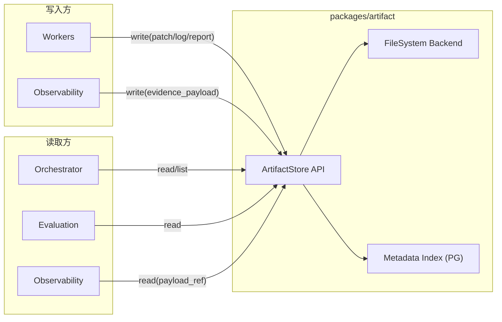

# Artifact — 产物管理设计

## 背景与动机

平台执行过程中产生大量产物（patch、日志、审查报告、reasoning 载荷等）。Artifact 包为所有模块提供统一的产物存储和检索接口，屏蔽存储后端差异。

## 设计原则

1. **统一接口**：所有产物通过 ArtifactStore API 存取，禁止直接文件操作
2. **后端可插拔**：Phase 1 本地文件系统，Phase 2+ 支持 S3/GCS
3. **元数据索引**：产物元数据写入 PostgreSQL，支持按 workflow/task/attempt/type 查询

## 公开接口

```ts
interface ArtifactStore {
  write(params: WriteParams): Promise<ArtifactRef>;
  read(ref: ArtifactRef): Promise<ArtifactContent>;
  list(query: ArtifactQuery): Promise<ArtifactRef[]>;
  delete(ref: ArtifactRef): Promise<void>;
}

interface WriteParams {
  content: Buffer | string;
  metadata: ArtifactMetadata;
}

interface ArtifactMetadata {
  artifactType: ArtifactType;
  workflowRunId: string;
  taskRunId?: string;
  attemptId?: string;
  filename: string;
  mimeType: string;
  sizeBytes: number;
}

type ArtifactType = "patch" | "log" | "review_report" | "reasoning_payload" | "evidence_payload";

type ArtifactRef = string; // 格式: "{artifactType}/{workflowRunId}/{taskRunId}/{filename}"

interface ArtifactContent {
  data: Buffer;
  metadata: ArtifactMetadata;
}

interface ArtifactQuery {
  workflowRunId?: string;
  taskRunId?: string;
  attemptId?: string;
  artifactType?: ArtifactType;
}
```

## 架构图



## 存储路径结构

```
artifacts/
├── patch/{workflowRunId}/{taskRunId}/{filename}
├── log/{workflowRunId}/{taskRunId}/{filename}
├── review_report/{workflowRunId}/{taskRunId}/{filename}
├── reasoning_payload/{workflowRunId}/{taskRunId}/{filename}
└── evidence_payload/{workflowRunId}/{taskRunId}/{filename}
```

## 与其他模块的关系

- 被 workers 调用（写入 patch、日志、报告）
- 被 observability 调用（存储大载荷证据，返回 `payload_ref`）
- 被 orchestrator 调用（读取审查报告用于决策）
- 不依赖任何其他 workspace 包

## Phase 1 范围

| 包含 | 不包含（Phase 2+）|
|------|-------------------|
| write / read / list | GC / 过期清理 |
| 本地文件系统后端 | S3 / GCS 后端 |
| PostgreSQL 元数据索引 | 全文检索 |
| 基本 delete | 压缩 / 加密 |

## 反模式

| 反模式 | 为什么禁止 |
|--------|-----------|
| 直接读写文件系统绕过 ArtifactStore | 破坏元数据一致性，无法追踪产物来源 |
| 在 artifact 中做评分或业务判断 | artifact 只管存取，不做业务逻辑 |

## 参考

- `ARCHITECTURE.md`
- `docs/design-docs/arch-attempt-observability-evaluation.md`
