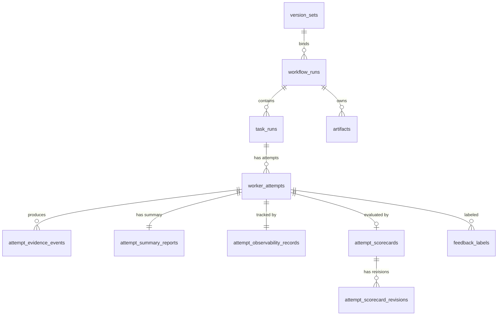

# Infra/Postgres — 数据库设计

## 背景与动机

平台所有模块共享一个 PostgreSQL 实例，表结构是跨模块的硬契约。本文档定义完整 DDL、索引策略和迁移管理方案。

## 设计原则

1. **单一数据库**：Phase 1 所有模块共享一个实例
2. **UUID 主键**：所有表主键使用 uuid，应用层生成
3. **时间戳标准化**：所有时间字段使用 timestamptz
4. **不使用软删除**：直接删除 + 归档表（Phase 2）
5. **部分索引优化**：高频查询使用 WHERE 条件限缩索引范围

## ER 关系图



## 完整 DDL

```sql
-- ============================================================
-- 元表：迁移版本管理
-- ============================================================

CREATE TABLE schema_migrations (
  version     int PRIMARY KEY,
  filename    varchar(256) NOT NULL,
  applied_at  timestamptz NOT NULL DEFAULT now()
);

-- ============================================================
-- 领域：实验控制
-- ============================================================

CREATE TABLE version_sets (
  id                      uuid PRIMARY KEY,
  method_version          jsonb NOT NULL,
  execution_version       jsonb NOT NULL,
  default_weight_template varchar(64) NOT NULL DEFAULT 'default',
  created_at              timestamptz NOT NULL DEFAULT now()
);

-- ============================================================
-- 领域：工作流编排 (orchestrator)
-- ============================================================

CREATE TABLE workflow_runs (
  id                      uuid PRIMARY KEY,
  version_set_id          uuid NOT NULL REFERENCES version_sets(id),
  workflow_definition_id  varchar(128) NOT NULL DEFAULT 'default',
  status                  varchar(32) NOT NULL DEFAULT 'created',
  trigger_type            varchar(32) NOT NULL,
  trigger_ref             varchar(256),
  input                   jsonb NOT NULL,
  result                  jsonb,
  current_step_id         varchar(128),
  completed_steps         jsonb NOT NULL DEFAULT '[]',
  created_at              timestamptz NOT NULL DEFAULT now(),
  updated_at              timestamptz NOT NULL DEFAULT now(),
  finished_at             timestamptz
);

CREATE INDEX idx_workflow_runs_status ON workflow_runs(status);
CREATE INDEX idx_workflow_runs_version_set ON workflow_runs(version_set_id);
CREATE INDEX idx_workflow_runs_created_at ON workflow_runs(created_at DESC);

CREATE TABLE processed_events (
  event_id      varchar(256) PRIMARY KEY,
  processed_at  timestamptz NOT NULL DEFAULT now()
);

-- ============================================================
-- 领域：任务调度 (scheduler)
-- ============================================================

CREATE TABLE task_runs (
  id                      uuid PRIMARY KEY,
  workflow_run_id          uuid NOT NULL REFERENCES workflow_runs(id),
  task_type               varchar(32) NOT NULL,
  status                  varchar(32) NOT NULL DEFAULT 'ready',
  priority                int NOT NULL DEFAULT 0,
  max_attempts            int NOT NULL DEFAULT 3,
  current_attempt_count   int NOT NULL DEFAULT 0,
  timeout_ms              int NOT NULL DEFAULT 300000,
  params                  jsonb,
  created_at              timestamptz NOT NULL DEFAULT now(),
  updated_at              timestamptz NOT NULL DEFAULT now()
);

CREATE INDEX idx_task_runs_claimable ON task_runs(status, priority DESC, created_at ASC)
  WHERE status = 'ready';
CREATE INDEX idx_task_runs_workflow ON task_runs(workflow_run_id);

CREATE TABLE worker_attempts (
  id                  uuid PRIMARY KEY,
  task_run_id         uuid NOT NULL REFERENCES task_runs(id),
  worker_id           varchar(128) NOT NULL,
  implementation      varchar(32) NOT NULL,
  version_set_id      uuid NOT NULL REFERENCES version_sets(id),
  status              varchar(32) NOT NULL DEFAULT 'claimed',
  attempt_number      int NOT NULL,
  lease_token         varchar(128) NOT NULL UNIQUE,
  lease_expires_at    timestamptz NOT NULL,
  last_heartbeat_at   timestamptz,
  started_at          timestamptz NOT NULL DEFAULT now(),
  finished_at         timestamptz,
  failure_type        varchar(64),
  failure_reason      text,
  was_orphaned        boolean NOT NULL DEFAULT false
);

CREATE INDEX idx_attempts_lease_expiry ON worker_attempts(lease_expires_at)
  WHERE status IN ('claimed', 'running');
CREATE INDEX idx_attempts_task_run ON worker_attempts(task_run_id);
CREATE INDEX idx_attempts_worker ON worker_attempts(worker_id);

-- ============================================================
-- 领域：产物管理 (artifact)
-- ============================================================

CREATE TABLE artifacts (
  id                uuid PRIMARY KEY,
  ref               varchar(512) NOT NULL UNIQUE,
  artifact_type     varchar(64) NOT NULL,
  workflow_run_id   uuid NOT NULL REFERENCES workflow_runs(id),
  task_run_id       uuid REFERENCES task_runs(id),
  attempt_id        uuid REFERENCES worker_attempts(id),
  filename          varchar(256) NOT NULL,
  mime_type         varchar(128) NOT NULL,
  size_bytes        bigint NOT NULL,
  storage_path      varchar(1024) NOT NULL,
  created_at        timestamptz NOT NULL DEFAULT now()
);

CREATE INDEX idx_artifacts_workflow ON artifacts(workflow_run_id);
CREATE INDEX idx_artifacts_task ON artifacts(task_run_id);
CREATE INDEX idx_artifacts_attempt ON artifacts(attempt_id);
CREATE INDEX idx_artifacts_type ON artifacts(artifact_type);

-- ============================================================
-- 领域：观测 (observability)
-- ============================================================

CREATE TABLE attempt_evidence_events (
  event_id        varchar(256) PRIMARY KEY,
  attempt_id      uuid NOT NULL REFERENCES worker_attempts(id),
  sequence_no     int NOT NULL,
  event_type      varchar(64) NOT NULL,
  occurred_at     timestamptz NOT NULL,
  payload_ref     varchar(512),
  payload_inline  jsonb,
  ingested_at     timestamptz NOT NULL DEFAULT now()
);

CREATE INDEX idx_evidence_attempt_seq ON attempt_evidence_events(attempt_id, sequence_no);
CREATE INDEX idx_evidence_attempt_type ON attempt_evidence_events(attempt_id, event_type);

CREATE TABLE attempt_summary_reports (
  attempt_id        uuid PRIMARY KEY REFERENCES worker_attempts(id),
  task_run_id       uuid NOT NULL,
  worker_id         varchar(128) NOT NULL,
  version_set_id    uuid NOT NULL,
  final_status      varchar(32) NOT NULL,
  started_at        timestamptz NOT NULL,
  finished_at       timestamptz NOT NULL,
  duration_ms       int NOT NULL,
  token_totals      jsonb NOT NULL,
  cost_totals       jsonb NOT NULL,
  tool_stats        jsonb NOT NULL,
  artifact_refs     jsonb NOT NULL DEFAULT '[]',
  failure_type      varchar(64),
  failure_reason    text,
  checkpoint_digest text NOT NULL DEFAULT '',
  final_conclusion  text NOT NULL DEFAULT '',
  received_at       timestamptz NOT NULL DEFAULT now()
);

CREATE TABLE attempt_observability_records (
  attempt_id            uuid PRIMARY KEY REFERENCES worker_attempts(id),
  state                 varchar(32) NOT NULL DEFAULT 'collecting',
  evidence_count        int NOT NULL DEFAULT 0,
  last_evidence_at      timestamptz,
  finished_received_at  timestamptz,
  summary_received_at   timestamptz,
  was_orphaned          boolean NOT NULL DEFAULT false,
  orphaned_at           timestamptz,
  restored_at           timestamptz,
  created_at            timestamptz NOT NULL DEFAULT now(),
  updated_at            timestamptz NOT NULL DEFAULT now()
);

CREATE INDEX idx_obs_records_state ON attempt_observability_records(state)
  WHERE state != 'complete';

-- ============================================================
-- 领域：评估 (evaluation) — Phase 1 schema 预留
-- ============================================================

CREATE TABLE attempt_scorecards (
  attempt_id          uuid PRIMARY KEY REFERENCES worker_attempts(id),
  latest_revision_id  uuid,
  state               varchar(32) NOT NULL DEFAULT 'pending',
  created_at          timestamptz NOT NULL DEFAULT now(),
  updated_at          timestamptz NOT NULL DEFAULT now()
);

CREATE TABLE attempt_scorecard_revisions (
  id                      uuid PRIMARY KEY,
  attempt_id              uuid NOT NULL REFERENCES attempt_scorecards(attempt_id),
  source                  varchar(16) NOT NULL,
  trigger                 varchar(64) NOT NULL,
  weight_snapshot         jsonb NOT NULL,
  dimension_scores        jsonb NOT NULL,
  total_score             numeric(4,3) NOT NULL,
  model_or_rubric_version varchar(128) NOT NULL,
  created_by              varchar(64) NOT NULL,
  created_at              timestamptz NOT NULL DEFAULT now()
);

CREATE INDEX idx_scorecard_revisions_attempt ON attempt_scorecard_revisions(attempt_id, created_at DESC);

CREATE TABLE feedback_labels (
  id              uuid PRIMARY KEY,
  target_type     varchar(32) NOT NULL,
  target_id       uuid NOT NULL,
  reason_code     varchar(64) NOT NULL,
  created_by      varchar(64) NOT NULL,
  evidence_refs   jsonb NOT NULL DEFAULT '[]',
  created_at      timestamptz NOT NULL DEFAULT now()
);

CREATE INDEX idx_feedback_labels_target ON feedback_labels(target_type, target_id);
CREATE INDEX idx_feedback_labels_reason ON feedback_labels(reason_code);

-- ============================================================
-- 领域：实验控制 — Phase 1 schema 预留
-- ============================================================

CREATE TABLE benchmark_cases (
  id                uuid PRIMARY KEY,
  task_type         varchar(32) NOT NULL,
  name              varchar(256) NOT NULL,
  description       text,
  input             jsonb NOT NULL,
  weight_overrides  jsonb,
  created_at        timestamptz NOT NULL DEFAULT now()
);

-- ============================================================
-- 领域：观测 → 评估 异步桥接
-- ============================================================

CREATE TABLE pending_eval_jobs (
  id            uuid PRIMARY KEY,
  attempt_id    uuid NOT NULL REFERENCES worker_attempts(id),
  trigger       varchar(64) NOT NULL,
  status        varchar(32) NOT NULL DEFAULT 'ready',
  retries       int NOT NULL DEFAULT 0,
  max_retries   int NOT NULL DEFAULT 3,
  created_at    timestamptz NOT NULL DEFAULT now(),
  updated_at    timestamptz NOT NULL DEFAULT now()
);

CREATE INDEX idx_pending_eval_jobs_status ON pending_eval_jobs(status)
  WHERE status IN ('pending', 'processing');
```

## 索引策略说明

| 索引 | 目的 | 查询场景 |
|------|------|----------|
| `idx_task_runs_claimable` | Claim 高频查询 | 部分索引，只含 ready 状态 |
| `idx_attempts_lease_expiry` | LeaseReaper 扫描 | 部分索引，只含活跃 attempt |
| `idx_evidence_attempt_seq` | 时间线查询 | 按 attempt 顺序获取证据 |
| `idx_obs_records_state` | OrphanReaper 扫描 | 部分索引，排除已完成 |
| `idx_pending_eval_jobs_status` | Eval job 消费 | 部分索引，只含待处理 |

## 迁移策略

| 决策 | 选择 | 理由 |
|------|------|------|
| 工具 | 自定义 SQL 文件 + 版本号 | Phase 1 表少，无需 ORM 框架复杂性 |
| 文件命名 | `{NNN}_{description}.sql` | 简单递增，按顺序执行 |
| 执行方式 | `scripts/migrate.sh` | 读取未执行迁移，记录到 schema_migrations |
| 回滚 | `{NNN}_{description}.down.sql` | 只在开发环境使用 |

## 目录结构

```
infra/postgres/
├── migrations/
│   ├── 001_initial_schema.sql
│   └── 001_initial_schema.down.sql
├── seeds/
│   └── dev_seed.sql
└── scripts/
    └── migrate.sh
```

## Phase 1 范围

| 包含 | 不包含（Phase 2+）|
|------|-------------------|
| 全部核心表 DDL | 分库分表 |
| 部分索引优化 | 读写分离 |
| 简单迁移脚本 | ORM 迁移框架 |
| dev seed 数据 | 生产备份恢复策略 |
| 外键约束 | 最终一致性（去外键）|

## 参考

- `ARCHITECTURE.md`
- `docs/design-docs/scheduler.md`
- `docs/design-docs/orchestrator.md`
- `docs/design-docs/observability.md`
- `docs/design-docs/artifact.md`
