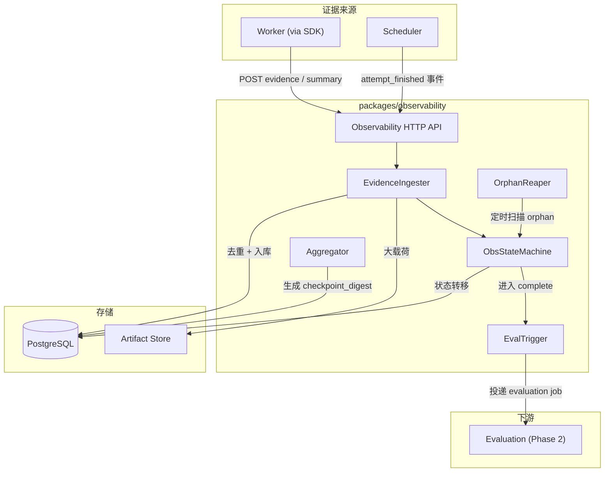
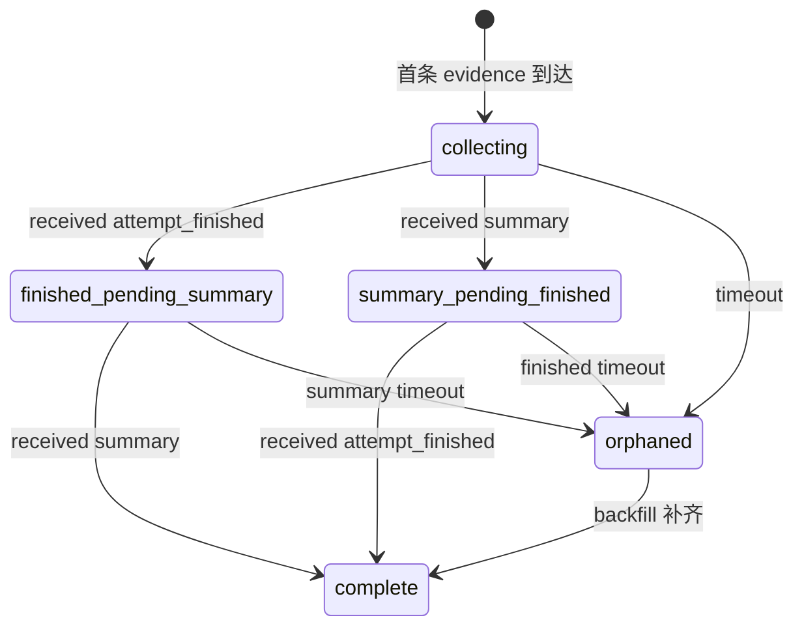

# Observability — 观测服务设计

## 背景与动机

Observability 是 Phase 1 最小实验闭环的关键路径。它负责接收 Worker 上报的证据事件和 Summary Report，维护 attempt 的观测状态机，在数据齐备时触发评估链路。它是"执行事实"到"评估判断"之间的桥梁。

## 设计原则

1. **只描述事实，不做判断**：索引和聚合证据，不产出评分
2. **不阻塞执行链路**：observability 不可用时，scheduler 的 claim/complete/expire 不受影响
3. **幂等接收**：支持乱序、重复投递的证据事件（通过 event_id 去重）
4. **状态机驱动**：attempt 观测状态由明确的状态机管理
5. **大载荷外置**：大体量 payload 存入 Artifact，observability 只保留引用

## 核心架构图



## 核心类型定义

```ts
type ObservabilityState =
  | "collecting"
  | "finished_pending_summary"
  | "summary_pending_finished"
  | "complete"
  | "orphaned";

interface AttemptObservabilityRecord {
  attemptId: string;
  state: ObservabilityState;
  evidenceCount: number;
  lastEvidenceAt?: string;
  finishedReceivedAt?: string;
  summaryReceivedAt?: string;
  wasOrphaned: boolean;
  orphanedAt?: string;
  restoredAt?: string;
  createdAt: string;
  updatedAt: string;
}

interface StoredEvidenceEvent {
  eventId: string;
  attemptId: string;
  sequenceNo: number;
  eventType: EvidenceEventType;
  occurredAt: string;
  payloadRef?: string;
  payloadInline?: unknown;
  ingestedAt: string;
}

interface StoredSummaryReport {
  attemptId: string;
  taskRunId: string;
  workerId: string;
  versionSetId: string;
  finalStatus: string;
  startedAt: string;
  finishedAt: string;
  durationMs: number;
  tokenTotals: { input: number; output: number; total: number };
  costTotals: { totalUsd: number };
  toolStats: { totalCalls: number; successCount: number; failedCount: number };
  artifactRefs: string[];
  failureType?: string;
  failureReason?: string;
  checkpointDigest: string;
  finalConclusion: string;
  receivedAt: string;
}
```

## Observability HTTP API

| 操作 | 方法 | 路径 | 说明 |
|------|------|------|------|
| 批量上报证据 | POST | `/attempts/{attemptId}/evidence` | Worker 调用 |
| 上报 Summary | POST | `/attempts/{attemptId}/summary` | Worker 调用 |
| attempt 结束通知 | POST | `/attempts/{attemptId}/finished` | Scheduler 调用 |
| 查询观测状态 | GET | `/attempts/{attemptId}/status` | 查询 |
| 查询证据时间线 | GET | `/attempts/{attemptId}/timeline` | 查询 |
| 查询 summary | GET | `/attempts/{attemptId}/summary` | 查询 |

## 状态机



### 状态转移表

| 当前状态 | 事件 | 目标状态 |
|----------|------|----------|
| (不存在) | evidence 到达 | collecting |
| collecting | attempt_finished | finished_pending_summary |
| collecting | summary 到达 | summary_pending_finished |
| finished_pending_summary | summary 到达 | complete |
| summary_pending_finished | attempt_finished | complete |
| collecting | timeout | orphaned |
| finished_pending_summary | summary timeout | orphaned |
| summary_pending_finished | finished timeout | orphaned |
| orphaned | 缺失数据到达 | complete |

## EvidenceIngester 逻辑

```
function ingestEvidence(attemptId, events[]):
  deduplicated = events.filter(e => !existsInDB(e.eventId))
  for each event in deduplicated:
    if event.payload size > INLINE_THRESHOLD (4KB):
      ref = artifactStore.write(event.payload)
      event.payloadRef = ref
      event.payloadInline = null
    else:
      event.payloadInline = event.payload
    insert into attempt_evidence_events
  
  updateObsRecord(attemptId):
    evidenceCount += deduplicated.length
    lastEvidenceAt = max(events.occurredAt)
    if state == null → state = "collecting"
  
  return { accepted: deduplicated.length, duplicates: events.length - deduplicated.length }
```

## Aggregator — checkpoint_digest 生成

触发时机：summary 入库时，如果 `checkpointDigest` 为空字符串则自动计算。

```
function generateCheckpointDigest(attemptId):
  checkpoints = query reasoning_checkpoint events ORDER BY sequence_no ASC
  if checkpoints.length == 0: return ""
  decisions = checkpoints.map(c => c.payload.decision)
  digest = decisions.join("\n")
  if digest.length > 2000:
    digest = digest.substring(0, 2000) + "\n[truncated, {count} checkpoints]"
  return digest
```

## OrphanReaper

| 参数 | 默认值 | 说明 |
|------|--------|------|
| `scanIntervalMs` | 300000 (5min) | 扫描间隔 |
| `collectingTimeoutMs` | 600000 (10min) | collecting 无新证据超时 |
| `summaryTimeoutMs` | 300000 (5min) | finished 后等 summary 超时 |
| `finishedTimeoutMs` | 300000 (5min) | summary 后等 finished 超时 |
| `batchSize` | 20 | 单次扫描批次 |

## EvalTrigger

状态机进入 `complete` 时自动触发：
- Phase 1：写入 `pending_eval_jobs` 表
- Phase 2：投递异步 job 到消息队列

降级：evaluation 服务不可用时，job 留在 pending 表中等待重试。

## 配置项汇总

| 配置项 | 类型 | 默认值 | 说明 |
|--------|------|--------|------|
| `port` | number | 8002 | HTTP 服务端口 |
| `db.connectionString` | string | 必填 | PostgreSQL 连接串 |
| `db.poolSize` | number | 10 | 连接池大小 |
| `artifact.baseUrl` | string | 必填 | Artifact 服务地址 |
| `inlinePayloadThreshold` | number | 4096 | 内联载荷阈值（bytes）|
| `orphanReaper.scanIntervalMs` | number | 300000 | 扫描间隔 |
| `orphanReaper.collectingTimeoutMs` | number | 600000 | collecting 超时 |
| `orphanReaper.summaryTimeoutMs` | number | 300000 | 等 summary 超时 |
| `orphanReaper.finishedTimeoutMs` | number | 300000 | 等 finished 超时 |
| `orphanReaper.batchSize` | number | 20 | 扫描批次 |
| `eval.baseUrl` | string | 可选 | Evaluation 服务地址 |
| `eval.retryMaxAttempts` | number | 3 | eval job 重试次数 |

## Phase 1 范围

| 包含 | 不包含（Phase 2+）|
|------|-------------------|
| 证据接收 + 去重 + 存储 | 实时流式查询 |
| Summary 接收 + 存储 | Summary 自动生成 |
| 状态机完整实现 | 多实例协调 |
| OrphanReaper 扫描 | 分布式定时任务 |
| checkpoint_digest 聚合 | LLM 摘要升级 |
| 时间线查询 API | 全文检索 / 回放 UI |
| EvalTrigger 投递 | 异步消息队列 |
| 内联/外置载荷分流 | 压缩 / 加密 |

## 反模式

| 反模式 | 为什么禁止 |
|--------|-----------|
| Observability 修改 attempt 执行状态 | 执行状态归 Scheduler 管 |
| 跳过状态机直接触发评估 | 证据不完整时评分不可靠 |
| Worker 直接写证据到数据库 | 必须通过 API 确保去重和状态机一致 |
| 所有载荷都内联存储 | 大载荷外置到 Artifact |
| Observability 阻塞 Scheduler API | 两者故障域隔离 |

## 参考

- `ARCHITECTURE.md`
- `docs/design-docs/arch-attempt-observability-evaluation.md`
- `docs/design-docs/worker-sdk.md`
