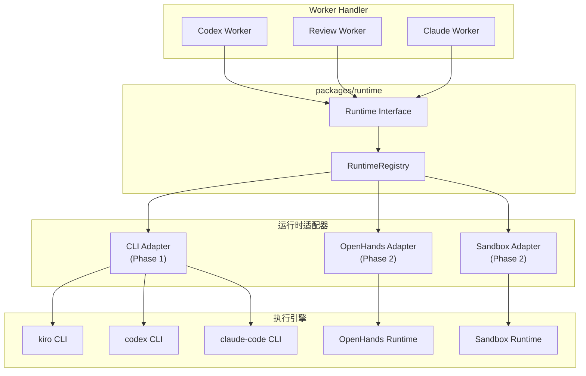
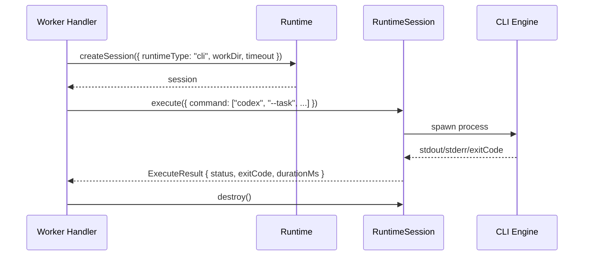

# Runtime — 运行时抽象设计

## 背景与动机

Worker 的底层执行引擎多样（Kiro CLI、Codex CLI、Claude Code CLI、OpenHands Agent），Runtime 包提供统一的执行接口，屏蔽具体运行时差异，让 Worker 只关注任务逻辑。

## 设计原则

1. **接口统一**：所有运行时实现同一个 Runtime / RuntimeSession 接口
2. **与 worker-sdk 平级**：两者互不依赖，Worker 同时导入两者
3. **可取消**：通过 AbortSignal 传播取消信号
4. **适配器模式**：具体运行时实现在 `runtimes/` 目录，packages/runtime 只定义接口和注册表

## 公开接口

```ts
interface Runtime {
  createSession(config: SessionConfig): Promise<RuntimeSession>;
}

interface RuntimeSession {
  execute(request: ExecuteRequest): Promise<ExecuteResult>;
  destroy(): Promise<void>;
}

interface SessionConfig {
  runtimeType: RuntimeType;
  workDir: string;
  timeout: number;
  env?: Record<string, string>;
  abortSignal?: AbortSignal;
}

type RuntimeType = "openhands" | "sandbox" | "cli";

interface ExecuteRequest {
  command?: string[];
  task?: string;
  context?: Record<string, unknown>;
  timeoutMs?: number;
}

interface ExecuteResult {
  status: "success" | "failed" | "timeout" | "cancelled";
  exitCode?: number;
  stdout?: string;
  stderr?: string;
  artifacts?: string[];
  durationMs: number;
}
```

## 架构图



## 执行时序



## 实现结构

- `packages/runtime/` — 接口定义 + RuntimeRegistry
- `runtimes/openhands/` — OpenHands Agent 适配器（Phase 2）
- `runtimes/sandbox/` — 隔离沙箱适配器（Phase 2）

## 与其他模块的关系

- 被 workers 调用（handler 内部通过 runtime.execute() 执行实际任务）
- 与 worker-sdk 平级，两者互不依赖
- 不依赖任何其他 workspace 包

## Phase 1 范围

| 包含 | 不包含（Phase 2+）|
|------|-------------------|
| CLI runtime type（进程调用） | OpenHands 适配器 |
| AbortSignal 取消支持 | Sandbox 隔离 |
| 超时管理 | 资源限制（CPU/内存） |
| RuntimeRegistry 注册表 | 动态加载适配器 |

## 反模式

| 反模式 | 为什么禁止 |
|--------|-----------|
| Worker 直接 spawn 进程绕过 Runtime | 绕开了超时管理、取消传播和后续运行时切换能力 |
| 在 Runtime 中实现业务逻辑 | Runtime 只负责"怎么跑"，"跑什么"是 Worker 的决策 |
| worker-sdk 依赖 runtime 或反之 | 两者平级，通过 Worker 组合使用 |

## 参考

- `ARCHITECTURE.md`
- `docs/design-docs/worker-sdk.md`
