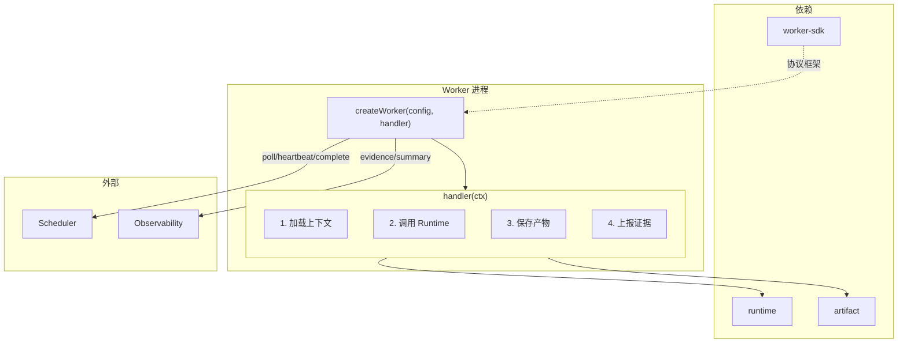
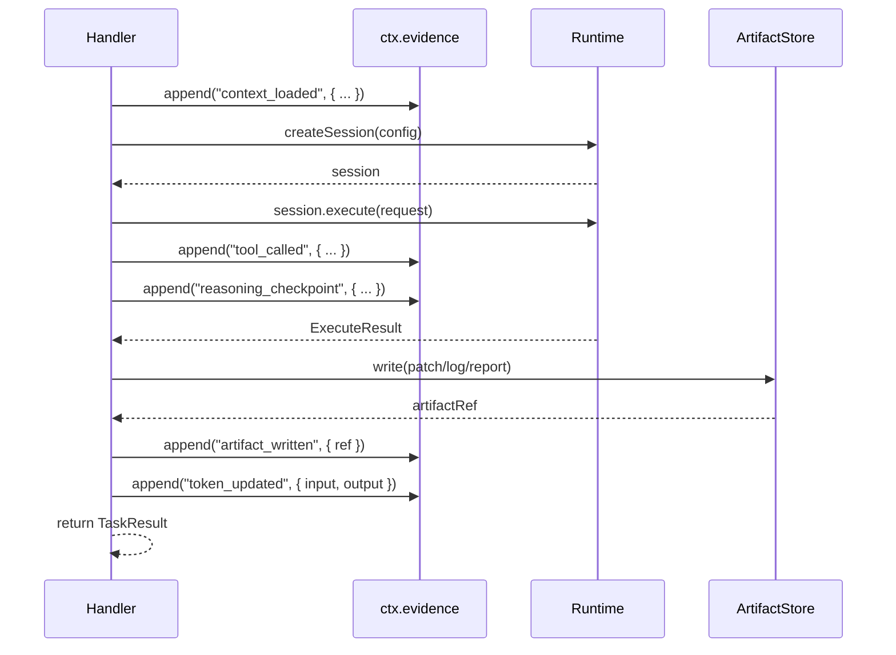
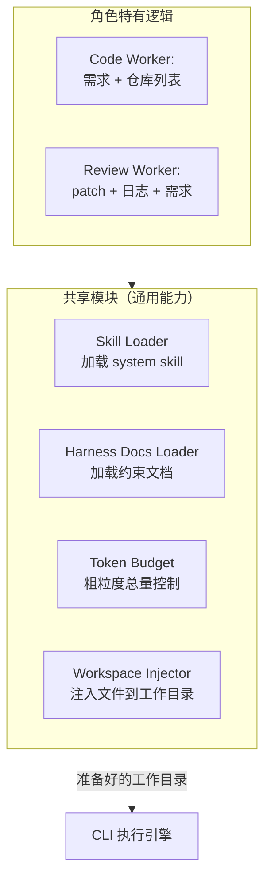

# Workers — 执行面统一设计

## 背景与动机

Workers 是 Worker SDK 的消费者，负责"拿到任务后做什么"。每个 Worker 通过 `createWorker(config, handler)` 启动，在 handler 内部组合 runtime + artifact 完成具体工作。本文档定义通用模式，然后描述各 worker 的差异。

## 设计原则

1. **SDK 消费者**：Workers 不直接与 Scheduler/Observability 通信，全部通过 SDK 框架
2. **Handler 专注业务**：handler 只关心"拿到任务做什么"，生命周期由 SDK 管理
3. **组合而非继承**：每个 worker 组合 SDK + runtime + artifact，不通过基类继承

## 通用架构



## Handler 通用执行流程



## 上下文工程

Worker 的核心差异化价值在于为 CLI 准备最优的执行上下文。同一个 CLI 工具，给它不同的上下文，输出质量天差地别。

### 上下文来源

| 来源 | 说明 | 谁提供 |
|------|------|--------|
| 需求描述 | task_run.params 中的 requirement | Orchestrator 通过 Scheduler 传入 |
| System Skill | 平台级操作指令（高频任务手册） | 平台仓库 `docs/skills/` |
| Project Skill | 项目仓库内的约束文档（AGENTS.md 等） | 目标仓库自带 |
| Harness Docs | 不可变约束（ARCHITECTURE.md、core-beliefs、编码规范） | 平台仓库 |
| 仓库代码 | 相关代码文件 | CLI 自行检索 |
| 前序产物 | 前面步骤的 patch、日志、review 报告 | Artifact Store |
| 版本配置 | 当前绑定的 prompt 模板、policy | version_set.method_version |

### 分层架构



### 代码文件选择

**策略：交给 CLI 自行检索。**

Worker 不替 CLI 选文件。CLI（kiro/codex/claude-code）本身具备强大的代码检索和文件发现能力。Worker 的职责是：

1. 通过 Runtime 准备好工作目录（clone 相关仓库）
2. 告诉 CLI "这些仓库你都可以看"
3. CLI 自己决定读哪些文件

多仓库场景：一个需求可能涉及前端仓 + 后端仓 + 参考仓，Worker 通过 task_run.params 获取仓库列表，传给 Runtime 准备工作目录。

### Skill / Harness Docs 注入

**策略：放到工作目录中 CLI 能识别的路径，不修改仓库原有文档。**

```
工作目录/
├── repo-frontend/          # clone 的前端仓（保留原有 AGENTS.md 等）
├── repo-backend/           # clone 的后端仓
└── .ai-sdlc/              # 平台注入的额外文档（CLI 额外配置路径）
    ├── skills/            # system skill 文件
    │   ├── code-task.md
    │   └── review-task.md
    └── harness/           # harness docs
        ├── architecture.md
        └── coding-standards.md
```

关键规则：

- **追加不覆盖**：仓库原有的 AGENTS.md / .cursorrules 等保持不动
- **平台文档放 CLI 的额外配置路径**：利用 CLI 原生的多文件源机制（如 `--instructions-file`、`.kiro/skills/`）
- **仓库文档是 project skill**（`method_version` 一部分），平台注入的是 **system skill**，两者分开追踪

### 工作目录管理

**策略：由 Runtime 层负责。**

Worker handler 只声明需要哪些仓库：

```ts
const session = await runtime.createSession({
  runtimeType: "cli",
  repos: [
    { url: "git@github.com:org/frontend.git", branch: "main" },
    { url: "git@github.com:org/backend.git", branch: "feat/login" },
  ],
  timeout: 300000,
  abortSignal,
});
// session.workDir → 准备好的工作目录路径
```

Runtime 负责：clone/worktree、清理、Phase 2 sandbox 内挂载。Worker 不关心具体策略。

### Token 预算管理

**策略：Worker 做粗粒度控制，代码检索 token 管理交给 CLI。**

- Worker 限制注入的 skill + harness docs 总量（如不超过 N 个文件或 M tokens）
- 不精细分配 context window 槽位——CLI 知道自己还剩多少空间
- token 预算阈值作为 `version_set.execution_version` 参数，可实验对比

### 可追踪性

**策略：记录引用，不存快照。**

Worker 在 `context_loaded` 证据事件中记录：

```ts
evidence.append("context_loaded", {
  repos: [
    { url: "git@github.com:org/frontend.git", commit: "abc123" },
    { url: "git@github.com:org/backend.git", commit: "def456" },
  ],
  skills: ["code-task.md", "review-task.md"],
  harnessDocs: ["architecture.md", "coding-standards.md"],
  versionSetId: "vs-xyz",
});
```

- 文件内容通过 commit SHA + 文件名可完整回溯
- `version_set.method_version` 已记录 skill/harness 的版本标识
- 不存全文快照——同一 version_set 跑 N 个 attempt 会产生 N 份重复数据

## Worker 差异化

| 维度 | Code Worker | Review Worker | Code Worker (Phase 2) |
|------|-------------|---------------|---------------|
| 路径 | `workers/code-worker` | `workers/review-worker` | `workers/code-worker` |
| 角色 | code | review | code |
| 支持的 TaskType | code, verify | review | code, verify |
| Runtime Type | cli (codex CLI) | cli (claude-code CLI) | cli (claude CLI) |
| 主要产物 | patch, log | review_report | patch, log |
| 输入上下文 | 需求描述 + 仓库状态 | patch + log + 需求描述 | 需求描述 + 仓库状态 |
| 特殊逻辑 | verify 时运行验收命令 | 加载前序 patch 和日志 | 与 code-worker 类似 |

> 注意：review-worker 使用 claude-code CLI 作为执行引擎，但其 *角色身份* 是 `review`，`implementation` 字段标记为 `"claude-code"`。命名以角色而非实现区分。

### Code Worker Handler

```ts
async function codexHandler(ctx: TaskContext): Promise<TaskResult> {
  const { taskRun, attempt, evidence, abortSignal } = ctx;
  const input = taskRun.params as CodeTaskParams;
  
  evidence.append("context_loaded", { requirement: input.requirement, repo: input.repository });

  const session = await runtime.createSession({
    runtimeType: "cli",
    workDir: input.repository,
    timeout: 300000,
    abortSignal,
  });

  try {
    const result = await session.execute({ command: ["codex", "--task", input.requirement] });
    evidence.append("tool_called", { tool_name: "codex", status: result.status });

    if (result.status !== "success") {
      return { status: "failed", failureType: "business_error", failureReason: result.stderr };
    }

    const patchRef = await artifactStore.write({
      content: result.stdout,
      metadata: { artifactType: "patch", workflowRunId: taskRun.workflowRunId, taskRunId: taskRun.id, filename: "patch.diff", mimeType: "text/x-diff", sizeBytes: Buffer.byteLength(result.stdout) },
    });
    evidence.append("artifact_written", { ref: patchRef });

    return { status: "completed", artifactRefs: [patchRef] };
  } finally {
    await session.destroy();
  }
}
```

### Review Worker Handler

```ts
async function reviewHandler(ctx: TaskContext): Promise<TaskResult> {
  const { taskRun, evidence, abortSignal } = ctx;
  const input = taskRun.params as ReviewTaskParams;

  const patchRefs = await artifactStore.list({ taskRunId: input.codeTaskRunId, artifactType: "patch" });
  const patches = await Promise.all(patchRefs.map(ref => artifactStore.read(ref)));
  evidence.append("context_loaded", { patchCount: patches.length });

  const session = await runtime.createSession({ runtimeType: "cli", workDir: input.repository, timeout: 300000, abortSignal });

  try {
    const result = await session.execute({ command: ["claude-code", "--review", ...] });
    evidence.append("tool_called", { tool_name: "claude-code", status: result.status });

    const reportRef = await artifactStore.write({
      content: result.stdout,
      metadata: { artifactType: "review_report", workflowRunId: taskRun.workflowRunId, taskRunId: taskRun.id, filename: "review.md", mimeType: "text/markdown", sizeBytes: Buffer.byteLength(result.stdout) },
    });
    evidence.append("artifact_written", { ref: reportRef });

    const conclusion = parseReviewConclusion(result.stdout);
    return { status: "completed", artifactRefs: [reportRef], finalConclusion: conclusion };
  } finally {
    await session.destroy();
  }
}
```

## Worker 配置

```ts
// code-worker
{ roles: ["code"], implementation: "codex", supportedTaskTypes: ["code", "verify"] }

// review-worker
{ roles: ["review"], implementation: "claude-code", supportedTaskTypes: ["review"] }

// code-worker
{ roles: ["code"], implementation: "claude-code", supportedTaskTypes: ["code", "verify"] }
```

## Phase 1 范围

| 包含 | 不包含（Phase 2+）|
|------|-------------------|
| code-worker + review-worker | code-worker |
| 单任务串行处理 | 并发任务处理 |
| CLI runtime 调用 | Agent runtime（OpenHands）|
| 基础证据上报 | 精细化 reasoning checkpoint |
| 固定 prompt 模板 | 动态 prompt 组装 |

## 反模式

| 反模式 | 为什么禁止 |
|--------|-----------|
| Worker 直接调用 Scheduler API | 必须通过 SDK 框架 |
| Worker 内部实现重试逻辑 | 重试归 Scheduler 管 |
| Worker 之间直接通信 | 通过 Artifact 共享数据 |
| 在 Worker 中做流程编排决策 | 编排归 Orchestrator |

## 参考

- `docs/design-docs/worker-sdk.md`
- `docs/design-docs/runtime.md`
- `docs/design-docs/artifact.md`
