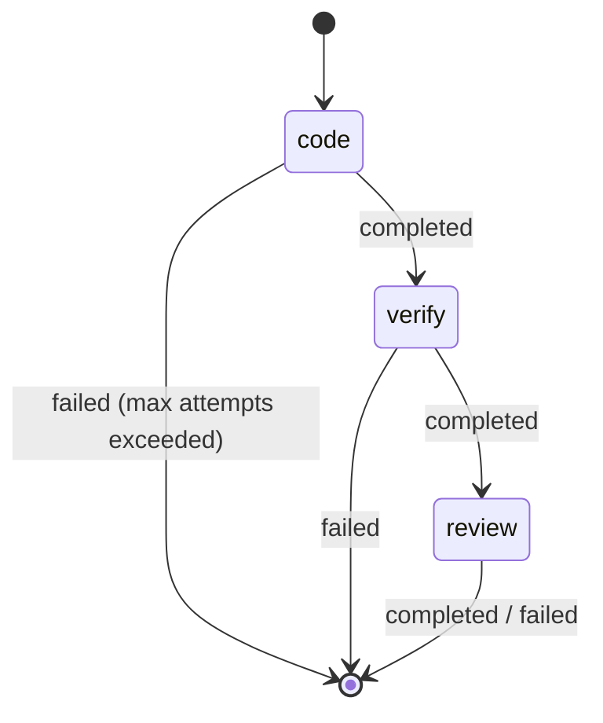
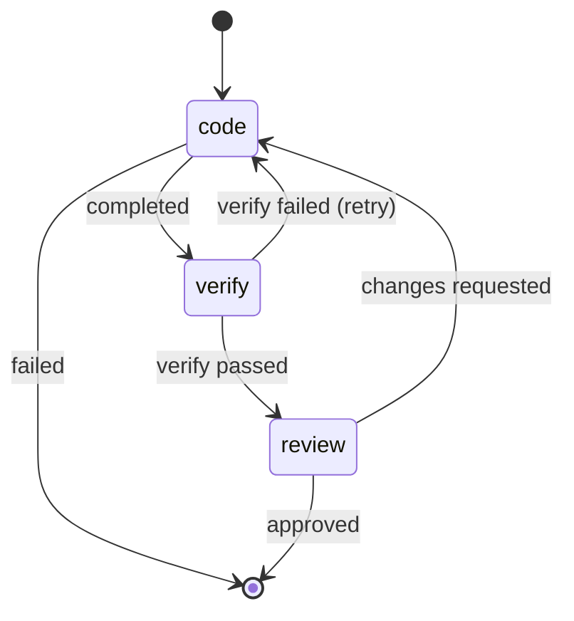
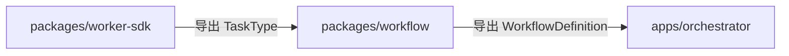

# Workflow — 工作流定义与模板设计

## 背景与动机

Orchestrator 负责"执行 workflow"，但 workflow 的结构定义（包含哪些步骤、什么顺序、失败策略）应该独立于执行引擎。`packages/workflow` 负责定义 workflow 模板，Orchestrator 消费这些模板来驱动执行。

## 设计原则

1. **定义与执行分离**：workflow 是数据，orchestrator 是引擎
2. **Phase 1 固定，Phase 2+ 可定制**：初期提供硬编码模板，后续支持 YAML/JSON 声明式定义
3. **TaskType 来自 worker-sdk**：workflow 依赖 worker-sdk 的类型导出

## 公开接口

```ts
import type { TaskType } from "@ai-sdlc/worker-sdk";

interface WorkflowDefinition {
  id: string;
  name: string;
  version: string;
  steps: StepDefinition[];
}

interface StepDefinition {
  stepId: string;
  taskType: TaskType;
  dependsOn: string[];
  config: StepConfig;
  onFailure: FailureStrategy;
}

interface StepConfig {
  maxAttempts: number;
  timeoutMs: number;
  params?: Record<string, unknown>;
}

type FailureStrategy = "fail_workflow" | "skip" | "retry_then_fail";

/** Phase 1：固定模板 */
function getDefaultWorkflow(): WorkflowDefinition;

/** Phase 2+：按 ID 加载自定义模板 */
function getWorkflow(id: string): Promise<WorkflowDefinition>;
```

## TaskType 与 Worker Role 的关系

- `code` 和 `verify` TaskType 由 `code` role 的 Worker 执行（codex-worker、claude-worker）
- `review` TaskType 由 `review` role 的 Worker 执行（review-worker）
- verify 不是独立 Worker，而是 code role Worker 支持的第二种任务类型

## Phase 1 固定模板

```ts
const DEFAULT_WORKFLOW: WorkflowDefinition = {
  id: "default",
  name: "标准交付流程",
  version: "1.0.0",
  steps: [
    {
      stepId: "code",
      taskType: "code",
      dependsOn: [],
      config: { maxAttempts: 3, timeoutMs: 300000 },
      onFailure: "retry_then_fail",
    },
    {
      stepId: "verify",
      taskType: "verify",
      dependsOn: ["code"],
      config: { maxAttempts: 2, timeoutMs: 300000 },
      onFailure: "retry_then_fail",
    },
    {
      stepId: "review",
      taskType: "review",
      dependsOn: ["verify"],
      config: { maxAttempts: 1, timeoutMs: 300000 },
      onFailure: "fail_workflow",
    },
  ],
};
```

## 状态流转图

Phase 1 固定流程：


Phase 2+ 演进（条件分支示例）：


## 与其他模块的关系



- 被 orchestrator 消费（读取 workflow 定义来决定下一步做什么）
- 依赖 worker-sdk（仅类型导入：TaskType）

## 演进路径

| Phase | 能力 |
|-------|------|
| Phase 1 | `getDefaultWorkflow()` 返回硬编码线性流程 |
| Phase 2 | 支持 YAML/JSON 声明式定义 + 条件分支 |
| Phase 3 | 用户自定义编排 + 并行步骤 + DAG |

## Phase 1 范围

| 包含 | 不包含（Phase 2+）|
|------|-------------------|
| 固定线性模板 | YAML/JSON 定义加载 |
| getDefaultWorkflow() | 条件分支 |
| StepDefinition 类型体系 | 并行步骤 / DAG |
| FailureStrategy 枚举 | 动态参数注入 |

## 反模式

| 反模式 | 为什么禁止 |
|--------|-----------|
| Orchestrator 内硬编码流程步骤 | 流程定义属于 workflow 包，orchestrator 只负责执行 |
| Workflow 定义中包含执行逻辑 | workflow 只描述"做什么和什么顺序"，不描述"怎么做" |
| Worker 自行决定下一步 | 步骤编排是 orchestrator 的职责，worker 只完成当前任务 |

## 参考

- `ARCHITECTURE.md`
- `docs/design-docs/worker-sdk.md`
