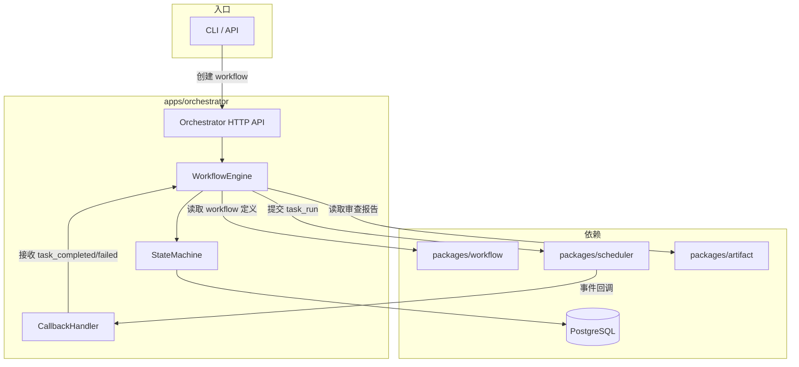
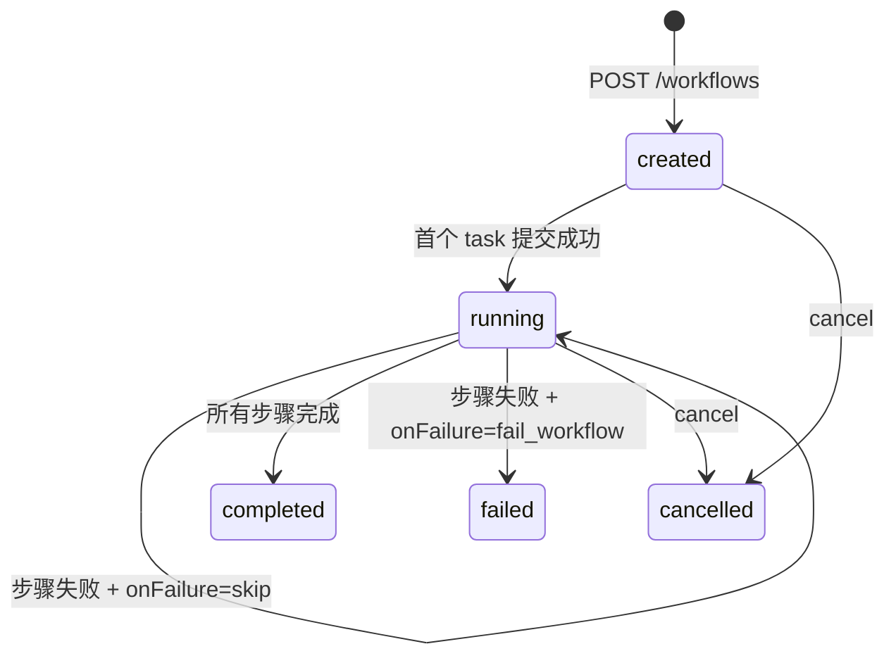
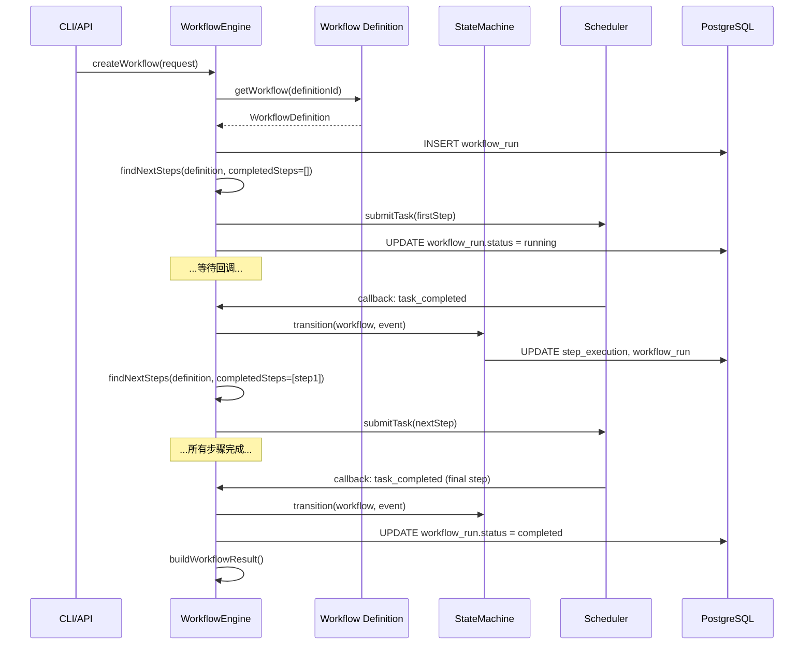
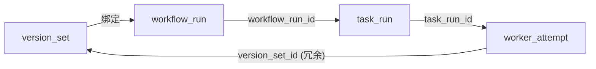

# Orchestrator — 工作流编排器设计

## 背景与动机

Orchestrator 是平台的控制面入口，负责接收用户提交的任务需求，创建 `workflow_run`，按 workflow 定义逐步向 Scheduler 提交 `task_run`，并根据任务完成/失败事件推进 workflow 状态。它是唯一拥有 workflow_run 全局视图的模块。

## 设计原则

1. **编排不执行**：只负责"下一步做什么"的决策，具体执行委托给 Scheduler → Worker
2. **事件驱动推进**：workflow 状态变更由 Scheduler 的回调事件触发，而非轮询
3. **Workflow 定义外置**：编排逻辑基于 `packages/workflow` 提供的 WorkflowDefinition
4. **Version Set 绑定**：每个 workflow_run 必须绑定一个 version_set，贯穿整个执行链路
5. **幂等性**：同一事件重复投递不产生副作用

## 核心架构图



## 核心类型定义

```ts
type WorkflowRunStatus = "created" | "running" | "completed" | "failed" | "cancelled";

interface WorkflowRun {
  id: string;
  versionSetId: string;
  workflowDefinitionId: string;
  status: WorkflowRunStatus;
  triggerType: TriggerType;
  triggerRef?: string;
  input: WorkflowInput;
  currentStepId?: string;
  completedSteps: string[];
  result?: WorkflowResult;
  createdAt: string;
  updatedAt: string;
  finishedAt?: string;
}

type TriggerType = "manual" | "benchmark" | "api";

interface WorkflowInput {
  requirement: string;
  repository?: string;
  branch?: string;
  context?: Record<string, unknown>;
}

interface WorkflowResult {
  finalStatus: "success" | "failed" | "partial";
  artifactRefs: string[];
  summary: string;
}

interface StepExecution {
  stepId: string;
  taskRunId: string;
  status: "pending" | "submitted" | "completed" | "failed" | "skipped";
  submittedAt?: string;
  completedAt?: string;
}
```

## Orchestrator HTTP API

| 操作 | 方法 | 路径 | 说明 |
|------|------|------|------|
| 创建 workflow | POST | `/workflows` | 创建并启动 workflow_run |
| 查询 workflow | GET | `/workflows/{workflowId}` | 获取状态 |
| 列出 workflows | GET | `/workflows` | 分页列表 |
| 取消 workflow | POST | `/workflows/{workflowId}/cancel` | 取消执行 |
| Scheduler 回调 | POST | `/callbacks/task-event` | 接收任务事件 |

```ts
interface CreateWorkflowRequest {
  versionSetId: string;
  workflowDefinitionId?: string;  // 默认 "default"
  triggerType: TriggerType;
  triggerRef?: string;
  input: WorkflowInput;
}
```

## 状态机



## WorkflowEngine 推进时序



## 步骤推进算法

```
function findNextSteps(definition, completedSteps):
  for each step in definition.steps:
    if step.stepId in completedSteps → skip
    if step.stepId == currentlyRunning → skip
    if all step.dependsOn are in completedSteps → yield step
  return eligible steps (Phase 1: 取第一个，线性执行)
```

Phase 2：多个 step 的 dependsOn 同时满足时，可并发提交。

## 失败处理

```ts
function handleTaskFailed(workflowRun, stepDef, event):
  switch (stepDef.onFailure):
    case "fail_workflow":
      workflowRun.status = "failed"
      cancelRemainingSteps()
      buildWorkflowResult()
    case "skip":
      markStep("skipped")
      findAndSubmitNextSteps()
    case "retry_then_fail":
      // 重试由 Scheduler 处理（maxAttempts）
      // 此处只在 Scheduler 报告 task_failed（重试耗尽）时触发
      workflowRun.status = "failed"
      cancelRemainingSteps()
```

## 回调幂等性

- 每个回调事件携带 `eventId`（由 Scheduler 生成）
- Orchestrator 维护 `processed_events` 表，记录已处理的 eventId
- 重复 eventId 直接返回 200，不触发状态变更
- 事件处理和 processed_events 写入在同一事务中

## Version Set 全链路绑定



- `workflow_run` 创建时绑定 `version_set_id`
- Orchestrator 在 submitTask 时将 `version_set_id` 传递给 Scheduler
- Scheduler 在创建 attempt 时写入 `version_set_id`（冗余存储，方便查询）

## 配置项汇总

| 配置项 | 类型 | 默认值 | 说明 |
|--------|------|--------|------|
| `port` | number | 8000 | HTTP 服务端口 |
| `db.connectionString` | string | 必填 | PostgreSQL 连接串 |
| `db.poolSize` | number | 10 | 连接池大小 |
| `scheduler.baseUrl` | string | 必填 | Scheduler HTTP 地址 |
| `callbackUrl` | string | 必填 | 本服务回调地址 |
| `workflow.defaultDefinitionId` | string | "default" | 默认 workflow 模板 ID |

## Phase 1 范围

| 包含 | 不包含（Phase 2+）|
|------|-------------------|
| 线性 workflow 执行 | 并行步骤 / DAG 编排 |
| 固定 workflow 模板 | 自定义模板加载 |
| HTTP 回调接收事件 | 事件总线 / 消息队列 |
| 基本 cancel 操作 | 人工介入 / 暂停恢复 |
| manual + benchmark 触发 | webhook / 定时触发 |
| 单实例 | 多实例 + leader election |
| 回调幂等性 | 分布式事务 |

## 反模式

| 反模式 | 为什么禁止 |
|--------|-----------|
| Orchestrator 直接调用 Worker | 必须通过 Scheduler 调度 |
| 在 Orchestrator 中实现重试逻辑 | 重试是 Scheduler 的职责 |
| 轮询 Scheduler 查询任务状态 | 事件驱动，通过回调推进 |
| Workflow 定义硬编码在 Orchestrator 中 | 流程定义属于 `packages/workflow` |
| 回调处理中发起长时间操作 | 回调处理应快速，耗时操作异步化 |

## 参考

- `ARCHITECTURE.md`
- `docs/design-docs/scheduler.md`
- `docs/design-docs/workflow.md`
- `docs/design-docs/arch-dual-track-roadmap.md`
