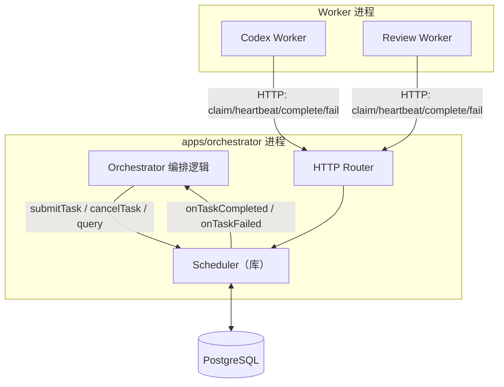
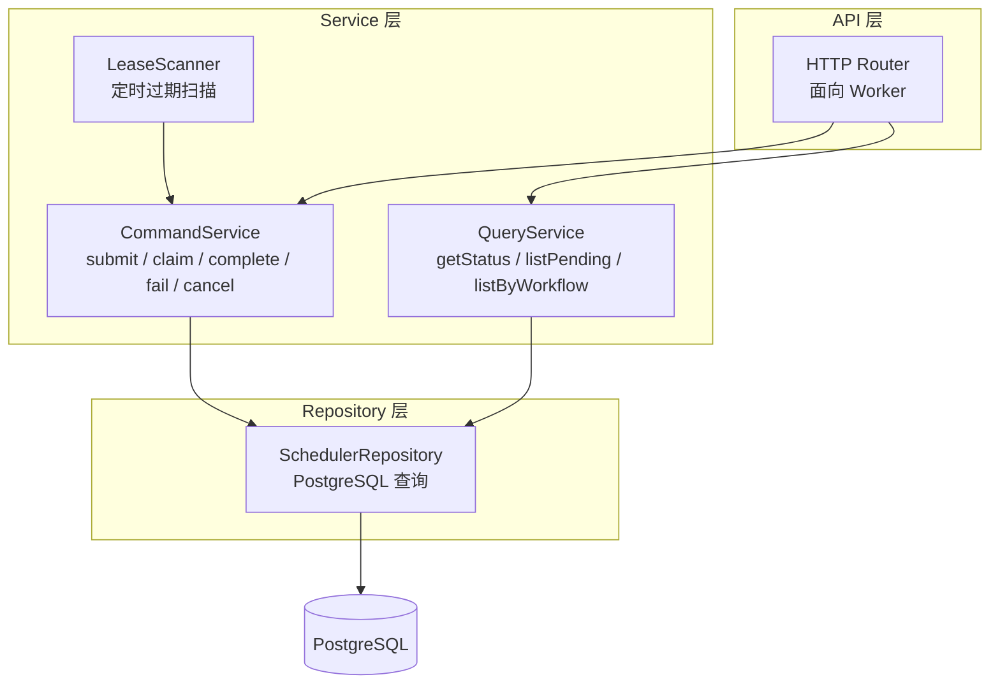
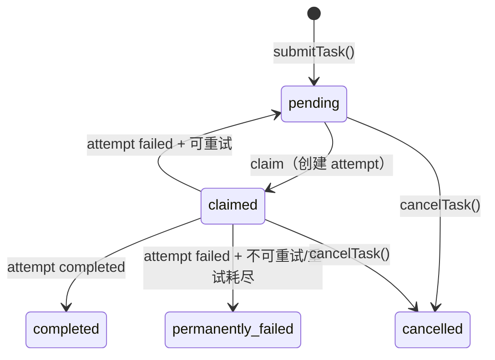
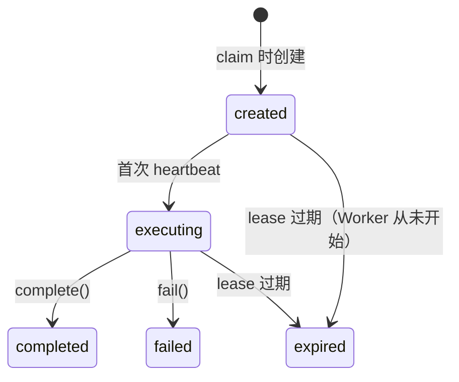

# Scheduler 调度设计

## 背景与动机

Scheduler 是 `task_run` 和 `worker_attempt` 生命周期的唯一 owner。它连接 Orchestrator（任务提交方）和 Worker（任务执行方），负责：

- 任务入队与状态管理
- Worker claim 分配与 lease 管理
- attempt 创建与过期回收
- 按失败类型的重试决策
- 任务完成/失败时通知 Orchestrator

Scheduler 不做编排决策、不承载观测负载、不管产物存储。

## 设计原则

1. **DB 是唯一真相来源**：所有状态持久化在 PostgreSQL，无内存队列。Phase 1 通过 `SELECT FOR UPDATE SKIP LOCKED` 实现轻量级队列语义。
2. **CQRS 接口语义**：公开 API 按 Command（submit/claim/complete/fail/cancel）和 Query（getStatus/listPending/listByWorkflow）分组。Phase 1 共享单一 Repository，Phase 2 可独立拆分读写实现。
3. **Phase 1 嵌入，Phase 2 可拆**：作为库嵌入 Orchestrator 进程，但接口设计为独立服务级别，未来可无痛拆出。
4. **attempt 由 Scheduler 创建**：Worker 不自行创建 attempt，保证生命周期一致性。
5. **重试是 Scheduler 的决策**：Worker 只报告 fail，Scheduler 根据 failureType 和剩余重试次数决定是否创建新 attempt。
6. **观测与执行故障域隔离**：Scheduler 的 claim/complete/expire 流程不依赖 Observability 可用性。

## 架构总览

### Scheduler 在系统中的位置



### 内部分层



## 标准做法

### 1. 接口设计

#### Orchestrator 侧（进程内调用）

```ts
interface Scheduler {
  // Command
  submitTask(input: SubmitTaskInput): Promise<TaskRun>;
  cancelTask(taskRunId: string): Promise<void>;

  // Query
  getTaskStatus(taskRunId: string): Promise<TaskRun | null>;
  listTasksByWorkflow(workflowRunId: string): Promise<TaskRun[]>;

  // Lifecycle
  start(): Promise<void>;
  stop(): Promise<void>;

  // HTTP router（挂载到 Orchestrator 的 HTTP 服务）
  router: HttpRouter;
}

interface SubmitTaskInput {
  workflowRunId: string;
  taskType: TaskType;
  input: Record<string, unknown>;
  priority?: "high" | "normal" | "low";  // Phase 1 忽略，预留
  maxRetries?: number;
}
```

#### Worker 侧（HTTP API）

| 操作 | 方法 | 路径 | 说明 |
|------|------|------|------|
| Claim | POST | `/tasks/claim` | 获取匹配 taskType 的任务 |
| Heartbeat | POST | `/attempts/{attemptId}/heartbeat` | 续租 |
| Complete | POST | `/attempts/{attemptId}/complete` | 标记成功 |
| Fail | POST | `/attempts/{attemptId}/fail` | 标记失败 |

### 2. 状态机

#### task_run 状态机



#### worker_attempt 状态机



### 3. 核心流程

#### Claim

```ts
async function claim(req: ClaimRequest): Promise<ClaimResponse | null> {
  const taskRun = await repo.findAndLockPendingTask(req.supportedTaskTypes);
  if (!taskRun) return null;

  await repo.updateTaskStatus(taskRun.id, "claimed");

  const attempt = await repo.createAttempt({
    taskRunId: taskRun.id,
    workerId: req.workerId,
    implementation: req.implementation,
    versionSetId: req.versionSetId,
    status: "created",
    leaseToken: generateLeaseToken(),
    leaseExpiresAt: now() + config.leaseDefaultMs,
  });

  return { taskRun, attempt, leaseToken: attempt.leaseToken, leaseDurationMs: config.leaseDefaultMs };
}
```

#### Fail + 重试决策

```ts
async function fail(req: FailRequest): Promise<void> {
  const attempt = await repo.findAttempt(req.attemptId);
  assertValidLease(attempt, req.leaseToken);

  await repo.updateAttemptStatus(attempt.id, "failed", {
    failureType: req.failureType,
    failureReason: req.failureReason,
  });

  const taskRun = await repo.findTaskRun(attempt.taskRunId);
  const shouldRetry = req.failureType !== "business_error"
    && req.failureType !== "cancelled"
    && taskRun.attemptCount < config.maxRetriesByTaskType[taskRun.taskType];

  if (shouldRetry) {
    await repo.updateTaskStatus(taskRun.id, "pending", {
      availableAfter: now() + config.retryDelayMs,
    });
  } else {
    await repo.updateTaskStatus(taskRun.id, "permanently_failed");
    config.onTaskFailed(taskRun);
  }
}
```

#### Lease 过期扫描

```ts
// 每 leaseScanIntervalMs 执行
async function scanExpiredLeases(): Promise<void> {
  const expired = await repo.findExpiredAttempts();
  for (const attempt of expired) {
    await repo.updateAttemptStatus(attempt.id, "expired");
    await handleAttemptFailure(attempt, "timeout");
  }
}
```

### 4. 数据模型

#### task_runs 表

```sql
CREATE TABLE task_runs (
  id              UUID PRIMARY KEY DEFAULT gen_random_uuid(),
  workflow_run_id  UUID NOT NULL,
  task_type       TEXT NOT NULL,
  status          TEXT NOT NULL DEFAULT 'pending',
  priority        TEXT NOT NULL DEFAULT 'normal',
  input           JSONB NOT NULL,
  attempt_count   INTEGER NOT NULL DEFAULT 0,
  max_retries     INTEGER NOT NULL DEFAULT 3,
  available_after TIMESTAMPTZ,
  created_at      TIMESTAMPTZ NOT NULL DEFAULT now(),
  updated_at      TIMESTAMPTZ NOT NULL DEFAULT now()
);

CREATE INDEX idx_task_runs_claimable
  ON task_runs (created_at)
  WHERE status = 'pending';

CREATE INDEX idx_task_runs_workflow
  ON task_runs (workflow_run_id);
```

#### worker_attempts 表

```sql
CREATE TABLE worker_attempts (
  id              UUID PRIMARY KEY DEFAULT gen_random_uuid(),
  task_run_id     UUID NOT NULL REFERENCES task_runs(id),
  worker_id       TEXT NOT NULL,
  implementation  TEXT NOT NULL,
  version_set_id  UUID NOT NULL,
  status          TEXT NOT NULL DEFAULT 'created',
  lease_token     TEXT NOT NULL UNIQUE,
  lease_expires_at TIMESTAMPTZ NOT NULL,
  failure_type    TEXT,
  failure_reason  TEXT,
  started_at      TIMESTAMPTZ,
  finished_at     TIMESTAMPTZ,
  created_at      TIMESTAMPTZ NOT NULL DEFAULT now()
);

CREATE INDEX idx_attempts_lease_expiry
  ON worker_attempts (lease_expires_at)
  WHERE status IN ('created', 'executing');

CREATE INDEX idx_attempts_task_run
  ON worker_attempts (task_run_id);
```

#### Claim SQL

```sql
SELECT * FROM task_runs
WHERE status = 'pending'
  AND task_type = ANY($1)
  AND (available_after IS NULL OR available_after <= now())
ORDER BY created_at ASC
LIMIT 1
FOR UPDATE SKIP LOCKED;
```

### 5. 目录结构

```
packages/scheduler/
├── package.json
├── tsconfig.json
├── src/
│   ├── index.ts
│   ├── types.ts
│   ├── api/
│   │   └── router.ts
│   ├── service/
│   │   ├── command-service.ts
│   │   ├── query-service.ts
│   │   └── lease-scanner.ts
│   ├── repository/
│   │   └── scheduler-repository.ts
│   └── create-scheduler.ts
└── tests/
```

### 6. 配置项

| 配置项 | 类型 | 默认值 | 说明 |
|--------|------|--------|------|
| `db` | DatabasePool | 必填 | PostgreSQL 连接池 |
| `leaseDefaultMs` | number | 300_000 (5min) | 默认 lease 时长 |
| `leaseScanIntervalMs` | number | 30_000 (30s) | 过期扫描间隔 |
| `retryDelayMs` | number | 30_000 (30s) | 重试等待间隔 |
| `maxRetriesByTaskType` | Record | `{code:3, verify:2, review:1}` | 最大重试次数 |
| `onTaskCompleted` | callback | 必填 | 完成通知 |
| `onTaskFailed` | callback | 必填 | 最终失败通知 |

### 7. Phase 1 范围

| 包含 | 不包含（Phase 2+）|
|------|-------------------|
| DB-as-queue，`FOR UPDATE SKIP LOCKED` | Redis 热缓存层 |
| FIFO 排序 | 优先级排序 |
| 固定延迟重试 (30s) | 指数退避 |
| 定时 lease 扫描 | 实时过期通知 |
| 按 failureType 重试决策 | 自定义重试策略插件 |
| 嵌入 Orchestrator 进程 | 独立服务部署 |
| 回调通知 Orchestrator | HTTP webhook / 事件总线 |

## 反模式

| 反模式 | 为什么禁止 |
|--------|-----------|
| 在 Scheduler 内维护内存队列 | 重启丢状态，DB 和内存双数据源一致性问题 |
| Worker 自己创建 attempt | 破坏 Scheduler 对 attempt 生命周期的独占管理 |
| Scheduler 承载观测负载（reasoning/tool payload） | 执行协议与观测协议分离，Scheduler 只管生命周期 |
| 在 claim 查询中不加 SKIP LOCKED | 多 Worker 并发时死锁或等待 |
| Scheduler 直接调用 Worker（推模式） | Worker 主动 pull 更简单可靠，Worker 控制自己的节奏 |
| 把重试决策放在 Worker 侧 | Worker 没有全局视角，Scheduler 掌握 attemptCount 和配置 |

## 适用范围

- `packages/scheduler`：本文档的主体实现
- `apps/orchestrator`：Scheduler 的宿主进程（Phase 1），调用 submitTask/cancelTask
- `packages/worker-sdk`：定义 Scheduler HTTP API 的请求/响应类型
- `infra/postgres`：task_runs 和 worker_attempts 表的 Schema

## 参考

- `ARCHITECTURE.md`
- `docs/design-docs/worker-sdk.md`
- `docs/design-docs/arch-dual-track-roadmap.md`
- `docs/design-docs/arch-attempt-observability-evaluation.md`
- `docs/design-docs/core-beliefs.md`
