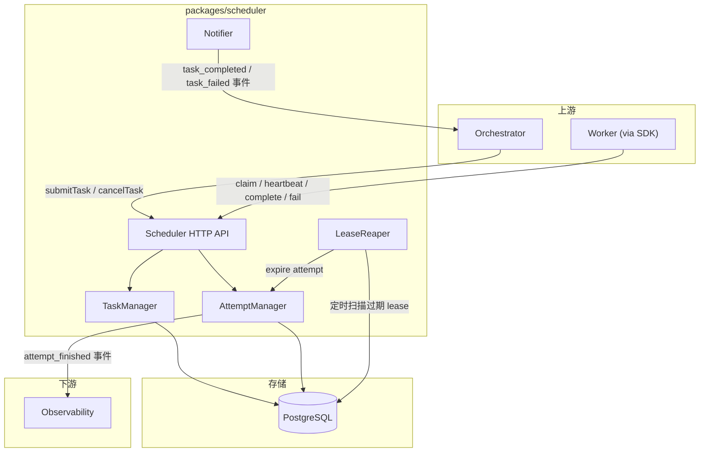
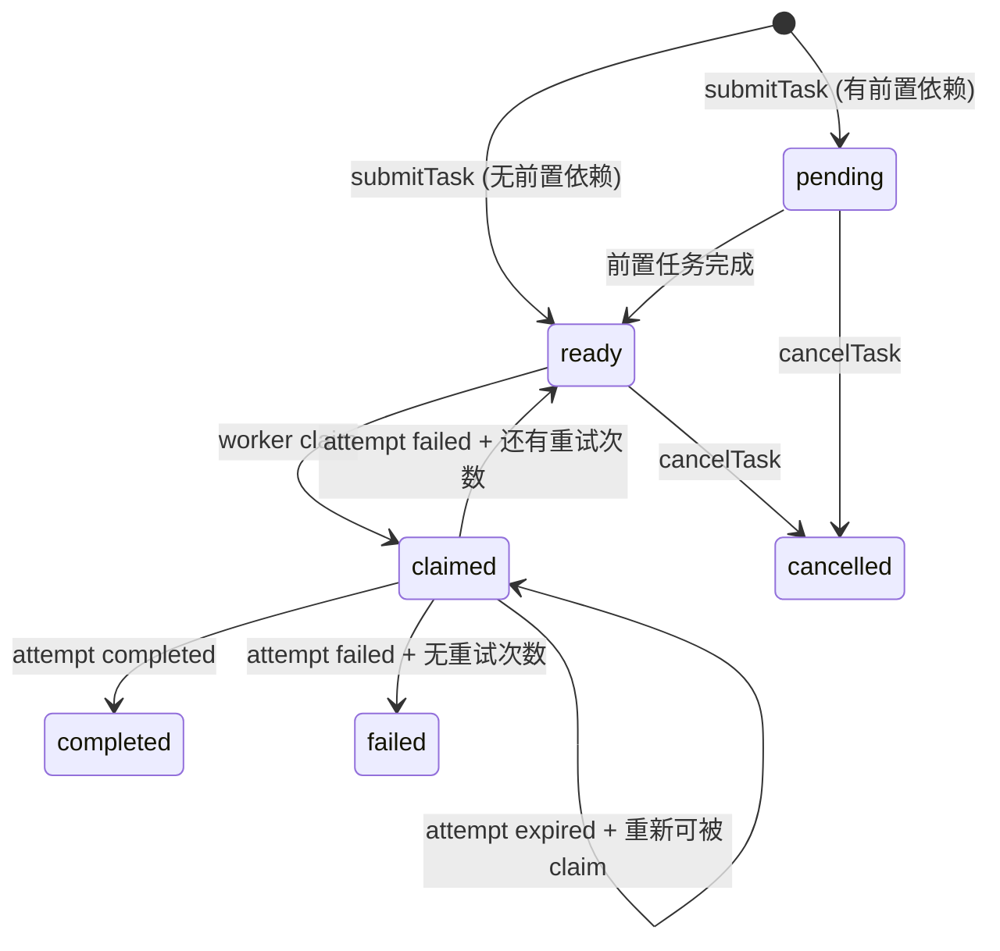
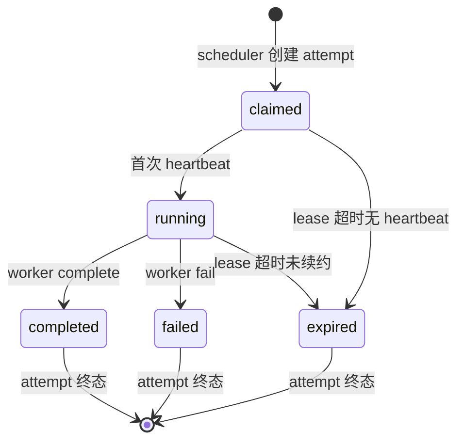

# Scheduler — 任务调度器设计

## 背景与动机

Scheduler 是平台的任务调度核心，负责 `task_run` 和 `worker_attempt` 的生命周期管理。它是 Orchestrator 和 Worker 之间的中间层——Orchestrator 提交任务，Worker 通过 SDK 消费任务，Scheduler 管理两者之间的匹配、租约和重试。

## 设计原则

1. **单一职责**：只做任务队列管理和 attempt 生命周期，不做业务判断
2. **Attempt 由 Scheduler 创建**：Worker 不自己创建 attempt，保证唯一性和生命周期一致性
3. **Lease-based 并发控制**：同一 task_run 同一时刻只有一个活跃 attempt（Phase 1）
4. **观测与执行分离**：Scheduler 只推进 attempt 状态，不承载证据负载
5. **无状态服务**：所有状态持久化在 PostgreSQL，Scheduler 可水平扩展（Phase 2+）

## 核心架构图



## 核心类型定义

```ts
// === Task Run ===

type TaskRunStatus = "pending" | "ready" | "claimed" | "completed" | "failed" | "cancelled";

interface TaskRun {
  id: string;
  workflowRunId: string;
  taskType: TaskType;
  status: TaskRunStatus;
  priority: number;
  maxAttempts: number;
  currentAttemptCount: number;
  timeoutMs: number;
  params?: Record<string, unknown>;
  createdAt: string;
  updatedAt: string;
}

// === Worker Attempt ===

type AttemptStatus = "claimed" | "running" | "completed" | "failed" | "expired";

interface WorkerAttempt {
  id: string;
  taskRunId: string;
  workerId: string;
  implementation: WorkerImplementation;
  versionSetId: string;
  status: AttemptStatus;
  attemptNumber: number;
  leaseToken: string;
  leaseExpiresAt: string;
  lastHeartbeatAt: string;
  startedAt: string;
  finishedAt?: string;
  failureType?: string;
  failureReason?: string;
  wasOrphaned: boolean;
}

// === Lease ===

interface LeaseInfo {
  attemptId: string;
  leaseToken: string;
  leaseDurationMs: number;
  expiresAt: string;
  lastHeartbeatAt: string;
}
```

## Scheduler HTTP API

### 上游 API（Orchestrator 调用）

| 操作 | 方法 | 路径 | 说明 |
|------|------|------|------|
| 提交任务 | POST | `/tasks` | 创建 task_run |
| 取消任务 | POST | `/tasks/{taskId}/cancel` | 取消未完成任务 |
| 查询任务 | GET | `/tasks/{taskId}` | 获取任务状态 |

```ts
interface SubmitTaskRequest {
  workflowRunId: string;
  taskType: TaskType;
  versionSetId: string;
  priority?: number;
  maxAttempts?: number;        // 默认 3
  timeoutMs?: number;          // 默认 300000
  params?: Record<string, unknown>;
  callbackUrl: string;         // Orchestrator 回调地址
}
```

### 下游 API（Worker 通过 SDK 调用）

| 操作 | 方法 | 路径 | 说明 |
|------|------|------|------|
| Claim | POST | `/tasks/claim` | 获取匹配任务 |
| Heartbeat | POST | `/attempts/{attemptId}/heartbeat` | 续租 |
| Complete | POST | `/attempts/{attemptId}/complete` | 标记成功 |
| Fail | POST | `/attempts/{attemptId}/fail` | 标记失败 |

## 状态机

### Task Run 状态机



### Worker Attempt 状态机



## Claim 匹配算法

```
1. 从 ready 状态的 task_run 中筛选 taskType ∈ worker.supportedTaskTypes
2. 按 priority DESC, createdAt ASC 排序
3. 取第一个，使用 SELECT ... FOR UPDATE SKIP LOCKED 防止并发抢占
4. 创建 worker_attempt 记录
5. 更新 task_run.status = claimed, current_attempt_count++
6. 返回 ClaimResponse
```

## Lease 管理

| 参数 | 默认值 | 说明 |
|------|--------|------|
| `defaultLeaseDurationMs` | 300000 (5min) | 初始 lease 时长 |
| `maxLeaseDurationMs` | 1800000 (30min) | 最大续约上限 |
| `reapIntervalMs` | 10000 (10s) | LeaseReaper 扫描间隔 |
| `reapBatchSize` | 50 | 单次扫描最多处理数 |

### LeaseReaper 行为

1. 定时扫描 `lease_expires_at < NOW()` 的活跃 attempt
2. 标记 attempt 状态为 `expired`，设置 `was_orphaned = true`
3. 如果 `task_run.currentAttemptCount < maxAttempts`：task_run 回到 `ready`
4. 否则：task_run 标记为 `failed`
5. 发送 `attempt_finished` 事件给 Observability

## 重试策略

```ts
interface RetryPolicy {
  maxAttempts: number;
  backoffType: "fixed" | "exponential";  // Phase 1: fixed only
  baseDelayMs: number;                   // 默认 5000
}
```

Phase 1：attempt 失败/过期后，如有重试次数，task_run 立即回到 `ready`。Phase 2：支持 exponential backoff + `not_before` 时间戳。

## 事件通知

```ts
type SchedulerEvent =
  | { type: "task_completed"; taskRun: TaskRun; attempt: WorkerAttempt }
  | { type: "task_failed"; taskRun: TaskRun; attempt: WorkerAttempt }
  | { type: "attempt_expired"; attempt: WorkerAttempt };

interface SchedulerNotifier {
  notifyOrchestrator(event: SchedulerEvent): Promise<void>;
  notifyObservability(attemptId: string, finalStatus: string): Promise<void>;
}
```

Phase 1：HTTP 回调（callbackUrl 在 submitTask 时注册）。Phase 2：消息队列。

## 错误处理

| 场景 | 处理 |
|------|------|
| Claim 时无可用任务 | 返回 204 |
| Heartbeat leaseToken 不匹配 | 返回 409 |
| Complete/Fail leaseToken 不匹配 | 返回 409（迟到结果丢弃） |
| 数据库写入失败 | 返回 500，Worker 重试 |
| Orchestrator 通知失败 | 本地重试队列，最多 3 次 |

## 配置项汇总

| 配置项 | 类型 | 默认值 | 说明 |
|--------|------|--------|------|
| `port` | number | 8001 | HTTP 服务端口 |
| `db.connectionString` | string | 必填 | PostgreSQL 连接串 |
| `db.poolSize` | number | 10 | 连接池大小 |
| `lease.defaultDurationMs` | number | 300000 | 默认 lease 时长 |
| `lease.maxDurationMs` | number | 1800000 | 最大 lease 时长 |
| `lease.reapIntervalMs` | number | 10000 | 过期扫描间隔 |
| `lease.reapBatchSize` | number | 50 | 单次扫描批次 |
| `retry.maxAttempts` | number | 3 | 默认最大重试次数 |
| `retry.baseDelayMs` | number | 5000 | 重试基础延迟 |
| `notification.maxRetries` | number | 3 | 通知重试次数 |
| `notification.retryDelayMs` | number | 2000 | 通知重试间隔 |

## Phase 1 范围

| 包含 | 不包含（Phase 2+）|
|------|-------------------|
| HTTP API（submit/claim/heartbeat/complete/fail） | WebSocket / 消息队列 |
| PostgreSQL 持久化 | Redis 缓存层 |
| LeaseReaper 定时扫描 | 分布式锁 / 多实例协调 |
| 固定延迟重试 | 指数退避 |
| HTTP 回调通知 | 事件总线 |
| 单实例部署 | 水平扩展 |
| Priority 排序 | 公平调度 / 权重队列 |

## 反模式

| 反模式 | 为什么禁止 |
|--------|-----------|
| Worker 自己创建 attempt | 破坏 Scheduler 对 attempt 唯一性和生命周期的控制权 |
| Claim 响应中返回大量上下文数据 | Claim 只返回任务元数据，具体上下文由 Worker 自行从 Artifact 获取 |
| Scheduler 内部调用 Runtime 或 Worker | Scheduler 只做调度，不执行 |
| 用内存队列替代 PostgreSQL | 违反持久化优先原则，进程重启丢失所有任务状态 |
| Heartbeat 中携带执行结果 | Heartbeat 只续约，结果通过 complete/fail 单独提交 |

## 参考

- `ARCHITECTURE.md`
- `docs/design-docs/worker-sdk.md`
- `docs/design-docs/arch-dual-track-roadmap.md`
