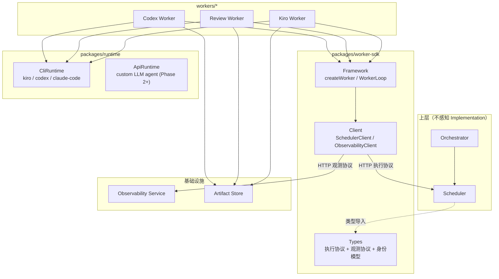
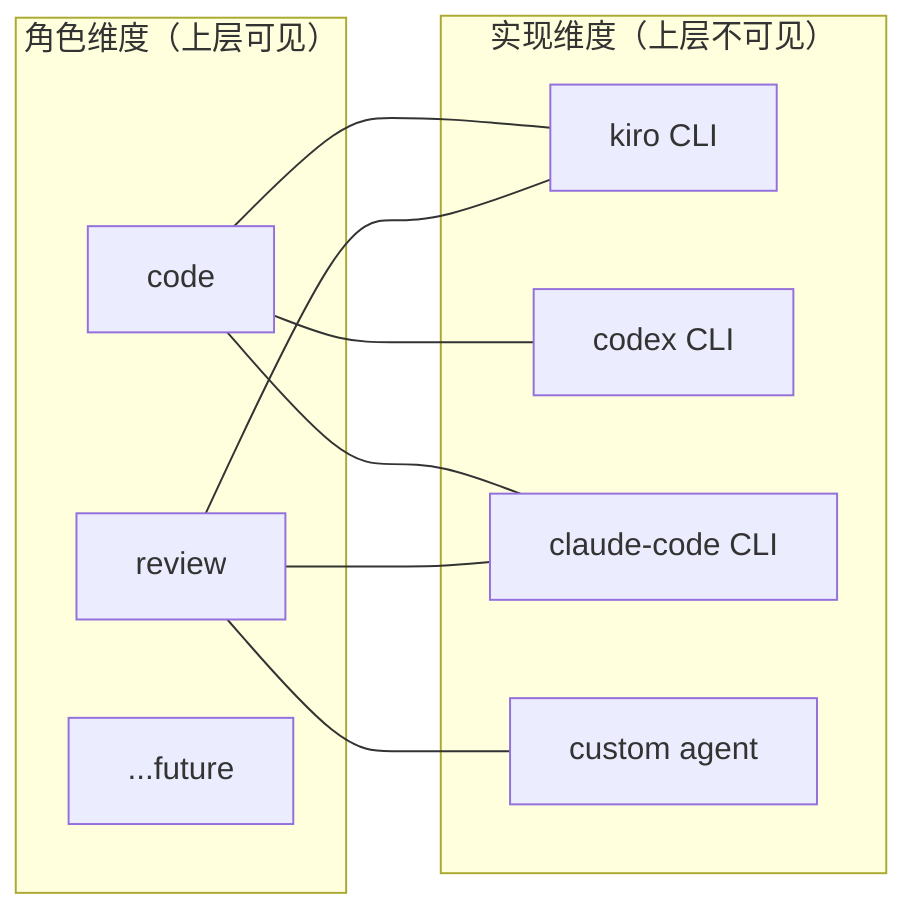
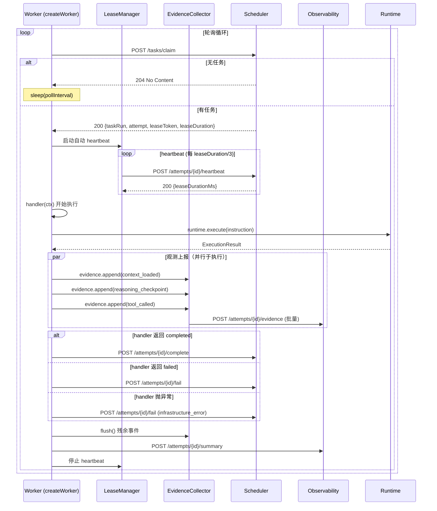
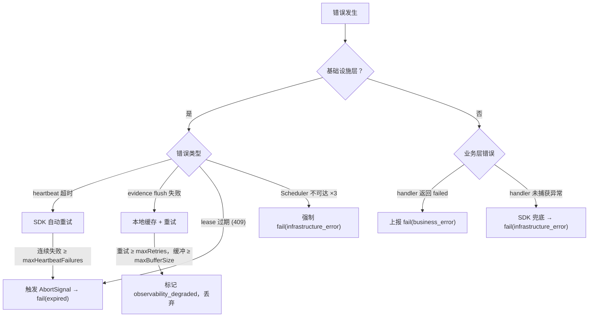

# Worker SDK 协议设计

## 背景与动机

平台通过多个专用 Worker 自动化完成 code → verify → review 流程。Worker 的底层执行引擎多样（Kiro CLI、Codex CLI、Claude Code CLI、自定义 LLM Agent），但上层调度系统不应感知这些差异。

Worker SDK 作为执行面的统一协议层，解决以下问题：

- 为所有 Worker 提供统一的 claim → execute → report → complete 生命周期框架
- 定义 Worker 与 Scheduler 之间的执行协议（轮询、heartbeat、完成/失败）
- 定义 Worker 与 Observability 之间的观测协议（证据事件、摘要报告）
- 屏蔽通信细节，让 Worker 开发者只关注"拿到任务后做什么"

## 设计原则

1. **Worker = Role × Implementation**：角色（code/review）决定"做什么"，实现（kiro/codex/claude-code/custom）决定"用什么跑"。上层只看 Role。
2. **协议轻量，框架可选**：SDK 核心是类型定义和协议客户端；高层框架（createWorker）是便利层，不是强制层。
3. **执行协议与观测协议分离**：Scheduler 只承载 attempt 生命周期推进，不承载 reasoning/tool 等大体量观测负载。
4. **基础设施错误 SDK 管，业务错误 Worker 管**：分层错误处理，避免 SDK 替 Worker 做业务决策。
5. **执行引擎适配不在 SDK 内**：具体的 CLI 调用、进程管理由 `packages/runtime` 负责，SDK 不感知。
6. **显式配置，禁止魔法**：所有行为通过构造函数参数控制，不读隐式环境变量。

## 架构总览

### Worker SDK 在系统中的位置



### Worker 双维度模型



### 执行循环时序图



### 错误处理分层



## 标准做法

### 1. Worker 身份模型

```ts
type WorkerRole = "code" | "review";

type WorkerImplementation = "kiro" | "codex" | "claude-code" | "custom";

type TaskType = "code" | "verify" | "review";

interface WorkerRegistration {
  workerId: string;
  roles: WorkerRole[];
  implementation: WorkerImplementation;
  supportedTaskTypes: TaskType[];
  versionSetId: string;
}
```

角色与 TaskType 的映射：

- `code` role → 支持 `"code"`, `"verify"`
- `review` role → 支持 `"review"`

关键规则：

- Scheduler 按 `TaskType` 分发任务，只匹配 `supportedTaskTypes`，不感知 implementation
- 一个 Worker 进程可注册多个 role，部署时通过配置决定实际承担哪些
- `implementation` 字段用于观测和实验对比，不参与调度逻辑

### 2. 包结构

```
packages/worker-sdk/
├── package.json
├── tsconfig.json
├── src/
│   ├── index.ts                 # 主入口：导出 createWorker + 核心类型
│   ├── types/
│   │   ├── execution.ts         # TaskRun, WorkerAttempt, Claim/Heartbeat/Complete/Fail
│   │   ├── observability.ts     # EvidenceEvent, SummaryReport, Checkpoint, ToolCalled
│   │   ├── identity.ts          # WorkerRole, WorkerImplementation, WorkerRegistration
│   │   ├── version.ts           # VersionSet 引用类型
│   │   └── interfaces.ts        # Logger, ObservabilityReporter, TelemetryProvider
│   ├── client/
│   │   ├── scheduler-client.ts  # HTTP 轮询 Scheduler API
│   │   └── observability-client.ts  # HTTP 上报证据事件和 summary
│   ├── framework/
│   │   ├── worker-loop.ts       # claim → execute → report → complete 主循环
│   │   ├── lease-manager.ts     # 自动 heartbeat、lease 过期检测
│   │   └── evidence-collector.ts # 收集并批量上报观测事件
│   └── create-worker.ts         # createWorker 工厂函数
└── tests/
```

依赖方向：

- `packages/worker-sdk` → 无外部 workspace 依赖（零依赖底层包）
- `packages/runtime` → 无外部 workspace 依赖
- `workers/*` → worker-sdk, runtime, artifact
- `packages/scheduler` → worker-sdk（仅类型导入）

### 3. createWorker 框架

```ts
interface WorkerConfig {
  workerId: string;
  roles: WorkerRole[];
  implementation: WorkerImplementation;
  supportedTaskTypes: TaskType[];
  versionSetId: string;
  scheduler: { baseUrl: string; pollIntervalMs: number };
  observability: { baseUrl: string; flushIntervalMs?: number; flushBatchSize?: number };
  logger?: Logger;
}

interface TaskContext {
  taskRun: TaskRun;
  attempt: WorkerAttempt;
  evidence: EvidenceCollector;
  abortSignal: AbortSignal;
  logger: Logger;
}

interface TaskResult {
  status: "completed" | "failed";
  artifactRefs?: string[];
  failureType?: string;
  failureReason?: string;
  finalConclusion?: string;
}

type ExecuteHandler = (ctx: TaskContext) => Promise<TaskResult>;

function createWorker(config: WorkerConfig, handler: ExecuteHandler): Worker;

interface Worker {
  start(): Promise<void>;
  stop(): Promise<void>;
}
```

执行循环：

1. Poll Scheduler（claim task）— 无任务则 sleep(pollInterval)
2. 启动 LeaseManager（自动 heartbeat）
3. 调用 handler(ctx) — handler 内部调用 runtime.execute()
4. 根据返回值调用 scheduler.complete() 或 scheduler.fail()
5. 发送 attempt_summary_report
6. 停止 LeaseManager，继续循环

导出层次：

```ts
// 高层框架
import { createWorker } from "@ai-sdlc/worker-sdk";

// 构建块（逃生舱）
import { SchedulerClient, LeaseManager, EvidenceCollector } from "@ai-sdlc/worker-sdk";

// 纯类型
import type { TaskRun, WorkerAttempt, WorkerRole } from "@ai-sdlc/worker-sdk";
```

### 4. 执行协议

Worker SDK 的 SchedulerClient 封装以下 HTTP API：

| 操作 | 方法 | 路径 | 说明 |
|------|------|------|------|
| Claim | POST | `/tasks/claim` | 请求获取匹配 taskType 的任务 |
| Heartbeat | POST | `/attempts/{attemptId}/heartbeat` | 续租 |
| Complete | POST | `/attempts/{attemptId}/complete` | 标记成功 |
| Fail | POST | `/attempts/{attemptId}/fail` | 标记失败 |

请求/响应类型：

```ts
interface ClaimRequest {
  workerId: string;
  supportedTaskTypes: TaskType[];
  implementation: WorkerImplementation;
  versionSetId: string;
}

interface ClaimResponse {
  taskRun: TaskRun;
  attempt: WorkerAttempt;
  leaseToken: string;
  leaseDurationMs: number;
}
// 无可用任务：HTTP 204 No Content

interface HeartbeatRequest {
  attemptId: string;
  leaseToken: string;
  progress?: string;
}
// 成功：200 + 新 leaseDurationMs
// lease 已过期：409 Conflict

interface CompleteRequest {
  attemptId: string;
  leaseToken: string;
  artifactRefs: string[];
}

interface FailRequest {
  attemptId: string;
  leaseToken: string;
  failureType: "business_error" | "infrastructure_error" | "timeout" | "cancelled";
  failureReason: string;
}
```

LeaseManager 行为：

- 按 `leaseDurationMs / heartbeatFactor`（默认 3）间隔自动 heartbeat
- 连续 `maxHeartbeatFailures`（默认 2）次失败触发 lease 过期回调
- Lease 过期时通过 AbortSignal 通知 handler

关键约束：

- Scheduler 在 claim 时创建 `worker_attempt`，Worker 不自己创建
- `leaseToken` 保证同一 attempt 只被一个 Worker 持有
- 重试由 Scheduler 发起，Worker fail 后 Scheduler 决定是否创建新 attempt

### 5. 观测协议

EvidenceCollector 接口：

```ts
interface EvidenceCollector {
  append(eventType: EvidenceEventType, payload: unknown): void;
  flush(): Promise<void>;
}

type EvidenceEventType =
  | "context_loaded"
  | "reasoning_checkpoint"
  | "tool_called"
  | "artifact_written"
  | "token_updated";
```

内部行为：

- `append()` 同步，事件进入内存缓冲区
- 缓冲区满 `flushBatchSize`（默认 10）条或每 `flushIntervalMs`（默认 5000）毫秒自动 flush
- `attempt_finished` 事件由 SDK 在 complete/fail 时自动发送

观测协议端点：

| 操作 | 方法 | 路径 | 说明 |
|------|------|------|------|
| 批量上报事件 | POST | `/attempts/{attemptId}/evidence` | 批量追加证据 |
| 上报 Summary | POST | `/attempts/{attemptId}/summary` | 完整摘要 |

事件结构（与 `arch-attempt-observability-evaluation` 对齐）：

```ts
interface AttemptEvidenceEvent {
  eventId: string;       // attemptId + sequenceNo + eventType 派生
  attemptId: string;
  sequenceNo: number;    // Worker 本地递增，SDK 自动管理
  eventType: EvidenceEventType;
  occurredAt: string;    // ISO 8601
  payloadRef?: string;   // 大载荷存 Artifact，此处只保留引用
  payload?: unknown;     // 小载荷内联
}
```

Summary Report（SDK 框架自动生成）：

```ts
interface AttemptSummaryReport {
  attemptId: string;
  taskRunId: string;
  workerId: string;
  versionSetId: string;
  finalStatus: "completed" | "failed" | "expired";
  startedAt: string;
  finishedAt: string;
  durationMs: number;
  tokenTotals: { input: number; output: number; total: number };
  costTotals: { totalUsd: number };
  toolStats: { totalCalls: number; successCount: number; failedCount: number };
  artifactRefs: string[];
  failureType?: string;
  failureReason?: string;
  checkpointDigest: string;  // SDK 传空字符串，由 observability 服务端聚合
  finalConclusion: string;
}
```

自动统计机制：

- `tokenTotals` / `costTotals`：从 `token_updated` 事件累加
- `toolStats`：从 `tool_called` 事件计数
- `artifactRefs`：从 `artifact_written` 事件收集
- `durationMs`：claim 到 complete/fail 的时间差

降级行为：

- 事件上报失败本地缓存（最多 `maxBufferSize` 条，默认 100），重试 `maxRetries` 次后丢弃
- 丢弃后标记 `observability_degraded`
- Summary 上报失败进入 orphan 超时流程
- 观测失败不阻塞执行协议

### 6. 错误处理

分层职责：

| 层级 | 错误类型 | 处理方 | 示例 |
|------|----------|--------|------|
| 基础设施层 | 网络/协议错误 | SDK 自动 | heartbeat 失败、HTTP 超时、连接中断 |
| 基础设施层 | Lease 过期 | SDK 自动 | Scheduler 返回 409 |
| 业务层 | 执行失败 | Handler 返回 | CLI 非零退出码、产物校验失败 |
| 业务层 | 未捕获异常 | SDK 兜底 → fail | handler 抛出未处理 Error |

AbortSignal 传播：

- SDK 在 TaskContext 中注入 `abortSignal`
- Lease 过期或 `worker.stop()` 时触发 abort
- Handler 应将 signal 传递给 runtime.execute() 等可取消操作

可恢复 vs 不可恢复：

- 可恢复（SDK 自动重试）：单次 heartbeat 网络超时、单次 evidence flush 失败
- 不可恢复（立即终止）：lease 过期（409）、Scheduler 不可达超过 maxRetries 次

### 7. 横切接口

```ts
interface Logger {
  debug(msg: string, meta?: Record<string, unknown>): void;
  info(msg: string, meta?: Record<string, unknown>): void;
  warn(msg: string, meta?: Record<string, unknown>): void;
  error(msg: string, meta?: Record<string, unknown>): void;
}

interface ObservabilityReporter {
  appendEvent(event: AttemptEvidenceEvent): void;
  sendSummary(report: AttemptSummaryReport): Promise<void>;
  flush(): Promise<void>;
}

interface TelemetryProvider {
  startSpan(name: string): Span;
}

interface Span {
  end(): void;
  setAttribute(key: string, value: string | number): void;
}
```

- Logger：内置 console 默认实现，Worker 可传入自定义实现
- ObservabilityReporter：Phase 1 为 `HttpObservabilityReporter`
- TelemetryProvider：Phase 1 为 `NoopTelemetryProvider`

### 8. 测试辅助

SDK 导出测试工具：

```ts
import { createTestContext, InMemorySchedulerClient, InMemoryObservabilityReporter } from "@ai-sdlc/worker-sdk/testing";

const ctx = createTestContext({ taskRun: mockTaskRun, attempt: mockAttempt });
const result = await myHandler(ctx);

expect(result.status).toBe("completed");
expect(ctx.evidence.events).toHaveLength(3);
```

### 9. 配置项汇总

| 配置项 | 类型 | 默认值 | 说明 |
|--------|------|--------|------|
| `scheduler.baseUrl` | string | 必填 | Scheduler HTTP 地址 |
| `scheduler.pollIntervalMs` | number | 5000 | 无任务时轮询间隔 |
| `observability.baseUrl` | string | 必填 | Observability 服务地址 |
| `observability.flushIntervalMs` | number | 5000 | 事件缓冲 flush 间隔 |
| `observability.flushBatchSize` | number | 10 | 缓冲区满触发 flush |
| `observability.maxRetries` | number | 3 | flush 失败重试次数 |
| `observability.maxBufferSize` | number | 100 | 本地缓冲上限 |
| `lease.heartbeatFactor` | number | 3 | heartbeat 间隔 = leaseDuration / 此值 |
| `lease.maxHeartbeatFailures` | number | 2 | 连续失败触发过期 |

### 10. Phase 1 范围

| 包含 | 不包含（Phase 2+）|
|------|-------------------|
| HTTP 轮询通信 | WebSocket / 消息队列推送 |
| 单进程单循环 | 多进程并发 claim |
| 基本 Logger | OpenTelemetry 集成 |
| InMemory 测试辅助 | 集成测试 harness |
| `code` + `review` 角色 | 其他角色扩展 |
| `kiro` / `codex` / `claude-code` 实现标识 | custom agent 运行时适配 |

## 反模式

| 反模式 | 为什么禁止 |
|--------|-----------|
| Worker 直接依赖 Scheduler 或 Orchestrator 包 | 违反依赖方向约束，Worker 只能通过 SDK 通信 |
| 把 reasoning/tool payload 塞进执行协议（claim/complete） | Scheduler 职责是 attempt 生命周期推进，不承载大体量观测负载 |
| Worker 自己创建 worker_attempt | attempt 由 Scheduler 在 claim 时创建，保证唯一性和生命周期一致性 |
| SDK 内部读环境变量决定行为 | 违反显式配置原则，所有行为通过构造函数参数控制 |
| SDK 内部自行实例化 Logger / Reporter | 横切关注点必须通过依赖注入，禁止内部 new |
| Worker 自己做重试调度决策 | 重试是 Scheduler 的职责，Worker 只负责报告 fail |
| 在 SDK 内实现执行引擎调用逻辑 | 执行引擎适配属于 `packages/runtime`，SDK 不感知 |

## 适用范围

- `packages/worker-sdk`：本文档的主体实现
- `workers/codex-worker`、`workers/review-worker`、`workers/claude-worker`：SDK 消费者
- `packages/scheduler`：仅导入 SDK 类型定义，实现执行协议的服务端
- `packages/runtime`：与 SDK 平级，Worker 同时依赖两者但两者互不依赖

## 参考

- `ARCHITECTURE.md`
- `docs/design-docs/arch-dual-track-roadmap.md`
- `docs/design-docs/arch-attempt-observability-evaluation.md`
- `docs/design-docs/core-beliefs.md`
- `docs/DOMAINS.md`
