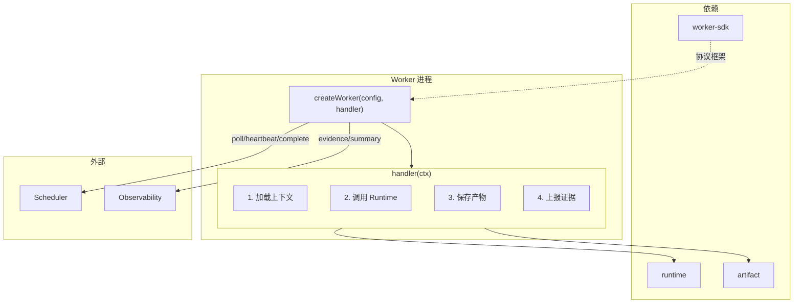
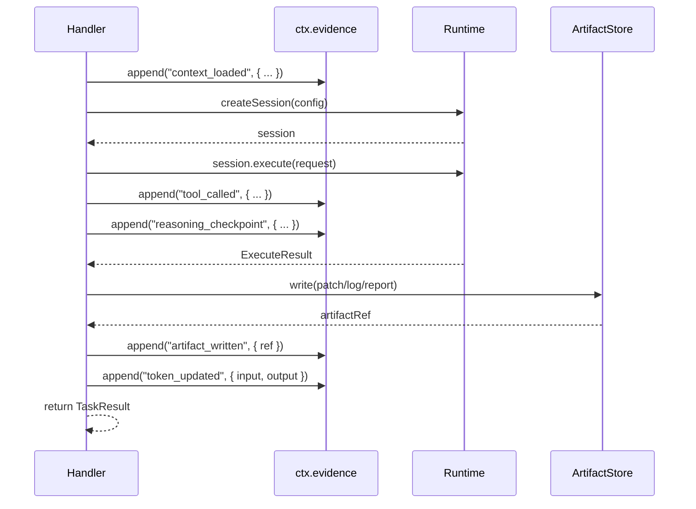

# Workers — 执行面统一设计

## 背景与动机

Workers 是 Worker SDK 的消费者，负责"拿到任务后做什么"。每个 Worker 通过 `createWorker(config, handler)` 启动，在 handler 内部组合 runtime + artifact 完成具体工作。本文档定义通用模式，然后描述各 worker 的差异。

## 设计原则

1. **SDK 消费者**：Workers 不直接与 Scheduler/Observability 通信，全部通过 SDK 框架
2. **Handler 专注业务**：handler 只关心"拿到任务做什么"，生命周期由 SDK 管理
3. **组合而非继承**：每个 worker 组合 SDK + runtime + artifact，不通过基类继承

## 通用架构



## Handler 通用执行流程



## Worker 差异化

| 维度 | Codex Worker | Review Worker | Claude Worker |
|------|-------------|---------------|---------------|
| 路径 | `workers/codex-worker` | `workers/review-worker` | `workers/claude-worker` |
| 角色 | code | review | code |
| 支持的 TaskType | code, verify | review | code, verify |
| Runtime Type | cli (codex CLI) | cli (claude-code CLI) | cli (claude CLI) |
| 主要产物 | patch, log | review_report | patch, log |
| 输入上下文 | 需求描述 + 仓库状态 | patch + log + 需求描述 | 需求描述 + 仓库状态 |
| 特殊逻辑 | verify 时运行验收命令 | 加载前序 patch 和日志 | 与 codex-worker 类似 |

### Codex Worker Handler

```ts
async function codexHandler(ctx: TaskContext): Promise<TaskResult> {
  const { taskRun, attempt, evidence, abortSignal } = ctx;
  const input = taskRun.params as CodeTaskParams;
  
  evidence.append("context_loaded", { requirement: input.requirement, repo: input.repository });

  const session = await runtime.createSession({
    runtimeType: "cli",
    workDir: input.repository,
    timeout: 300000,
    abortSignal,
  });

  try {
    const result = await session.execute({ command: ["codex", "--task", input.requirement] });
    evidence.append("tool_called", { tool_name: "codex", status: result.status });

    if (result.status !== "success") {
      return { status: "failed", failureType: "business_error", failureReason: result.stderr };
    }

    const patchRef = await artifactStore.write({
      content: result.stdout,
      metadata: { artifactType: "patch", workflowRunId: taskRun.workflowRunId, taskRunId: taskRun.id, filename: "patch.diff", mimeType: "text/x-diff", sizeBytes: Buffer.byteLength(result.stdout) },
    });
    evidence.append("artifact_written", { ref: patchRef });

    return { status: "completed", artifactRefs: [patchRef] };
  } finally {
    await session.destroy();
  }
}
```

### Review Worker Handler

```ts
async function reviewHandler(ctx: TaskContext): Promise<TaskResult> {
  const { taskRun, evidence, abortSignal } = ctx;
  const input = taskRun.params as ReviewTaskParams;

  const patchRefs = await artifactStore.list({ taskRunId: input.codeTaskRunId, artifactType: "patch" });
  const patches = await Promise.all(patchRefs.map(ref => artifactStore.read(ref)));
  evidence.append("context_loaded", { patchCount: patches.length });

  const session = await runtime.createSession({ runtimeType: "cli", workDir: input.repository, timeout: 300000, abortSignal });

  try {
    const result = await session.execute({ command: ["claude-code", "--review", ...] });
    evidence.append("tool_called", { tool_name: "claude-code", status: result.status });

    const reportRef = await artifactStore.write({
      content: result.stdout,
      metadata: { artifactType: "review_report", workflowRunId: taskRun.workflowRunId, taskRunId: taskRun.id, filename: "review.md", mimeType: "text/markdown", sizeBytes: Buffer.byteLength(result.stdout) },
    });
    evidence.append("artifact_written", { ref: reportRef });

    const conclusion = parseReviewConclusion(result.stdout);
    return { status: "completed", artifactRefs: [reportRef], finalConclusion: conclusion };
  } finally {
    await session.destroy();
  }
}
```

## Worker 配置

```ts
// codex-worker
{ roles: ["code"], implementation: "codex", supportedTaskTypes: ["code", "verify"] }

// review-worker
{ roles: ["review"], implementation: "claude-code", supportedTaskTypes: ["review"] }

// claude-worker
{ roles: ["code"], implementation: "claude-code", supportedTaskTypes: ["code", "verify"] }
```

## Phase 1 范围

| 包含 | 不包含（Phase 2+）|
|------|-------------------|
| codex-worker + review-worker | claude-worker |
| 单任务串行处理 | 并发任务处理 |
| CLI runtime 调用 | Agent runtime（OpenHands）|
| 基础证据上报 | 精细化 reasoning checkpoint |
| 固定 prompt 模板 | 动态 prompt 组装 |

## 反模式

| 反模式 | 为什么禁止 |
|--------|-----------|
| Worker 直接调用 Scheduler API | 必须通过 SDK 框架 |
| Worker 内部实现重试逻辑 | 重试归 Scheduler 管 |
| Worker 之间直接通信 | 通过 Artifact 共享数据 |
| 在 Worker 中做流程编排决策 | 编排归 Orchestrator |

## 参考

- `docs/design-docs/worker-sdk.md`
- `docs/design-docs/runtime.md`
- `docs/design-docs/artifact.md`
